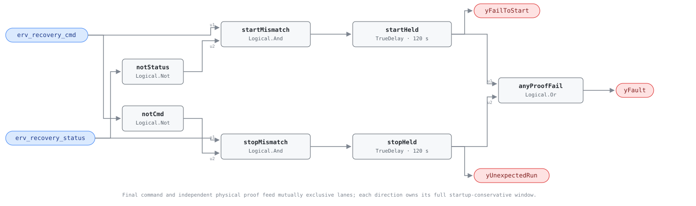

## Description

An active recovery device has to do more than receive an enable. This rule
compares the final command reaching the wheel drive or runaround pump with an
independent indication that the component actually operates. It detects both a
device that fails to start and one that continues running after its command is
removed. Passive plate cores have no command/status pair and are outside scope.

## Detection Logic

```text
yFailToStart   = (erv_recovery_cmd AND NOT erv_recovery_status)
                 sustained for start_proof_time
yUnexpectedRun = (erv_recovery_status AND NOT erv_recovery_cmd)
                 sustained for stop_proof_time

yFault = yFailToStart OR yUnexpectedRun
```

Block graph (`rule.cxf.jsonld`):



Each direction owns its delay, and both delays use `delayOnInit = true`. A
direction flip clears the old flag immediately and starts the other timer from
zero; the two diagnostic outputs cannot overlap because their command terms are
opposites. Agreement clears without an off-delay.

## Possible Diagnoses

`yFailToStart`:

1. Broken wheel belt/coupling, stalled motor, tripped overload, or failed drive
2. Runaround pump locked out, isolated, air-bound, or mechanically failed
3. Status switch/threshold failed even though the device operates
4. Final command point not reaching the starter or drive

`yUnexpectedRun`:

5. HOA/local switch left in HAND or drive left in local mode
6. Software override, welded contactor, or a second controller still commanding
7. Status point stuck true or sourced from the wrong component

## Energy Impact

PROTECTIVE, HIGH confidence, PROXY_ESTIMATION. A fail-to-start can remove most
of the intended heat recovery while downstream coils silently make up the load;
an unexpected run adds motor/pump power and can oppose bypass or frost intent.
Duration is known, but power and lost recovered heat are host-side quantities.

## Emissions Impact

Scope 1 + 2, PROXY_EMISSIONS. Device power is usually scope 2. Lost recovery
shifts load to electric cooling and either electric or fuel heating, so the
emissions scope follows the downstream plant and operating season.

## Deviations

- **Library-authored for active recovery only.** The HVAC FDD Reference has no
  ERV proof card; this is the established AHU/pump/boiler topology applied only
  where a real command and independent proof exist.
- **Both proof times are 120 s ADOPTED_TUNABLE defaults.** No cited source gives
  one portable wheel/runaround value; separate parameters preserve legitimate
  acceleration and coast-down differences.
- **Automatic jog belongs in the final command.** Greenheck documents wheel jog
  as normal control behavior; binding an upstream enable or excluding jog from
  the command would turn intentional operation into `yUnexpectedRun`.
- **Composed logic replaces `CDL.Logical.Proof`.** At engine pin `e2ff2f8`, that
  block has one timing contract and unsuitable initialization/chatter behavior;
  `Not` + `And` + two `TrueDelay`s preserves mutual exclusivity and full startup
  delays exactly like AHU-0039.
- **No evaluability output.** Evaluability is freshness, independence, and
  applicability of the two bindings, all host knowledge that cannot be derived
  from their boolean values.
- **No suppression.** A proof failure can cause ERV-0001's real effectiveness
  loss, and a wheel can fail while airflow stays balanced; operators benefit
  from both findings.
- **No ERV cluster.** The shared order belongs in `erv-effectiveness` and
  `proof-of-operation`; a three-rule delivery batch is not a causal taxonomy.
- **No empirical validation claim.** Command and independent wheel/pump proof
  are not available in the current simulation mapping; synthetic vectors cover
  all truth-table and timing behavior.

## Notes

Command echo is the dangerous binding: it agrees perfectly with the command
even when a belt is broken or a pump is seized. If the two points share the same
controller object or relay source, omit the rule until independent proof exists.
