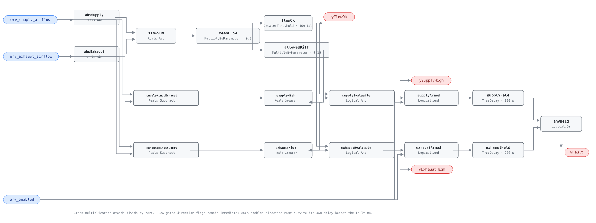

## Description

Energy recovery depends on two comparable air streams. A failed fan, loaded
filter, closed damper, poor balance, or bad sensor can leave one stream carrying
substantially more air than the other, reducing useful recovery and pushing the
building away from its intended pressure. This rule normalizes their difference
by mean flow, rejects low-flow operation, and reports which stream is high.

## Detection Logic

```text
mean_flow    = (|erv_supply_airflow| + |erv_exhaust_airflow|) / 2
allowed_diff = max_imbalance_fraction × mean_flow

yFlowOk      = mean_flow > minimum_evaluable_flow
ySupplyHigh  = yFlowOk AND (erv_supply_airflow − erv_exhaust_airflow > allowed_diff)
yExhaustHigh = yFlowOk AND (erv_exhaust_airflow − erv_supply_airflow > allowed_diff)

yFault = (erv_enabled AND ySupplyHigh) sustained for sustained_duration
      OR (erv_enabled AND yExhaustHigh) sustained for sustained_duration
```

Block graph (`rule.cxf.jsonld`):



The graph never divides: multiplying the positive evaluable mean by the allowed
fraction is algebraically equivalent and remains defined at zero flow. Both
comparisons and the flow floor are strict. Each direction owns a startup-
conservative timer, so a direct reversal resets persistence rather than allowing
two opposite short intervals to combine.

## Possible Diagnoses

1. Supply or exhaust fan failed, overridden, or running at the wrong speed
2. Loaded filter/core, blocked intake/discharge, or closed/stuck damper
3. Belt, wheel, or runaround-device problem changing system resistance
4. Unit never balanced, or balancing changed after filter/fan modifications
5. Airflow sensor bias, reversed polarity, mismatched averaging, or wrong unit
6. Intentional pressure offset not represented in the binding/configuration

## Energy Impact

COMFORT_ENERGY, MEDIUM confidence, QUALITATIVE_ONLY. The observed flow difference
is direct, but its energy consequence is not: it depends on fan curves, envelope
leakage, weather, pressure intent, and recovery effectiveness. The most valuable
output is often operational — which air path to inspect first.

## Emissions Impact

Scope 1 + 2, QUALITATIVE_EMISSIONS. Fan waste is scope 2; extra conditioning
from lost recovery or pressure-driven outdoor air follows the building's electric
cooling and electric/fuel heating systems. No emissions value is inferred here.

## Deviations

- **Division-free dynamic comparison.** The roadmap writes `difference / mean`;
  this graph compares each difference with `fraction × mean`, exactly equivalent
  when evaluable and defined even when both flows are zero.
- **One timer per direction.** A single delay after the directional OR would not
  reset on an instantaneous reversal, contradicting the required vector. The
  SYS-0008 per-condition idiom preserves the stated reset behavior.
- **`ySupplyHigh`/`yExhaustHigh` are immediate flow-gated diagnostics.** They are
  not persistence outputs and are not gated by `erv_enabled`; `yFault` is. False
  direction flags never mean NO_EVAL — that meaning belongs only to `yFlowOk`.
- **Absolute values serve only mean-flow evaluability.** Signed differences still
  choose direction, so a negative binding can look evaluable and alarm backwards;
  vectors pin this raw behavior and the host must reject such data.
- **0.15 is ADOPTED_TUNABLE; 100 L/s is NO_PORTABLE_DEFAULT.** Neither is called
  a standard requirement. Both must be reconciled with unit size, sensor range,
  and intentional pressure offset.
- **Frost-mode unbalance is explicitly excluded.** DOE's VICS testing shows a
  legitimate tempering strategy that changes the two core paths differently;
  evaluating that interval would diagnose the frost sequence as a flow fault.
- **No suppression or new cluster.** ERV-0004 can coexist with balanced airflow,
  and degraded effectiveness can remain a real separate finding. The shared
  investigation order is documented in the playbook.
- **No empirical validation claim.** The current EnergyPlus harness lacks two
  defensible device-local airflow measurements and operating-state mappings;
  synthetic vectors cover thresholds, evaluability, timing, and bad bindings.

## Notes

Do not "fix" a design pressure offset by widening the threshold until every unit
passes. Normalize to the intended offset first; the residual is the imbalance
this rule is meant to detect.
