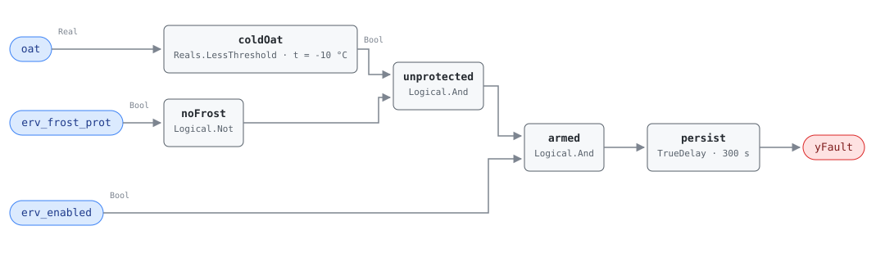

## Description

Below roughly -10 °C the moisture in the exhaust airstream starts freezing onto
the recovery core as it gives up its heat. Every ERV that runs in a cold climate
therefore carries a frost-protection sequence — preheat the incoming air, slow
the wheel, or bypass part of the outdoor air around the core — and that sequence
is what keeps the core from icing shut. This rule watches for the sequence
failing to appear when the weather calls for it.

It is a watchdog on a control sequence, not on a physical measurement. Nothing
here observes ice; the rule observes that the conditions for ice are present and
that the thing meant to prevent it is reporting itself inactive. That is a
deliberately cheap test — three points, no thermodynamics — and it is worth
having because the failure is silent. Frost accumulates over hours, the unit
keeps running, and the first symptom is usually a collapsed plate core or a
seized wheel discovered in spring. Severity 2 reflects that the cost is
equipment, not energy: the reference rates it PROTECTIVE with a
QUALITATIVE_ONLY estimation method, and the damage it prevents runs to the price
of a new core.

## Detection Logic

```
cold    = oat < frost_threshold                (-10.0 °C)
noFrost = NOT erv_frost_prot

yFault  = (cold AND noFrost AND erv_enabled) sustained continuously for alarm_delay
```

Block graph (`rule.cxf.jsonld`):



`coldOat` is a `Reals.LessThreshold` carrying a negative parameter, which the
library normally avoids — see Deviations for why a sub-zero temperature
threshold is the exception rather than a lapse. `noFrost` inverts the frost
status so the conjunction reads as a single sentence: cold outside, protection
off, unit running. `unprotected` combines the first two and `armed` adds the
enable, which is the reference's third conjunct rather than a host-side gate.

The comparison is strict, and here that matches the reference exactly — it also
writes `oat < frost_threshold` — so no expressiveness is lost at the boundary.
Outdoor air sitting at precisely -10.0 °C is not a fault and -10.1 °C is; both
sides are pinned by vectors because the equality case is where a threshold
argument usually starts.

`persist` requires 5 continuous minutes. The delay is doing real work despite
the short window: frost sequences stage in and out around their own setpoint,
and an outdoor-air reading crossing -10 °C on a windy afternoon can toggle the
cold term several times before the sequence latches. Five minutes of continuous
unprotected operation is past that. Any engagement of the sequence, however
brief, drops the timer and discards the accumulated time.

## Possible Diagnoses

1. Frost protection control sequence disabled — switched off during
   troubleshooting, or never enabled at commissioning on a unit shipped with it
   dormant
2. OAT sensor error, reading warmer than actual. The sequence is working and
   simply has not been told it is cold; this rule cannot distinguish that case
   from a dead sequence, and its own cold term is read from the same sensor
3. Frost protection damper or valve actuator failure — the sequence commands,
   nothing moves, and the status point may or may not admit it
4. Preheat coil not functioning: no hot water, a closed isolation valve, or a
   failed electric element behind a status point that still reports "on"

## Energy Impact

PROTECTIVE, MEDIUM confidence, QUALITATIVE_ONLY. There is no energy model here
and the reference does not attempt one — it points to the Energy Impact
Reference §4.4 framework and stops. The value is avoided equipment damage:
frozen plate cores crack, iced wheels stall their drive motors, and both failure
modes end in replacement rather than repair (the `erv-effectiveness` playbook
prices a core at $2,000-$5,000). Climate sensitivity is heating-dominant by
construction — the rule is unreachable above -10 °C.

The second-order energy cost is real but unmodelled: a partially iced core is a
degraded core, so a unit that runs unprotected through a cold snap will show up
in ERV-FC-050's effectiveness test afterwards. That ordering is worth knowing
when both fire on the same unit — this one is the cause, not a coincidence.

## Emissions Impact

Scope 2, DIRECT_EMISSIONS, HIGH confidence (the reference rates emissions
confidence higher than energy confidence here, and the frontmatter's single
`confidence` field carries the MEDIUM from the energy profile). The reference's
typical range is "protective; pump energy minor; equipment damage primary" with
no avoided-emissions basis — the emissions consequence is the embodied carbon of
a replacement core and the conditioning energy the building spends while the
recovery device is out of service, neither of which this rule can meter.

## Deviations

- **The threshold parameter is negative, and deliberately so.** The library's
  standing choice is to avoid negative parameters, expressing them as a
  `Sources.Constant` plus a `Subtract` so that every literal in a rule reads as
  a magnitude. A sub-zero temperature threshold is the documented exception:
  -10 °C is a *point on a scale with a fixed zero*, not a negated quantity, and
  writing it as `0 − 10` would invent an arithmetic that the physics does not
  have. `coldOat.t = -10.0` is the value an operator would type into the BAS,
  and a host retuning it for a milder climate sets -7.0, not 7.0. The inherently
  signed-quantity carve-out (regression slopes, sub-zero temperature
  thresholds) covers exactly this case.
- **`erv_enabled` is a conjunct in the graph, not a host-side operating-state
  gate.** The library's design stance keeps operating-state gating in
  frontmatter, but the reference writes the enable into the equation itself
  (`... AND erv_enabled = TRUE`), so the graph implements what the reference
  states. The consequence needs saying: with the ERV disabled, `yFault` reads
  false, and that false means *not applicable*, not *protected*. ERV-FC-050
  makes the same choice with the same point, so the pair behaves consistently on
  a unit that is off.
- **No evaluability output.** SCHEMA.md asks for a `y…` boundary output when the
  reference's semantics include an in-rule evaluability condition. There is none
  here that the host does not already hold: the only gating term is
  `erv_enabled`, which the host binds as a boundary input and can read directly.
  An output echoing an input would be noise. Contrast ERV-FC-050's
  `yTempDeltaOk`, which is *computed* from three temperatures and cannot be seen
  from outside the rule.
- **The frost test reads `oat`, the site sensor, not `erv_oa_entering_temp`.**
  This follows the reference's required-points list and the point dictionary,
  whose `oat` entry names ERV-FC-051's frost test as its consumer. On most units
  the two are the same physical sensor. Where they are not, the ERV inlet sensor
  is arguably the better measurement of what the core actually sees, and a host
  with a separate, well-sited inlet sensor may bind it here — but a rooftop
  `oat` in direct sun reads warm, which is diagnosis 2 and silences the rule.
- **`AlarmDelay = 5 min` becomes `persist.delayTime = 300 s` with
  `delayOnInit = true`** (Modelica/CDL default is `false`), the library's
  standing choice: a unit already running unprotected when the controller starts
  waits out the full five minutes rather than alarming on the first tick.
- **Fan status stays a host precondition.** The reference's ERV operating state
  for this chapter is "ERV enabled, both supply and exhaust fans running". The
  enable is in the graph because the equation names it; fan status is not a
  point in this rule's required list and is not invented here.
- **A unit with no frost sequence looks identical to a broken one.** The rule
  reads a status point; it cannot ask whether the sequence exists. Deploying it
  on a unit that was never given frost protection produces a season-long
  standing alarm. That is a real finding, but it belongs in a design review, so
  the preconditions put the exclusion host-side.
- Frontmatter `clusters` is empty: the reference defines no cluster containing
  an ERV rule, and this card does not edit the cluster set. The relationship to
  ERV-FC-050 is carried by `related` and by the shared playbook.
- Frontmatter `g36` is null. This is a research-backed 050-range rule sourced to
  engineering best practice; G36 has no ERV frost sequence to cite.

## Notes

The reference publishes no test vectors for this card, so every scenario in
`vectors.json` is library-authored. The pair worth reading together is
`cold_with_frost_protection_off` and `erv_disabled_in_deep_cold`: identical
weather, identical frost status, opposite meaning, and only the second one is
silence that means nothing. A host that treats `yFault = false` as "protected"
without checking `erv_enabled` will read the second case wrong.

Remediation is not in the [erv-effectiveness](../../../playbooks/erv-effectiveness.md)
playbook's step list — that document is written around a fouled or stalled
recovery device (ERV-FC-050) and the reference folds this card's fix into the
same page without giving it steps. The diagnosis order that the four causes
imply is: confirm the outdoor-air reading against a second sensor or the local
weather station first, because a warm-reading OAT sensor is both the cheapest
cause and the one that makes every other test misleading; then check whether the
sequence is enabled in the BAS at all; then command the frost output manually
and watch the damper, valve, or wheel respond; then verify the preheat source
has hot water or power. Steps 2 and 3 of the playbook still apply afterwards —
a unit that ran unprotected through a cold snap should have its core inspected
for damage before it is trusted again.
