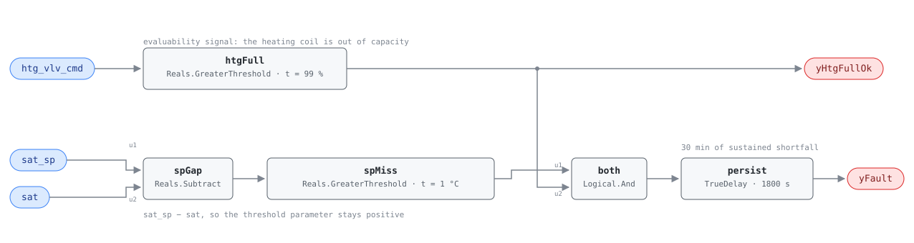

## Description

The valve is wide open and the air coming off the coil is still too cold. That
is the whole finding, and it is worth reporting because it is the one heating
complaint a fan coil cannot argue with: the loop has spent everything it has and
the discharge is still short, so the unit runs its fan for less heat than it was
designed to move and the zone makes up the difference from a baseboard, a space
heater, or not at all. The causes divide by where they sit — upstream (hot water
arriving too cold, which affects every FCU on the riser at once), at the unit (a
fouled or air-locked coil, a valve that reports open and is not), or at the
sensor (a discharge thermistor drifted low, inventing the whole thing). This is
AHU-0007's rule at zone scale; what changes is the sensor set, since an FCU has
no mixed-air temperature to check the coil against and the shortfall is measured
against setpoint alone.

## Detection Logic

```
yHtgFullOk = htg_vlv_cmd > hc_full_threshold        (false ⇒ host reports NO_EVAL)
yFault     = ((sat_sp − sat) > epsilon_sat AND yHtgFullOk)
             sustained continuously for alarm_delay
```

Block graph (`rule.cxf.jsonld`):



`spGap` subtracts in the direction that keeps the threshold positive —
`sat < sat_sp − ε` and `sat_sp − sat > ε` are the same statement, and the second
needs no negative constant. `htgFull` is both a term of the fault condition and
the boundary output `yHtgFullOk`, the same test read two ways: a valve at 60%
with the discharge 6 °C short is not a healthy unit, it is a unit this rule has
no opinion about, because the loop still has capacity and the shortfall could be
a slow morning. False `yHtgFullOk` means the rule made no claim, and the host
must publish NO_EVAL rather than healthy. Both comparisons are strict: a
shortfall of exactly 1.0 °C is not a fault and a valve reporting exactly 99.0% is
not full, which matters on quantized valve commands (see Deviations). `persist`
requires 30 continuous minutes, riding out a morning recovery from night
setback; recovery is immediate because `TrueDelay` has no off-delay, and
`delayOnInit = true` holds the window across a restart.

## Possible Diagnoses

1. Heating coil fouled or air-locked — the air side blocked with lint and dust,
   which an FCU filter in a hotel room reliably supplies, or an air pocket on the
   water side that a bleed valve clears in minutes
2. HW supply temperature too low — a plant or reset-schedule finding, not a unit
   finding. Check this first: it explains every unit on the riser at once
3. Heating valve stuck closed — the command reads 100% and the plug has not
   moved; the temperature across the coil piping separates this from a fouled
   coil in thirty seconds at the unit
4. SAT sensor out of calibration — a thermistor reading low invents this fault
   and nothing in the rule can see it. Suspect it first when one unit reports and
   its neighbours on the same riser do not

## Energy Impact

EXCESS_CONSUMPTION, MEDIUM confidence, PROXY_ESTIMATION. The reference gives
2–5% of zone heating energy. PROXY because the rule sees three signals and none
of them is airflow or power: the heat not delivered is
`fcu_airflow × ρ × cp × (sat_sp − sat)`, with airflow coming from the nameplate.
MEDIUM confidence because what the shortfall costs depends on what picks up the
load — an unheated hotel room at 3 a.m. costs nothing, the same room with an
electric space heater under the desk costs a great deal. Heating-dominant by
construction: the rule only evaluates in the heating state.

## Emissions Impact

Scope 1, PROXY_EMISSIONS, MEDIUM confidence; typically 50–400 kg CO₂e/yr per FCU.
Scope 1 because the heat a fan coil fails to deliver is heat a boiler burned gas
to make — the emissions are the combustion the plant did on this unit's behalf,
whether or not the air ever carried it. Avoided-emissions basis is the marginal
operating emissions rate (MOER) where the makeup heat is electric; where it is
more of the same hot water, the saving is fuel at the boiler.

## Deviations

- **The chapter states no tunables for this card at all** — it carries the
  equation and the operating state and nothing else — so all three parameters
  here are adopted rather than transcribed, and each is named as such in
  `params`.
- **`epsilon_sat` = 1.0 °C, adopted from G36.** The chapter's equation names
  `ε_sat` and never defines it; G36 Table 5.16.14.7 puts εSAT at 1 °C (2 °F),
  AHU-0007 carries that value, and it is the library's house convention. It is
  a sensor-error allowance, not a performance target: raise it and the rule
  tolerates an underperforming coil, lower it and it becomes a
  thermistor-accuracy alarm.
- **`alarm_delay` = 1800 s, adopted from G36 and not from the chapter.** The
  chapter gives FCU-0001 60 min and this card none, so the sibling's number is
  not automatically right. 1800 s is G36's own default and matches AHU-0007;
  30 minutes is long for a coil that charges in a few minutes, so a site can
  safely shorten it once the mode-delay precondition is enforced.
- **`hc_full_threshold` compares strictly, so the chapter's `≥ 99%` is read as
  `> 99%`.** CDL Reals has no `GreaterEqual`. On an analog signal the difference
  is measure-zero, but valve commands are frequently quantized to whole percent,
  which makes it a real blind spot: a host whose command saturates at an integer
  99 will never evaluate this rule, and must set `hc_full_threshold` to 98.9.
- **`epsilon_sat` compares strictly too**, so a shortfall of exactly 1.0 °C is
  clear and 1.1 °C alarms. Measure-zero on a real-valued temperature, erring
  toward silence.
- **The subtraction runs `sat_sp − sat`.** The chapter writes
  `sat < (sat_sp − ε_sat)`, which read literally needs a negative threshold on a
  signed difference; reversing the operands keeps `epsilon_sat` positive and is
  algebraically identical.
- **`yHtgFullOk` is exposed as a boundary output; AHU-0007 exposes only
  `yFault`.** The valve conjunct is computable in-rule and is the whole
  applicability test for this card, so SCHEMA.md's rule for in-rule evaluability
  applies. It is a threshold comparison rather than an echo of the input — a host
  reading it learns the coil is saturated, which `htg_vlv_cmd` alone does not say
  without knowing `hc_full_threshold`. Shape precedent: VFD-0001's `yCmdOk`.
- **The valve conjunct is the chapter's `htg_vlv_cmd ≥ 99%`, not "commanded
  open".** A rule that fired on any open valve would report every FCU in its
  morning pull-up.
- **The chapter's runtime estimator is transcribed but is not scale-invariant.**
  `waste_kw ≈ (sat_sp − sat) / sat_sp × fcu_htg_capacity_kw` divides a
  temperature difference by a temperature, so a 6 °C shortfall against a 35 °C
  setpoint reads 17% of capacity and the same physical state in kelvin reads
  1.9%. It is kept because the chapter is the source of record, with the
  dimensionally sound makeup term beside it; a host accumulating energy should
  use the second.
- **No coil-entering temperature is available, so there is no companion test.**
  G36 pairs FC#7 with FC#5 (SAT above MAT) on an air handler, catching a coil
  doing nothing at all rather than merely too little. The FCU dictionary carries
  `rat` as the entering proxy (FCU-0004/FCU-0005 use it that way) but this card's
  equation does not, and it adds no points the reference did not give it.
  Recorded as the obvious upgrade: `sat > rat` in heating needs no adopted
  constants.
- **Operating-state gating and the mode delay live in frontmatter, not in the
  graph.** The graph is silent outside full heating only because the valve
  conjunct happens to be false there, and that coincidence is not a substitute
  for the host's OS#1 gate — a unit can saturate its heating valve while the
  sequence is in a state where the discharge setpoint means something else.
- The reference publishes no vectors, so the whole suite is authored from the
  equation and every assertion edge was checked by replaying the graph at the
  pinned engine rev.
- **Frontmatter `clusters` is empty.** The reference lists no cluster for this
  fault and this card does not invent one; the relationship to the rest of the
  FCU family is carried by the shared playbook.
- `persist.delayOnInit = true` (Modelica/CDL default is `false`), the library's
  standing choice: a unit already short of setpoint at full valve waits out the
  alarm delay instead of alarming on the first tick after a restart.
- Severity 3 (warning) and method `rule`, per the reference's chapter 12 card
  and the FCU index; its §5.8.5 index carries no severity column.

## Notes

Order the service by scope. Step 2.2 of the
[fcu-faults](../../../playbooks/fcu-faults.md) playbook is the plant check — is
the hot water supply temperature adequate? — and it belongs first because it is
free, remote, and explains the correlated case: if every FCU on a riser reports
at once, no coil is fouled, a reset schedule is. If one unit reports and its
neighbours do not, step 3.1 is the visit — bleed the coil, then clean it, then
verify the valve actually strokes. Diagnosis 4 sits outside that order, and the
cheapest way to rule it in is to compare the discharge reading against return
air with the valve closed.

Expect FCU-0005 on the same units in the opposite season: a heating valve worn
enough not to seat is a valve that will also fail to open fully, and the same
seat that leaks in July starves the coil in January.
