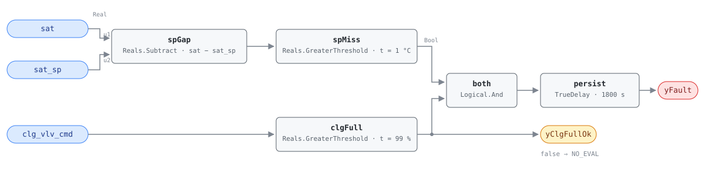

## Description

The chilled-water valve is wide open and the air leaving the fan coil is still
above its setpoint. The loop has already asked for everything it has, so
whatever is wrong is not tuning: either the coil cannot deliver, the chilled
water behind it cannot, the fan is not moving air across it, or the sensor
reporting the miss is wrong. On a fan coil the fault is quiet in a way it never
is on an air handler — one unit under-cooling one hotel room produces a guest
complaint, not a trend review — and the reference's chapter introduction is
blunt about why: fan coils are distributed by the dozens, rarely instrumented
well, and faults on them persist for long periods. Two to five percent of a
zone's cooling energy is small until it is multiplied by three hundred rooms.
This is the cooling-side member of the reference's FCU-0002/FCU-0003 pair, the fan
coil analog of AHU-0007/AHU-0013.

## Detection Logic

```
yClgFullOk = clg_vlv_cmd > cc_full_threshold      (false ⇒ host reports NO_EVAL)
sp_gap     = sat − sat_sp

yFault = (sp_gap > sat_error_threshold) AND yClgFullOk,
         sustained continuously for alarm_delay
```

Block graph (`rule.cxf.jsonld`):



`spGap` and `spMiss` are the reference's `sat > (sat_sp + ε_sat)` rearranged so
the allowance stays a single positive number at one CXF path. `clgFull` is the
half that gives the miss its meaning — a discharge above setpoint at a part-open
valve is a control loop doing its job, and only a loop that has run out of coil
is evidence of a defect. It feeds `both` and also leaves the block as
`yClgFullOk`, so a host can tell the two silences apart: silence with
`yClgFullOk` true is a coil keeping up, silence with it false is a loop that
still has valve left to give, about which this rule has nothing to say. Both
comparisons are strict, so a miss sitting exactly on 1.0 °C and a command parked
exactly on 99.0% both read healthy — the second matters on quantized commands
(see Deviations). `persist` requires 30 continuous minutes, which separates a
failed coil from a morning pulldown or a room coming out of setback;
`delayOnInit = true` puts the alarm at exactly 1800 s from a miss already
present at load. The graph is FCU-0002's mirror — same five blocks, same two
outputs, same three parameters, with the subtraction and the valve swapped.

## Possible Diagnoses

Transcribed from the reference's FCU-0003 card:

1. Cooling coil fouled
2. CHW supply temperature too high
3. Cooling valve stuck closed
4. Fan speed too low for cooling demand

Two readings that list needs. The reference gives FCU-0002 "SAT sensor out of
calibration" and does not repeat it here, but a discharge sensor reading high
produces this trace exactly and is the cheapest thing to eliminate; G36's
cooling-side equivalent (§5.16.14 FC#13) leads with SAT sensor error, so check
the sensor first. And diagnosis 4 reads backwards at first: lower airflow across
a fixed coil makes the discharge *colder*. The case that presents here is the
extreme one — a fan stopped, off its belt, or blocked by a fouled filter leaves
near-stagnant air on the discharge sensor, which reads close to room temperature
while the valve pins open. That is why fan status is the first precondition.

## Energy Impact

EXCESS_CONSUMPTION, MEDIUM confidence, PROXY_ESTIMATION, savings range 2–5% of
zone cooling energy — the reference's own profile, with no PNNL EEM mapped.
PROXY because the rule reads two temperatures and a command, not airflow,
capacity or power, so both the reference's
`(sat − sat_sp) / sat_sp × fcu_clg_capacity_kw` and the scale-free enthalpy form
need a nameplate the rule cannot see. What the range buys depends on the
diagnosis: if a heating valve is leaking on the same unit the shortfall is paid
for twice (FCU-0005 sees that), while a fouled coil or warm chilled water
wastes nothing at the coil and moves the cost to a zone that stays warm and a
plant that runs longer. Cooling-dominant.

## Emissions Impact

Scope 2, PROXY_EMISSIONS, MEDIUM confidence; the reference gives 50–400 kg
CO₂e/yr per fan coil, MOER basis. Everything this fault spends is purchased
electricity at the chiller and pumps. Note the direction of the accounting:
emissions can rise when the fault is fixed, because a coil restored to capacity
finally delivers the cooling the room was asking for. The honest claim is that
this rule buys comfort and diagnosis, and the avoided-emissions half belongs to
whatever waste the repair uncovers — most often a leaking heating valve on the
same unit.

## Deviations

- **Both tunables are adopted, not transcribed.** The reference's card states an
  equation and an operating state and stops. This card adopts 1.0 °C and 1800 s
  from G36 Addendum u's AHU AFDD tables (εSAT = 1 °C, AlarmDelay = 30 min,
  provenance NISTIR 7365), the values AHU-0013 ships. The delay is the more
  debatable — a fan coil settles far faster than an air handler, so a site can
  drop it to 900 s — and the chapter's one published AlarmDelay (FCU-0001's
  60 min) is a counting window, not evidence for this card.
- **`clg_vlv_cmd ≥ 99%` becomes a strict `> 99.0`.** CDL `Reals` has no
  `GreaterEqual`, so a command parked at exactly 99.000% reads as not-saturated.
  Measure-zero on a modulating command and it errs toward silence, but fan coils
  are the worst offenders for quantization: a host binding integer percent, or a
  controller that clamps to a rounded 99, should retune `cc_full_threshold` to
  98.9, and a unit whose "valve" is a two-position solenoid should bind at
  something like 50% or omit the rule.
- **The setpoint comparison is rewritten as a gap comparison**, the same
  rearrangement as AHU-0013 and AHU-0001: subtracting first keeps the
  allowance the positive number the reference names, retunable at one CXF path.
  The two forms can differ by one ulp on a value straddling the threshold, which
  is not observable at 1 °C on a sensor rated to ±1 °C.
- **The strict comparison at `spMiss`** likewise makes a miss of exactly 1.0 °C
  healthy and 1.1 °C a fault — measure zero, same direction of error.
- **G36 §5.22.6 is cited but was not read.** The G36 material available to this
  library is Addendum u, which carries the AHU AFDD sections but not the fan coil
  section, so the equation, operating state and diagnosis list are the
  *reference's* transcription of G36 and the adopted defaults come from the AHU
  tables. This is the card's largest blind spot: different published defaults
  would retune without touching the graph, but a specified averaging treatment
  would be structural — see the next item.
- **Instantaneous samples, with no averaging.** The reference writes the equation
  on instantaneous points and this card implements exactly that. Every AHU AFDD
  section of Addendum u computes 5-minute rolling averages, so §5.22.6 plausibly
  does too; if it does, this rule differs the way AHU-0013 documents. Averaging
  tolerates a signal whose mean sits outside the bound while it keeps crossing
  back, persistence does not, so an oscillating discharge can hide indefinitely.
  A steady miss against a saturated valve reads the same either way.
- **Operating states and the settling window are host-side preconditions.** A
  verdict outside the cooling state or inside a transition window is NO_EVAL. Fan
  status matters more here than on an air handler and leads the list, because the
  FCU point dictionary carries no fan status or fan speed point for the graph to
  read.
- **`yClgFullOk` is the library's, not the reference's.** Exposing the
  saturation conjunct as a boundary output adds no logic and changes no verdict;
  it lets the host distinguish "the coil is keeping up" from "the loop has not
  saturated, ask me later", which are the same `yFault = false` and mean
  different things. Same stance and wiring as FCU-0002's `yHtgFullOk`.
- **The chapter's asymmetries are carried, not smoothed.** This card follows the
  chapter wherever it differs from FCU-0002: Scope 2 against Scope 1,
  cooling-dominant against heating-dominant, OS#3 against OS#1, and a diagnosis
  list that trades "SAT sensor out of calibration" for "fan speed too low". Only
  the diagnosis swap looks like an authoring slip, and Possible Diagnoses says so
  in prose instead of editing the list.
- **The reference's runtime formula is transcribed with a caveat rather than
  corrected.** Dividing a temperature difference by a temperature *level* makes
  the answer depend on whether the setpoint is in °C, K or °F; read literally in
  the library's units it is a fractional-shortfall heuristic.
  `energy_impact.runtime_estimation` keeps the published form, flags the scale
  dependence, and adds the scale-free enthalpy-flow expression AHU-0013 uses.
- **Severity 3, category, confidence and estimation method are the reference's**
  (3/warning, EXCESS_CONSUMPTION, MEDIUM, PROXY_ESTIMATION), corroborated by the
  chapter README; the air-handler parent AHU-0013 also sits at 3.
- The reference publishes no vectors for this card, so `vectors.json` is authored
  from the equation.
- **`persist.delayOnInit = true`** (Modelica/CDL default is `false`), the
  library's standing choice: a violation already present at load waits out the
  full 30 minutes instead of alarming on the first tick after a restart.
- **Frontmatter `clusters`, `suppresses` and `suppressed_by` are empty.** The
  cluster set defines no FCU cluster and this card does not edit it. The
  relationships to FCU-0002 (the mirror), FCU-0004 (a cooling leak, which
  makes the discharge colder and so cannot explain this fault) and FCU-0005 (a
  heating leak, which can) are carried by `related` and the shared playbook.

## Notes

Read `yClgFullOk` before reading `yFault`. On a modulating fan coil it is false
most of the day, and every `yFault = false` under it means "not evaluated", not
"the coil is keeping up".

The setpoint this rule compares against is the one the sequence is actually
holding, which makes it quietly dependent on how the fan coil is controlled. A
unit that controls to zone temperature with no discharge setpoint has nothing to
bind to `sat_sp`, and a host that fabricates one — from the zone setpoint, or a
design value nobody is holding — will produce a standing alarm every mild
afternoon. Omit the rule on such a unit rather than bind it; that is the common
case on older fan coils.

The [fcu-faults](../../../playbooks/fcu-faults.md) playbook orders the service,
and its step 1.2 has the right instruction: rule out the plant first, because a
CHW riser running warm produces this fault simultaneously on every fan coil it
serves, and the fleet-wide pattern is the cheapest discriminator available. A
single unit alarming alone points at the coil, the valve, or the fan on that
unit; step 3.1 covers the coil work.
