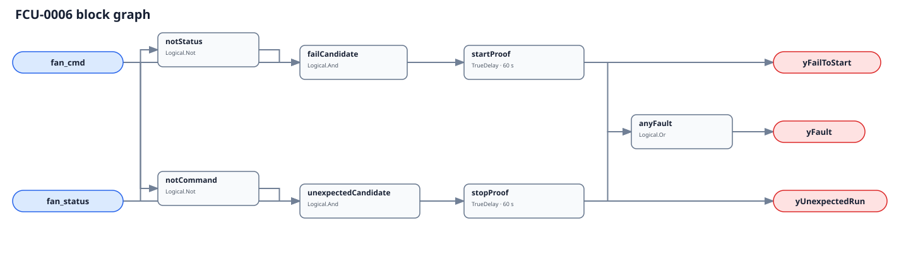

## Description

This rule checks whether the FCU fan did what its final Boolean command
requested. Commanded on without independent proof is a fail-to-start; proven on
without command is unexpected operation. The direction identifies the mismatch,
not its cause, and neither diagnostic output is an evaluability gate.

## Detection Logic

```
fail_to_start  = fan_cmd AND NOT fan_status
unexpected_run = NOT fan_cmd AND fan_status

yFailToStart   = fail_to_start sustained for start_proof_time
yUnexpectedRun = unexpected_run sustained for stop_proof_time
yFault         = yFailToStart OR yUnexpectedRun
```



Each direction has its own `TrueDelay(delayOnInit=true)`. Agreement clears both
lanes immediately. A direct mismatch reversal clears the old diagnostic and
starts the other timer from zero; elapsed time never transfers between lanes.

## Possible Diagnoses

1. Failed motor, ECM, controller, breaker, contactor, or output wiring.
2. Seized fan wheel, failed belt, coupling, or bearing.
3. Condensate, freeze, or local safety interlock omitted from command.
4. Bad current, airflow, speed, rotation, or auxiliary-contact proof.
5. Local thermostat, hand switch, or independent controller owns the fan.

## Energy Impact

The effect is direction-dependent. Unexpected operation can waste measured
electrical energy during the mismatch. Fail-to-start is primarily availability,
comfort, and diagnostic-coverage loss; these two booleans cannot price it.

## Emissions Impact

Scope 2 is proxy-only for unexpected operation: multiply independently measured
device kW by mismatch hours and an appropriate operating emissions factor. Do
not claim avoided energy or emissions for fail-to-start without another model.

## Deviations

- **Both timers are adopted commissioning values.** No cited source establishes
  universal FCU fan proof windows. Configure them independently around
  the actual sequence, proof device, sampling, and network latency.
- **The command is final and device-scoped.** An upstream enable, demand, or
  fleet request can disagree with status while downstream logic works correctly.
- **Status is independent proof.** Command echo makes the graph tautological;
  proof type determines whether electrical operation, rotation, or delivery was
  actually demonstrated.
- **No whole-rule suppression is encoded.** Fail-to-start can invalidate another
  rule's running premise, but unexpected operation may leave that rule physically
  meaningful; current metadata cannot suppress by direction.
- **`delayOnInit=true` is explicit on both lanes.** Evaluator restart into an
  existing mismatch must serve the full configured proof time.
- **No empirical FPR or TPR is claimed.** Current simulation telemetry cannot
  provide both an independent final command and field-like proof for this device.
- **Passive fan coils are explicitly not applicable.** A host must not synthesize a
  command/status pair for a unit that moves air only by convection.
- **The Boolean pair proves fan operation, not the requested ECM or multi-speed stage.**
  A wrong-stage failure needs speed or stage feedback and is outside this graph.

## Notes

Read the direction before interpreting FCU-0002 through FCU-0005: fail-to-start removes
their airflow premise, while unexpected operation can leave their temperature signatures
physically meaningful.
