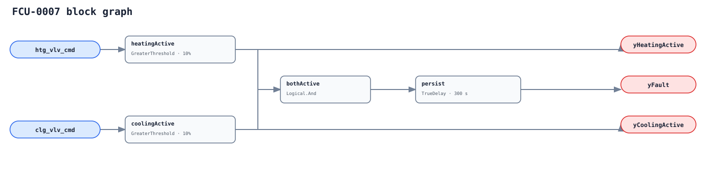

## Description

This rule detects a same-FCU heating-valve command and cooling-valve command
materially open together. It reports a command conflict, not physical valve
position or coil heat transfer. FCU-0004/0005 remain useful for distinguishing
unintended thermal effect with a nominally closed command.

## Detection Logic

```
heating_active = htg_vlv_cmd > heating_active_threshold
cooling_active = clg_vlv_cmd > cooling_active_threshold

yHeatingActive = heating_active
yCoolingActive = cooling_active
yFault = (heating_active AND cooling_active) sustained for sustained_duration
```



Both comparisons are strict. `TrueDelay(delayOnInit=true)` starts only while
both subconditions are true; either command clearing resets the timer and a
mature alarm clears immediately.

## Possible Diagnoses

1. Heating and cooling PID loops overlap or lack an interlock
2. Occupancy, mode, or setpoint transition leaves both outputs active
3. BAS priority-array override holds one command open
4. Wrong point scaling or commands bound from different FCUs
5. Intentional dehumidification/reheat, freeze, or exercise mode not host-gated

## Energy Impact

Simultaneous commands can add and remove heat at the same terminal, increasing
plant and fan energy. Commands alone do not prove valve position, water flow,
or thermal transfer, so this card makes no portable savings claim.

## Emissions Impact

Scope 1 and/or 2 effects depend on the serving heating and cooling plants.
Quantify only after measuring delivered heat and avoided plant input energy.

## Deviations

- **Thresholds and duration are library defaults.** The source supports the
  signature, not universal 10% or 300 s values; commission all three.
- **Intentional cooling-plus-reheat is host-excluded.** The graph has no mode
  input and intentionally alarms on that raw overlap when the host gate is absent.
- **CLU-01 is unchanged.** Its AHU-0016 trigger cannot causally clear a local
  FCU command conflict under the cluster contract; shared workflow is represented
  by the simultaneous-hc playbook instead.
- **Leak rules are not suppressed.** A command conflict and physical heat transfer
  with a closed command are different evidence and can co-occur.
- **No empirical FPR or TPR is claimed.** No current harness exposes both physical
  same-FCU valve commands without inference; validation is synthetic only.
