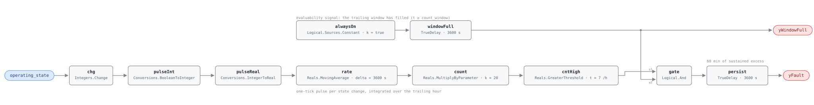

## Description

A fan coil unit that walks between heating, deadband, cooling and off more than
a few times an hour is not following load. Load does not move that fast in a
hotel room; what moves that fast is a threshold with nothing to hold the unit on
one side of it — heating and cooling setpoints too close together, a zone sensor
that jitters across the changeover point, or a wall thermostat someone keeps
adjusting. Each transition strokes valves, restarts or respeeds the fan, and
cools air that was being warmed a minute ago, so the energy goes into work that
cancels itself. On one unit the numbers are small, which is exactly why the
fault survives: a building with three hundred FCUs has some number oscillating
right now and the only way to find them is to count. This is AHU-FC-004's rule
at zone scale, on faster equipment, which is why the tick band and the warm-up
gate are stricter here.

## Detection Logic

```
pulse        = (operating_state ≠ previous tick's operating_state)   one tick wide
count        = MovingAverage(pulse, count_window) × count_scale      transitions in the trailing hour
yWindowFull  = model time ≥ count_window                             (false ⇒ host reports NO_EVAL)
yFault       = (count > os_max AND yWindowFull), sustained continuously for alarm_delay
```

Block graph (`rule.cxf.jsonld`):



`chg` asks only whether the state value moved; its `up` and `down` outputs are
declared for completeness and left unconnected, since which state the unit moved
to says nothing about whether it is oscillating. `Reals.MovingAverage` is a
continuous-time integral mean, so a one-tick pulse encloses one tick interval of
area and `count_scale = count_window / dt` converts the pulse average back into
a transition count — making `count_scale` a property of the host's clock rather
than of the building, with a legal tick band at both ends (see Deviations).
`cntHigh` is strict: exactly seven transitions an hour reads clear, eight
alarms, and the arithmetic lands on the boundary exactly. The top branch is what
AHU-FC-004 does not have: `alwaysOn` → `windowFull` goes true at exactly
t = 3600 s, the instant the moving average stops dividing by elapsed time and
starts dividing by the window. It gates the alarm and leaves the block as
`yWindowFull`, so a host that reads it learns the difference between "not
faulted" and "cannot tell yet". The earliest possible assertion is therefore
7200 s: one hour to fill the window, one hour of sustained excess. Both delays
carry `delayOnInit = true`.

## Possible Diagnoses

1. Deadband between heating and cooling too narrow — the condition that ends the
   heating mode is the condition that starts the cooling one, so the unit flips
   back as soon as it has finished acting
2. Conflicting zone demands — a perimeter room with solar gain on one side and
   an exterior wall on the other asks for both, and the unit alternates
3. Sensor noise causing mode oscillation — one poorly located or intermittent
   zone sensor crosses the changeover threshold every few minutes and the
   sequencing logic faithfully obeys

## Energy Impact

COMFORT_ENERGY, LOW confidence, QUALITATIVE_ONLY. There is no waste term to
compute from this rule's inputs — it sees a state index and cannot say what any
transition cost. The reference puts the loss at 1–3% of zone energy, split
between actuator wear and coils charged then abandoned before the air stream has
settled. Size the opportunity host-side per Energy Impact Reference §4.4
(unstable hours × FCU coil and fan power); this rule contributes the hours. LOW
confidence: no controlled study isolates cycling losses from the deadband change
that fixes them, and no PNNL measure covers zone-level sequencing stability.
Climate-neutral.

## Emissions Impact

Scope 1 + 2, QUALITATIVE_EMISSIONS, LOW confidence; on the order of
5–15 kg CO₂e/yr per FCU from cycling losses. Both scopes appear because the
transitions cross between them — a unit oscillating between heating and cooling
burns a little gas at the boiler and a little electricity at the chiller for the
same hour of indecision. The magnitude is an order of magnitude, not an
estimate; the reason to chase it is the fleet, where three hundred units at
10 kg CO₂e/yr is three tonnes against a setpoint change. Avoided-emissions
basis: N/A.

## Deviations

- **The reference card names no points; `operating_state` is our binding.** The
  chapter 12 card states the logic and the tunables with no Required Points
  table, so this rule binds the host-derived integer point the FCU dictionary
  carries for the purpose. Only transitions are consumed and no value is ever
  interpreted, so any stable enumeration binds — the dictionary recommends G36
  §5.22's OS#1–#4 index and requires only that the encoding not change.
- **Rolling count built from a moving average, because the block set has no
  windowed counter.** `Integers.OnCounter` counts monotonically from a reset, so
  a trailing-hour count would need a host-driven hourly reset — a tumbling count
  whose verdict depends on where the hour boundary fell.
- **`count_scale` is coupled to the host's tick interval, and the default is not
  AHU-FC-004's.** `k = count_window / dt`, and 20.0 is correct only at a 180 s
  tick; AHU-FC-004 ships 12.0 for a 300 s tick, and copying a `count_scale`
  between the two cards is the most likely way to deploy this wrong. The failure
  is silent: an FCU changing state 20 times an hour, read on a 60 s tick with
  `count_scale` left at 20.0, reports a steady 6.7 per hour and never alarms.
- **The legal tick band is 57.15 s ≤ dt ≤ 450 s, and both ends bite.** The lower
  end is the `MovingAverage` ring — 64 checkpoints, of which a window retains
  `count_window/dt + 1`, so `dt ≥ 3600/63`; past it the block silently drops the
  oldest in-window sample, shortening the window and inflating the count. The
  upper end is the change counter: at most one transition per tick, so a strict
  `count > 7` needs `dt ≤ 3600/8 = 450 s` for 8 to be reachable.
- **AHU-FC-004 states the ring bound as 56.25 s (3600/64); the correct figure is
  57.15 s (3600/63).** The retained set includes one checkpoint at or before the
  window's trailing edge, so a window spanning `n` ticks needs `n + 1` slots.
  The difference matters only within a second of the bound.
- **A change counter aliases, and the count is clipped rather than
  wrong-signed.** Above the ceiling the rule under-reports: at the shipped 180 s
  tick a unit changing state every 90 s shows at most 20/h, and a state that
  returns to its previous value within one tick shows nothing. Clipping delays
  nothing, since the alarm path is limited by the window and the delay rather
  than by how far above `os_max` the count sits, but a host that displays the
  count should say it is a floor.
- **Startup artifact (a): a spurious first-tick pulse, which costs nothing.**
  `Integers.Change` compares against `pre_u_start` on the first tick, so a unit
  that loads in OS#3 registers a change at t = 0. It encloses no area (`dt` is
  zero on the first tick) and never reaches the count. `chg.pre_u_start` is
  written explicitly as 0 and is not a card parameter.
- **Startup artifact (b): the first hour reads as a rate, and here the graph
  handles it rather than the host.** While `t < count_window` the moving average
  divides by elapsed time, so two changes in the first six minutes read as 20/h.
  AHU-FC-004 leaves that to a precondition; this card computes the condition in
  the graph because it is computable, and `gate` keeps the extrapolated rate off
  the persistence clock until the window has filled.
- **The window gate makes this rule slower than AHU-FC-004, deliberately.**
  Earliest assertion is `count_window + alarm_delay` = 7200 s, where AHU-FC-004
  can assert at 3900 s on a first-hour extrapolation its frontmatter then tells
  the host to discard. Requiring a completed hour is what "transitions per hour"
  actually says, at an hour of detection latency on a fault whose alarm delay is
  already an hour.
- **`BooleanToInteger` → `IntegerToReal` where `Conversions.BooleanToReal` would
  do it in one block.** Kept for shape parity with AHU-FC-004, so the two cards
  read as the same rule; it costs one block instance and no behavior.
- **Strict `>` on a discrete count.** Exactly 7 transitions an hour is clear and
  8 alarms — the chapter's `> OS_MAX` read literally — and the arithmetic is
  exact at the boundary rather than approximately exact.
- **The counting window is half-open.** A transition exactly `count_window` old
  has just left the window. The reference is silent; it matters only on the
  threshold and errs toward silence.
- **`alarm_delay` equals `count_window`**, both 60 min per the chapter's
  tunables line. This is not G36's 30-minute `AlarmDelay`; the chapter governs.
- **`alwaysOn.k` is written explicitly and is not a card parameter.**
  `Logical.Sources.Constant` has no default for `k`, and exposing it would let a
  host switch the evaluability signal off, which is not a tuning decision.
- The reference publishes no vectors, so the whole suite is authored from the
  equation, and every assertion edge was derived by replaying the graph at the
  pinned engine rev — the moving average's warm-up and decay trajectories do not
  match hand-computed sample statistics.
- **CLU-01 membership.** A zone unit swapping between heating and cooling every
  few minutes is doing both within any window long enough to matter, so
  AHU-FC-004's syndrome argument carries over. The cluster index owner accepted
  the case and `clusters/clusters.json` lists FCU-FC-001 in CLU-01.
- `persist.delayOnInit = true` and `windowFull.delayOnInit = true`
  (Modelica/CDL default is `false`), the library's standing choice.
  `windowFull` depends on it for its meaning — at `false` the constant-true input
  would assert on tick 0 and the signal would say the window was full when it was
  empty.
- **`related` is the library's, not the reference's.** The chapter 12 card
  carries no Related row; AHU-FC-004 is named as the same rule one level up the
  air path, one-way because that card's frontmatter is not edited here. No
  intra-FCU link is claimed.
- Severity 3 (warning) and method `rule` per the reference's chapter 12 card and
  the FCU index; its §5.8.5 index carries no severity column. Operating states
  OS 1–4 are declared, not gated — the chapter marks the fault applicable in
  every state and there is nothing for the graph to exclude.

## Notes

The fix is a deadband, and it is remote and free. Step 2.1 of the
[fcu-faults](../../../playbooks/fcu-faults.md) playbook puts the minimum at 2 °F
(1 °C) between heating and cooling setpoints and says to check for sensor noise
first, which is the right order: widening a deadband around a jittery input
hides the noise without fixing it. Step 4.2 confirms at transitions back under
7/h, which is this rule reading clear.

The reason to run this rule is fleet triage — the list of which forty units out
of three hundred are oscillating is worth an afternoon, because they will almost
all share one cause. Sort by count, not by alarm: the number behind the boolean
(`count.y`) is what ranks the work. `count_scale` and the tick belong on any
deployment checklist; they are the only values here that are properties of the
host's clock rather than of the building, and the failure mode is silent.
