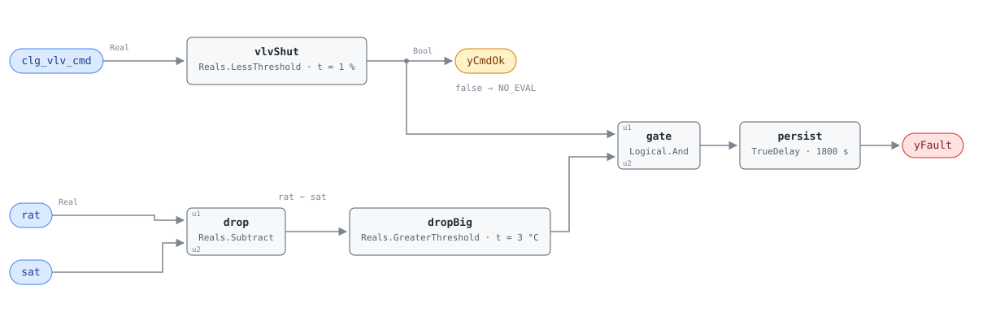

## Description

A fan coil's chilled-water valve is small, and when its seat wears the leak is
correspondingly small: a few degrees of cooling on air the sequence believes is
passing an inert coil. In the heating season that is the expensive version —
the heating coil warms the air, the leaking cooling coil takes part of it back,
the zone holds setpoint, and the only evidence is a boiler and a chiller both
working slightly harder than the room requires. Nobody complains, so nobody
looks, which is why the fault is worth a rule rather than a walkthrough: fan
coils are deployed by the hundred, and one leaking seat wastes an amount too
small to see on a bill and too tedious to find by hand. The chapter puts one
leaking valve at 3–10% of zone cooling energy and 100–800 kg CO₂e a year, mapped
to PNNL EEM-03. Because the rule reads temperatures rather than flows it cannot
separate a worn seat from an actuator short of its close position from a
three-way bypass that is not sealing; all three are on the diagnosis list.

## Detection Logic

```
yCmdOk = clg_vlv_cmd < cmd_closed_threshold          (false ⇒ host reports NO_EVAL)
drop   = rat − sat

yFault = (drop > inactive_coil_threshold) AND yCmdOk,
         sustained continuously for alarm_delay
```

Block graph (`rule.cxf.jsonld`):



`drop` subtracts in the reference's own order (`entering_temp − leaving_temp`),
which makes the sign of this rule the opposite of FCU-FC-005's. `vlvShut` feeds
`gate` and also leaves the block as `yCmdOk`, so a host can tell the two
silences apart: quiet with `yCmdOk` true is a coil shut and behaving, quiet with
it false is a coil that was asked to cool, about which this rule has no opinion.
On this side of the pair the fan works against the signal — with both valves
shut a healthy unit reads `rat − sat` slightly *negative*, because the fan puts
its shaft work into the air — so a leak must overcome that rise and then clear
the sensor allowance on top, and the shipped 3.0 °C takes roughly 4 °C of real
coil work to trip where the same number on the heating-side twin trips at about
2 °C. Both comparisons are strict. `persist` requires 30 continuous minutes,
separating a leaking seat from a coil giving up the chilled water standing in it
after a call ends; recovery is immediate, and `delayOnInit = true` holds the
window across a restart.

## Possible Diagnoses

Transcribed from the reference's FCU-FC-004 card:

1. Cooling coil valve leaking through — the worn or eroded seat; the common case,
   priced by the playbook at $150–$600 to replace
2. Valve not fully closing (mechanical) — the actuator has lost its close
   position or binds short of the seat, distinguishable on site by stroking it
   against feedback
3. Three-way valve bypass not sealing — nothing about the valve's travel looks
   wrong, which is why this one survives an actuator check

A fourth belongs in the operator's head though the reference does not list it:
either sensor being wrong produces this trace with a perfectly good valve. A
return sensor reading high and a discharge sensor reading low are
indistinguishable here and both are cheap to check against a portable reference,
which is why G36 §5.16.14 puts the two sensor errors ahead of the valve in its
own diagnosis order.

## Energy Impact

CRITICAL_WASTE, HIGH confidence, DIRECT_MEASUREMENT, 3–10% of zone cooling
energy, mapped by the reference to PNNL EEM-03 (fix leaking valves).
DIRECT_MEASUREMENT is honest here: the two temperatures the rule reads *are* the
measurement, and the runtime formula converts them to thermal power with one
substitution — design airflow for measured, since an FCU has no flow station.
HIGH confidence because a sustained drop across a coil commanded shut has no
benign explanation other than a sensor or a stopped fan. Heating-dominant per
the chapter, which reads oddly for a cooling fault until the operating state is
taken into account: the hours a leaking chilled-water valve does the most damage
are the hours a heating coil is fighting it, and those are the hours the cooling
valve is commanded shut for weeks at a time. In deep cooling weather the same
leak hides behind legitimate calls for cooling.

## Emissions Impact

Scope 2, DIRECT_EMISSIONS, HIGH confidence; typically 100–800 kg CO₂e/yr per unit
of parasitic cooling, MOER basis. The unwanted cooling is purchased electricity
at the chiller and pumps, so the cooling half of the exchange is Scope 2 on every
site. The heating that cancels it follows whatever the plant burns and is
FCU-FC-005's half to claim. Where the cause turns out to be a sensor or a stopped
fan there is nothing to attribute at all.

## Deviations

- **`inactive_coil_threshold` is adopted, not transcribed.** The reference names
  the parameter and publishes no tunables line for this card. 3.0 °C is G36's
  composition for the same fault on an air handler — `sqrt(εSAT² + εRAT²) + ΔTSF`,
  the form Addendum u §5.17.4.5 FC#3 uses on the same sensor pair — which gives
  2.41 at that clause's 1 °C values and 2.98 with the ±1.4 °C-class sensors an FCU
  typically carries. It is also the value FCU-FC-005 ships, because the reference
  names one parameter for both equations. (Only FC#3's right-hand side is
  borrowed; its operands read as a drop under a description that says rise, so
  this card's sign comes from the reference's `entering_temp − leaving_temp`.)
- **Fan heat is inside the measurement, and here it works against the signal.**
  Neither the chapter nor the playbook mentions fan heat; the term comes from
  G36's ΔTSF via AHU-FC-014. The fan raises the discharge and the leaking coil
  lowers it, so `rat − sat` under-reports the true coil drop by one fan rise:
  3.0 °C measured is about 4 °C of coil work, making this rule about half as
  sensitive in coil terms as its twin. The asymmetry is real, not an authoring
  slip; a host wanting matched sensitivity lowers this threshold by one fan-heat
  term.
- **`clg_vlv_cmd = 0%` becomes `< 1.0%`.** CDL `Reals` has no equality block, and
  equality on a float from a BAS would be the wrong test anyway — controllers
  write 0.0001% and round-tripped analog values land near but not on zero. 1.0%
  is tighter than AHU-FC-050's 5% "open" threshold because that rule needs the
  valve to be doing something and this one needs it to be doing nothing. On a
  two-position solenoid the command is 0 or 100 and the test is exact.
- **`alarm_delay` is adopted at 30 minutes.** The reference publishes no delay
  here; FCU-FC-001's 60 min belongs to a transition counter and says nothing
  about a coil. 1800 s is the AHU twin's G36 AlarmDelay and it does identifiable
  work — riding out the residual cold a just-closed coil gives up. A site whose
  coils purge in five minutes can cut it and detect leaks sooner.
- **Strict comparisons at both boundaries.** A drop sitting exactly on 3.0 °C is
  not a fault and a command sitting exactly on 1.0% is not shut. The reference
  writes `>` for the temperature test; the command side is the adopted test
  above. Both err toward silence, and a host binding coarsely quantized
  temperatures should retune down.
- **The G36 clause is the chapter's citation, carried forward unverified.** The
  library's G36 material is Addendum u, which carries no fan coil section, so
  everything claimed as transcribed comes from the reference's ch.12 card and the
  `g36` field is provenance the reference asserts. If §5.22.6 states averaging
  windows, epsilons or an alarm delay, they will correct the adopted values above.
- **`rat` and `sat` stand in for the coil entering and leaving temperatures**, as
  the FCU point dictionary directs, so the rule sees the whole air path: the fan
  is inside the measurement (handled by the fan-heat term) and so is any duct
  after the coil (not handled, and it biases this rule quieter). One
  configuration breaks the binding in the dangerous direction — a cabinet drawing
  outdoor air upstream of the coil presents a mixture colder than the return
  sensor reads, so `rat − sat` shows a winter drop with no leak at all.
- **The fan-running gate cannot be bound in v1.** The rule's most important
  precondition is that air is moving, and the FCU point dictionary carries no fan
  status, fan command, or airflow point, so the gate lives in `preconditions`
  with nothing in the graph enforcing it. A cycling-fan FCU evaluated between
  cycles is the realistic way to get a false alarm out of this rule
  (`fan_off_standing_water_reads_as_a_leak` pins it). Adding `fan_status` to the
  dictionary is the fix.
- **`yCmdOk` is the library's, not the reference's.** Exposing the command
  conjunct as a boundary output adds no logic and changes no verdict; it lets the
  host distinguish "the coil is shut and quiet" from "the coil is cooling, ask me
  later", which are the same `yFault = false` and mean opposite things. Same
  wiring as FCU-FC-005's `yCmdOk` and RTU-FC-051's `yStageOk`.
- **Instantaneous samples instead of rolling averages.** G36's AHU set computes
  every signal as a 5-minute rolling average; whether §5.22.6 does is unknown
  here. Persistence is not equivalent — averaging tolerates a signal whose mean
  sits outside the bound while it keeps crossing back, so a leak modulated by
  riser pressure or a valve hunting around its seat can hide indefinitely. A
  steady leak reads the same either way.
- **A leak is only visible between calls for cooling.** The rule is silent
  whenever the valve is open, so a valve that leaks all summer is detected in
  autumn and one on a unit in continuous cooling is never detected at all. That
  is inherent in the reference's equation, and it is the structural reason the
  chapter calls the fault heating-dominant.
- **Operating state OS#2 is host-enforced, and only half of it is testable
  here.** The graph's command test covers the cooling half of "no active coils";
  the heating half is not tested, and that gap is benign — an active heating coil
  raises `sat` and can only silence this rule, never trip it. Masking costs
  detections, not credibility.
- **The runtime formula is extended.** To the chapter's
  `(entering_temp − leaving_temp) × fcu_airflow × cp_air` this card adds air
  density (the product needs mass flow) and adds the fan's rise back, since the
  measured drop is the coil's work reduced by it — a quarter of the answer at the
  shipped threshold.
- **Severity 3 is the reference's, and it disagrees with the AHU twin.**
  AHU-FC-014/015 carry severity 2, assigned by this library because the AHU
  reference has no card to state one. The difference is defensible on scale and
  is recorded rather than smoothed, because a host ranking a mixed fleet by
  severity will see the same physics at two levels.
- **`clusters` is empty.** The chapter README calls FCU-FC-004/005 the
  zone-scale members of the simultaneous-conditioning family, but
  `clusters/clusters.json` lists only AHU rules there and this card does not edit
  the cluster set. The relationship is carried by `related` and the playbook.
- `persist.delayOnInit = true` (Modelica/CDL default is `false`), the library's
  standing choice: a leak already present when the controller restarts waits out
  the full 30 minutes instead of alarming on the first tick.
- The reference publishes no vectors for this card, so `vectors.json` is authored
  from the equation.

## Notes

Read `yCmdOk` before reading `yFault`. On a unit in cooling season it will be
false most of the day, and every `yFault = false` under it means "not
evaluated", not "no leak".

This card is one half of a pair the reference states symmetrically, and the
asymmetries are what to hold in mind: the sign of the subtraction is reversed
(`rat − sat` here, `sat − rat` in FCU-FC-005), fan heat pushes the two
measurements in opposite directions so the shared 3.0 °C is not a shared
sensitivity, and the emissions scope differs because the plants differ.
Everything else is identical, because nothing in the chapter distinguishes them.

The [fcu-faults](../../../playbooks/fcu-faults.md) playbook orders the service.
Step 1.3 is the manual version of this rule — command the valve to 0% and
measure across the coil, where *any* measurable change confirms the leak, a
sharper test than this rule ships because a technician knows the fan is running
and can put a calibrated probe on both sides. Step 2.3 is the remote workaround:
lock the cooling valve out for the heating season while the unit waits for
parts. Step 3.4 ranks a fleet by `|temp_change| × airflow × cp_air`, which is
this card's runtime estimator. Expect FCU-FC-002 on the same unit in heating
weather — if both are active, this one is the cause and that one the
consequence.
