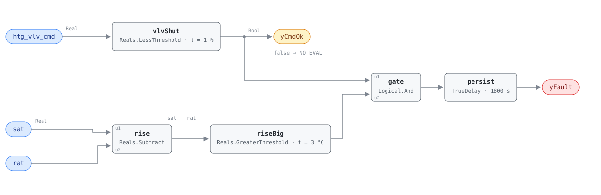

## Description

A fan coil's heating valve is a small two-way valve on a small coil, and when
its seat wears the leak is correspondingly small: a few degrees of rise across a
coil the sequence believes is shut. Nothing about the unit looks broken — the
fan runs, the valve reports 0%, the zone holds setpoint, because the cooling
coil or the neighbouring units quietly take the extra heat back out. Nobody
complains, so nobody looks, which is why this is worth a rule rather than a
walkthrough: FCUs are deployed by the hundred in hotels and apartments, each
wasting an amount too small to notice on a bill and too tedious to find by hand.
The chapter puts one leaking valve at 3–10% of zone heating energy and
100–800 kg CO₂e a year. Reading temperatures rather than flows, the rule cannot
separate a worn seat, a valve that never quite closes, and hot water
thermosiphoning through a vertically piped coil with the valve shut and
blameless; all three are on the diagnosis list.

## Detection Logic

```
yCmdOk = htg_vlv_cmd < cmd_closed_threshold   (false ⇒ host reports NO_EVAL)
rise   = sat − rat

yFault = (rise > inactive_coil_threshold) AND yCmdOk,
         sustained continuously for alarm_delay
```

Block graph (`rule.cxf.jsonld`):



`rise` subtracts in the reference's own order (`leaving_temp − entering_temp`),
which is what makes the sign of this rule the opposite of FCU-FC-004's.
`vlvShut` feeds `gate` and also leaves the block as `yCmdOk`, so a host can tell
the two silences apart: quiet with `yCmdOk` true is a coil shut and behaving,
quiet with it false is a coil being asked to heat, about which this rule has
nothing to say. The allowance is where the physics lives. On a healthy FCU with
both valves shut, `sat − rat` is not zero — the fan sits between the two sensors
and puts its shaft work into the air — so with a pair of zone-grade sensors each
allowed to be off by more than a degree, a healthy unit can read nearly 3 °C
with nothing running. With the fan inside the measurement the shipped 3.0 °C
fires when the coil's own contribution passes roughly 2 °C, and a bigger fan
raises the floor it has to clear; sites that measure their fan rise should put
their number in the sum. Both comparisons are strict. `persist` requires 30
continuous minutes, separating a leaking seat from a coil surrendering the hot
water standing in it after a call ends; recovery is immediate on the tick the
rise falls back inside the allowance or the valve opens, and `delayOnInit = true`
holds the window across a restart.

## Possible Diagnoses

Transcribed from the reference's FCU-FC-005 card:

1. Heating coil valve leaking through — the worn or eroded seat; the common case,
   priced by the playbook at $150–$600 to replace
2. Valve not fully closing (mechanical) — the actuator has lost its close
   position or binds short of the seat, distinguishable on site by stroking it
   against feedback
3. Gravity circulation through the coil — hot water thermosiphoning up through a
   vertically piped coil with the valve genuinely shut. Nothing is broken and a
   new valve fixes nothing; the fix is a check valve or a piping change, and the
   playbook flags this specifically for multi-story buildings

A fourth belongs in the operator's head though the reference does not list it:
either sensor being wrong produces this trace with a perfectly good valve. A
return sensor reading low and a discharge sensor reading high are
indistinguishable here and both are cheap to check against a portable reference,
which is why G36 §5.16.14 puts the two sensor errors ahead of the valve in its
own diagnosis order.

## Energy Impact

CRITICAL_WASTE, HIGH confidence, DIRECT_MEASUREMENT, 3–10% of zone heating
energy, mapped by the reference to PNNL EEM-03 (fix leaking valves).
DIRECT_MEASUREMENT is honest here: the two temperatures the rule reads *are* the
measurement, and the runtime formula converts them to thermal power with one
substitution — design airflow for measured, since an FCU has no flow station.
HIGH confidence because a sustained rise across a coil commanded shut has no
benign explanation other than a sensor. Cooling-dominant per the chapter, and the
reason also explains when the rule can see anything: heat leaking into a zone in
cooling season is paid for twice, and that is the season the heating valve is
commanded shut for weeks at a time — precisely the state `yCmdOk` requires. In
deep heating weather the same leak hides behind legitimate calls for heat.

## Emissions Impact

Scope 1, DIRECT_EMISSIONS, HIGH confidence; typically 100–800 kg CO₂e/yr per unit
of parasitic heating, MOER basis. Scope 1 is the reference's assignment and it
assumes a fuel-fired hot water plant; on a site whose hot water comes from an
electric boiler or a heat pump the same leaked heat is Scope 2, and the cooling
that removes it is Scope 2 either way, so an all-electric building reads the
whole exchange as Scope 2. Where the cause turns out to be a sensor there is
nothing to attribute at all.

## Deviations

- **`inactive_coil_threshold` is adopted, not transcribed.** The reference names
  the parameter and publishes no tunables line for this card. 3.0 °C uses G36
  §5.16.14's composition — root-sum-square of the two sensor errors plus a
  fan-heat term — which at the ±1.4 °C-class sensors an FCU typically carries and
  1 °C of fan rise gives 2.98. The AHU twin AHU-FC-015 ships 4.1623 for the same
  composition because it reads the coil through a mixed-air sensor G36 allows to
  be off by 3 °C, so the FCU threshold is legitimately tighter. A site with
  matched ±0.5 °C sensors and a measured 0.4 °C fan rise gets ≈ 1.1.
- **Fan heat is inside the measurement, and it is where this pair stops being
  symmetric.** Neither the chapter nor the playbook mentions fan heat; the term
  comes from G36's ΔTSF via AHU-FC-015. Here the measured rise is the true coil
  rise *plus* the fan's, so 3.0 °C trips at about 2 °C of coil rise, while on the
  cooling-side twin the fan's rise hides part of the drop and the same threshold
  needs about 4 °C — so the one number the reference asks for makes the heating
  rule roughly twice as sensitive. A host wanting matched sensitivity raises this
  threshold or lowers FCU-FC-004's by one fan-heat term.
- **`htg_vlv_cmd = 0%` becomes `< 1.0%`.** CDL `Reals` has no equality block, and
  equality on a float from a BAS would be the wrong test anyway — controllers
  write 0.0001% and round-tripped analog values land near but not on zero. 1.0%
  is tighter than AHU-FC-050's 5% "open" threshold because that rule needs the
  valve to be doing something and this one needs it to be doing nothing.
- **`alarm_delay` is adopted at 30 minutes.** The reference publishes no delay
  here; FCU-FC-001's 60 min belongs to a transition counter and says nothing
  about a coil. 1800 s is the AHU twin's G36 AlarmDelay and it does identifiable
  work — riding out the residual heat a just-closed coil gives up. A site whose
  coils purge in five minutes can cut it and detect leaks sooner.
- **Strict comparisons at both boundaries.** A rise sitting exactly on 3.0 °C is
  not a fault and a command sitting exactly on 1.0% is not shut. The reference
  writes `>` for the temperature test; the command side is the adopted test
  above. Both err toward silence, and a host binding coarsely quantized
  temperatures should retune down.
- **The G36 clause is the chapter's citation, carried forward unverified.** The
  library's G36 material covers §5.16.14 (the AHU set) and not the FCU set, so
  everything claimed as transcribed comes from the reference's ch.12 card and the
  `g36` field is provenance the reference asserts. If §5.22.6 states averaging
  windows, epsilons or an alarm delay, they will correct the adopted values above.
- **`rat` and `sat` stand in for the coil entering and leaving temperatures**, as
  the FCU point dictionary directs, so the rule sees the whole air path: the fan
  is inside the measurement (handled by the fan-heat term) and so is any duct
  after the coil (not handled, and it biases this rule slightly louder). Two
  configurations break the binding outright — a `rat` bound to a wall-mounted
  space sensor, and a four-pipe unit taking ducted outdoor air upstream of the
  coils.
- **The fan-running gate cannot be bound in v1.** The rule's most important
  precondition is that air is moving, and the FCU point dictionary carries no fan
  status, fan command, or airflow point, so the gate lives in `preconditions`
  with nothing in the graph enforcing it. A cycling-fan FCU evaluated between
  cycles is the realistic way to get a false alarm out of this rule; adding
  `fan_status` to the dictionary is the fix.
- **`yCmdOk` is the library's, not the reference's.** Exposing the command
  conjunct as a boundary output adds no logic and changes no verdict; it lets the
  host distinguish "the coil is shut and quiet" from "the coil is heating, ask me
  later", which are the same `yFault = false` and mean opposite things. Same
  wiring as RTU-FC-051's `yStageOk` and AHU-FC-055's `yTempDeltaOk`.
- **Instantaneous samples instead of rolling averages.** G36's AHU set computes
  every signal as a 5-minute rolling average; whether §5.22.6 does is unknown
  here. Persistence is not equivalent — averaging tolerates a signal whose mean
  sits outside the bound while it keeps crossing back, so a valve hunting around
  its seat can hide indefinitely. A steady leak reads the same either way.
- **A leak is only visible between calls for heat.** The rule is silent whenever
  the valve is open, so a valve that leaks all winter is detected in spring and
  one on a unit in continuous heating is never detected at all. That is inherent
  in the reference's equation, and it is the structural reason the chapter calls
  the fault cooling-dominant.
- **Severity 3 is the reference's, and it disagrees with the AHU twin.**
  AHU-FC-014/015 carry severity 2, assigned by this library because the AHU
  reference has no card to state one. The difference is defensible on scale and
  is recorded rather than smoothed, because a host ranking a mixed fleet by
  severity will see the same physics at two levels.
- **Operating state OS#2 is host-enforced.** The graph's command test covers the
  heating half of "no active coils"; the cooling half is not tested and does not
  need to be, since an active cooling coil drives `sat` below `rat` and can only
  silence this rule, never trip it.
- **The runtime formula is extended.** To the chapter's
  `(leaving_temp − entering_temp) × fcu_airflow × cp_air` this card adds air
  density (the product needs mass flow) and subtracts the fan's rise, which is in
  the measured difference and is none of the coil's doing — a third of the answer
  at the threshold.
- **`clusters` is empty.** The chapter README calls FCU-FC-004/005 the
  zone-scale members of the simultaneous-conditioning family, but
  `clusters/clusters.json` lists only AHU rules under CLU-01 and this card does
  not edit the cluster set. The relationship is carried by `related` and the
  playbook.
- `persist.delayOnInit = true` (Modelica/CDL default is `false`), the library's
  standing choice: a leak already present when the controller restarts waits out
  the full 30 minutes instead of alarming on the first tick.
- The reference publishes no vectors for this card, so `vectors.json` is authored
  from the equation.

## Notes

Read `yCmdOk` before reading `yFault`. On a unit in heating season it will be
false most of the day, and every `yFault = false` under it means "not
evaluated", not "no leak".

This card is one half of a pair the reference states symmetrically, and the
places where the pair is *not* symmetric are worth carrying into FCU-FC-004: the
sign of the subtraction (`sat − rat` here, `rat − sat` there), the direction fan
heat pushes the measurement (into this rule's threshold, against that one's),
and the emissions scope (Scope 1 here for a fuel-fired plant, Scope 2 there for
the chiller). Everything else is identical, because nothing in the chapter
distinguishes them.

The [fcu-faults](../../../playbooks/fcu-faults.md) playbook orders the service.
Step 1.3 is the manual version of this rule — command the valve to 0% and
measure across the coil, where *any* measurable change confirms the leak — and
it is where the gravity-circulation check lives, the one diagnosis a new valve
will not fix. Step 2.3 is the remote workaround: lock the heating valve out for
the season, which on a fleet firing a dozen units at once is the difference
between a summer of parasitic heating and none. Step 3.4 ranks that fleet by
`|temp_change| × airflow × cp_air`, this card's runtime estimator. Expect
FCU-FC-003 on the same unit in cooling weather — if both are active, this one is
the cause and that one the consequence.
