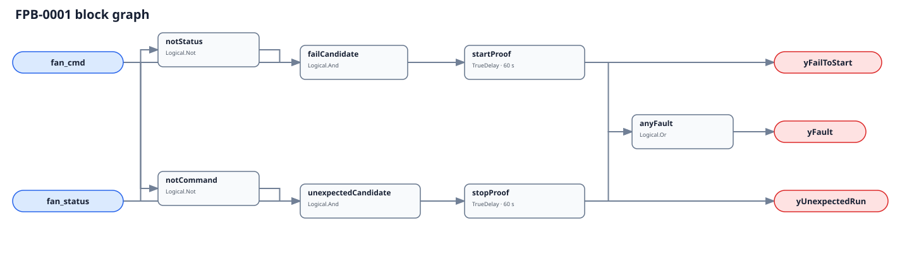

## Description

This rule checks whether the fan inside a series or parallel fan-powered
terminal did what its final Boolean command requested. Direction identifies the
observed mismatch, not its cause or the subtype's expected operating schedule.

## Detection Logic

```
fail_to_start  = fan_cmd AND NOT fan_status
unexpected_run = NOT fan_cmd AND fan_status
yFailToStart   = fail_to_start sustained for start_proof_time
yUnexpectedRun = unexpected_run sustained for stop_proof_time
yFault         = yFailToStart OR yUnexpectedRun
```



Independent `TrueDelay(delayOnInit=true)` lanes prevent elapsed time from
crossing a mismatch-direction reversal. Agreement clears both lanes immediately.

## Possible Diagnoses

1. Failed motor, ECM, contactor, controller output, breaker, or wiring.
2. Seized wheel, failed bearing, belt, coupling, or fan relay.
3. Bad current, airflow, pressure, speed, rotation, or auxiliary-contact proof.
4. Local hand/thermostat ownership or a subtype-specific interlock omitted from command.
5. Wrong terminal or upstream AHU fan bound to either canonical point.

## Energy Impact

Unexpected operation can waste terminal-fan electricity and alter delivered
heating or airflow. Fail-to-start is principally a comfort and availability
finding; this Boolean pair cannot price its zone or plant effect.

## Emissions Impact

Scope 2 proxy applies only to unexpected operation using measured fan kW,
mismatch hours, and the applicable electricity factor.

## Deviations

- **Both 60 s timers are adopted.** No cited source establishes portable FPB proof windows.
- **Subtype schedule remains host-side.** The same graph is valid for a continuously running series fan and an intermittently commanded parallel fan because it judges agreement, not when command should be on.
- **Final command and independent proof are mandatory.** Upstream enable creates false positives; command echo creates a blind spot.
- **No whole-rule suppression is encoded.** Fail-to-start can remove another rule's premise while unexpected run can leave that rule physically meaningful.
- **No empirical FPR or TPR is claimed in this slice.** The LBNL adapter and exact dataset-to-canonical-point mappings are deferred to PR11.
