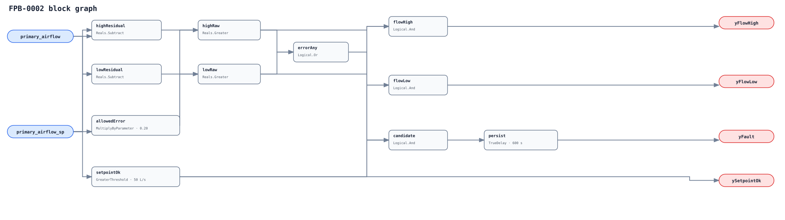

## Description

This rule detects primary air delivered materially above or below the active
FPB target. It deliberately measures only the AHU-fed inlet stream; neither a
series fan's total discharge nor a parallel fan's induced branch is equivalent.

## Detection Logic

```
setpoint_ok  = primary_airflow_sp > minimum_airflow_sp
allowed      = primary_airflow_sp * max_tracking_error_fraction
flow_high    = (primary_airflow - primary_airflow_sp) > allowed
flow_low     = (primary_airflow_sp - primary_airflow) > allowed
yFlowHigh    = setpoint_ok AND flow_high
yFlowLow     = setpoint_ok AND flow_low
yFault       = setpoint_ok AND (flow_high OR flow_low),
               sustained for sustained_duration
```



The positive setpoint floor defines the valid domain. Cross-multiplied
residuals avoid `Divide` entirely, so zero setpoint cannot evaluate an unsafe denominator.

## Possible Diagnoses

1. Stuck, disconnected, or miscalibrated primary-air damper/actuator.
2. Insufficient or excessive upstream duct static pressure or failed AHU reset.
3. Blocked inlet, damaged flow ring, wrong K-factor, or sensor bias.
4. Stale, misbound, or incorrect active setpoint/units.
5. Pressure-dependent controller or subtype total-flow point bound as primary flow.

## Energy Impact

High primary flow can raise AHU fan, cooling, and reheat energy; low flow can
miss ventilation and comfort targets. The signature alone does not identify
which effect is avoidable, so the card remains qualitative.

## Emissions Impact

Scope 1/2 qualitative by the serving heating/cooling system. Quantify only
after isolating the cause and measuring the affected fan or thermal input.

## Deviations

- **The graph does not divide.** The brief's fractional-error equation is algebraically equivalent in the enforced positive-setpoint domain; cross-multiplication makes zero-denominator safety structural.
- **50 L/s is not portable.** It is an adoption-blocking placeholder because meaningful minimum flow scales with box size and ventilation design.
- **20% and 600 s are adopted.** Sources support the mechanism, not universal thresholds.
- **Direction handoff preserves persistence.** One timer follows the low/high OR; a continuously out-of-band sampled reversal remains one tracking fault.
- **`ySetpointOk` is not the whole host gate.** AHU availability, settled target, calibration, and controller behavior remain external obligations.
- **No empirical FPR or TPR is claimed.** The LBNL replay adapter is deferred to PR11.
