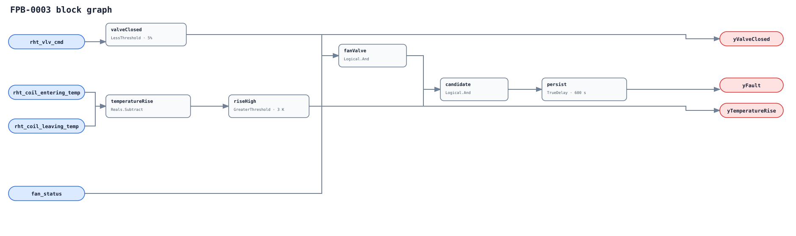

## Description

This rule identifies heat added across a hydronic FPB reheat coil while its
valve is commanded shut and airflow through that coil is proven. Coil-local
measurement is essential, especially before PFPU branch air mixes with primary air.

## Detection Logic

```
valve_closed = rht_vlv_cmd < valve_closed_threshold
rise         = rht_coil_leaving_temp - rht_coil_entering_temp
rise_high    = rise > temperature_rise_threshold
yValveClosed = valve_closed
yTemperatureRise = rise_high
yFault = fan_status AND valve_closed AND rise_high,
         sustained for sustained_duration
```



Both thresholds are strict. The complete three-part candidate feeds one
`TrueDelay(delayOnInit=true)`; loss of any premise clears a mature alarm immediately.

## Possible Diagnoses

1. Valve seat passing from wear, debris, fouling, or unsuitable close-off pressure.
2. Actuator/linkage not reaching the seat despite a closed command.
3. Manual bypass, three-way piping, or unintended gravity circulation.
4. Residual hot-water availability or warm-soak not excluded by the host.
5. Entering/leaving sensor bias, swap, or PFPU mixed-discharge misbinding.

## Energy Impact

Leaked reheat can be paid for twice when primary cooling removes it again.
Temperature rise is only a proxy; PFPU primary airflow is not automatically
the branch coil airflow required to turn that rise into thermal power.

## Emissions Impact

Scope 1 and/or 2 depends on heating and cooling sources. Use validated coil
airflow, rise, runtime, and source-specific factors before quantifying savings.

## Deviations

- **All three defaults are adopted.** The brief labeled 600 s as library precedent, but no existing 600 s leakage rule supports that claim; it is recorded as `ADOPTED_TUNABLE` instead.
- **The rule is hydronic-only.** Electric reheat needs proof/status logic and safety treatment rather than a fictitious valve command.
- **Temperatures are coil-local.** This is stricter than common VAV/FCU proxies and prevents PFPU branch mixing from erasing the signature.
- **Fan proof is in-graph, but other gates remain host-side.** Hot-water availability, warm-soak, freeze/exercise, and point quality still determine evaluability.
- **The rule is related to leak siblings but not placed in CLU-01.** A single AHU simultaneous-command repair cannot reliably clear a physically passing terminal valve.
- **No empirical FPR or TPR is claimed.** LBNL replay and mapping are deferred to PR11.
