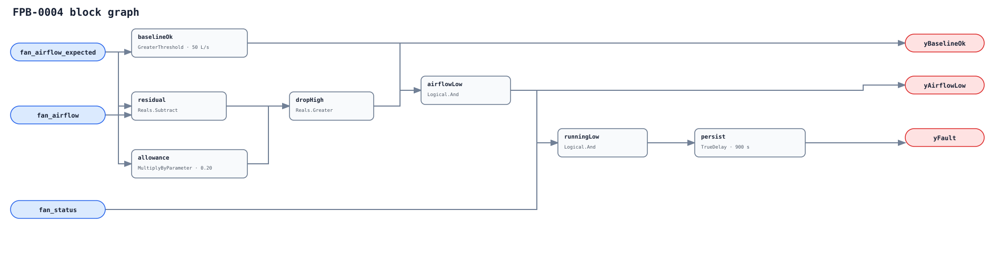

## Description

This rule detects fan-path airflow materially below a known-good, current-condition
baseline while the terminal fan is proven on. It reports delivery degradation,
not a specific dirty filter, fan, belt, damper, voltage, or sensor cause.

## Detection Logic

```
baseline_ok = fan_airflow_expected > minimum_expected_airflow
residual    = fan_airflow_expected - fan_airflow
allowance   = fan_airflow_expected * max_airflow_drop_fraction
airflow_low = baseline_ok AND residual > allowance
yBaselineOk = baseline_ok
yAirflowLow = airflow_low
yFault      = fan_status AND airflow_low, sustained for sustained_duration
```



Cross-multiplication makes the relative test safe without a `Divide`; all
comparisons are strict and persistence uses `delayOnInit=true`.

## Possible Diagnoses

1. Restricted intake/discharge, dirty filter, or obstructed fan-path damper.
2. Fouled/damaged wheel, slipping belt/coupling, low speed, voltage, or torque limit.
3. Different fan configuration, pressure, or subtype state than the baseline.
4. Actual/expected path mismatch, bad sensor, stale model, or degraded training data.

## Energy Impact

Low delivered airflow can extend fan/reheat/primary-air operation or miss load.
The residual is a delivery proxy, not measured power; no kWh is claimed.

## Emissions Impact

Scope 2 qualitative through fan and compensating HVAC electricity.

## Deviations

- **No Divide block is used.** Cross-multiplication is equivalent in the positive expected-flow domain and structurally safe at zero.
- **The expected point is site-fitted, not a universal fan curve.** Readiness, training, features, path scope, and domain checks remain host obligations.
- **All defaults require commissioning.** 50 L/s is adoption-blocking; 20% and 900 s are adopted tunables.
- **Proof remains related rather than a suppressor.** FPB-0001 fail-to-start invalidates the premise, but unexpected run can still leave this degradation signature meaningful.
- **No empirical FPR/TPR is claimed.** LBNL mapping/replay is deferred to PR11.
