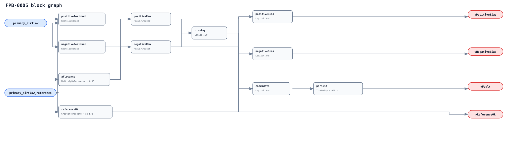

## Description

This rule gives the canonical primary-airflow sensor an independent second
opinion. Sustained disagreement is a sensor-integrity finding, but an ordinary
host-derived reference can be wrong too, so the verdict remains ambiguous.

## Detection Logic

```
reference_ok = primary_airflow_reference > minimum_reference_airflow
allowance    = primary_airflow_reference * max_disagreement_fraction
positive     = (primary_airflow - primary_airflow_reference) > allowance
negative     = (primary_airflow_reference - primary_airflow) > allowance
yPositiveBias = reference_ok AND positive
yNegativeBias = reference_ok AND negative
yReferenceOk  = reference_ok
yFault = reference_ok AND (positive OR negative), sustained for sustained_duration
```



No `Divide` exists. One timer follows the direction OR, so a sampled sign
reversal without reconvergence preserves age; any in-band sample resets it.

## Possible Diagnoses

1. Primary airflow sensor bias, scaling/K-factor, tubing, or pickup fault.
2. Reference sensor/model bias, stale version, or out-of-domain extrapolation.
3. Circular reference, different stream/location, time misalignment, or unit mismatch.
4. Real transient the reference cannot reproduce.

## Energy Impact

The disagreement itself uses no energy. Impact is whatever wrong airflow
control or downstream diagnosis the erroneous member causes.

## Emissions Impact

Scope 1/2 qualitative through downstream heating, cooling, and fan decisions.

## Deviations

- **Ambiguous means no automatic victim.** The graph's input roles differ, but the reference contract is not inherently trusted enough to invalidate primary_airflow without deployment certification.
- **No Divide block is used.** Positive-reference cross-multiplication is safe at zero and negative raw references.
- **All defaults require commissioning.** The floor is adoption-blocking; 15% and 900 s are adopted.
- **FPB-0002 is not automatically suppressed.** A biased measurement can explain tracking error, but an ambiguous reference cannot silently erase it.
- **No empirical FPR/TPR is claimed.** LBNL replay is deferred to PR11.
