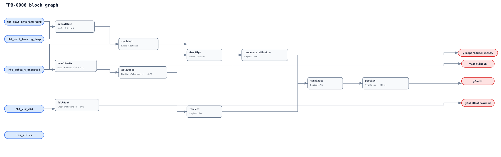

## Description

This rule detects actual reheat-coil air temperature rise materially below a
known-good current-condition expectation at proven airflow and near-full valve
command. It reports heat-transfer degradation without overclaiming fouling.

## Detection Logic

```
actual_rise = rht_coil_leaving_temp - rht_coil_entering_temp
baseline_ok = rht_delta_t_expected > minimum_expected_delta_t
full_heat   = rht_vlv_cmd > full_command_threshold
allowance   = rht_delta_t_expected * max_delta_t_drop_fraction
rise_low    = baseline_ok AND (rht_delta_t_expected - actual_rise) > allowance
yBaselineOk = baseline_ok
yFullHeatCommand = full_heat
yTemperatureRiseLow = rise_low
yFault = fan_status AND full_heat AND rise_low, sustained for sustained_duration
```



The relative deficit is cross-multiplied in the positive-baseline domain;
there is no `Divide`. Persistence uses `delayOnInit=true`.

## Possible Diagnoses

1. Air- or water-side fouling, coil air bypass, or obstructed flow path.
2. Low hot-water temperature/flow/pressure or serving-plant tracking failure.
3. Valve/actuator/linkage not delivering the commanded full stroke.
4. Excessive or mis-modeled airflow/fan condition.
5. Sensor bias/location, actual/expected scope mismatch, or bad baseline model.

## Energy Impact

Poor transfer can extend heating runtime or miss comfort. The temperature-rise
deficit is a performance proxy, not automatically avoidable thermal energy.

## Emissions Impact

Scope 1/2 qualitative by the hot-water source and compensating equipment.

## Deviations

- **The rule names observable degradation, not fouling.** Hydraulic, actuator, airflow, plant, sensor, and model causes share the signature.
- **No Divide block is used.** Cross-multiplication is equivalent only in the positive expected-rise domain enforced by yBaselineOk.
- **The expected point is site-fitted.** Known-good training, inputs, model readiness, and hot-water condition stay host-side.
- **All defaults require commissioning.** 3 K is adoption-blocking; 90%, 30%, and 900 s are adopted tunables.
- **No empirical FPR/TPR is claimed.** LBNL mapping/replay is deferred to PR11.
