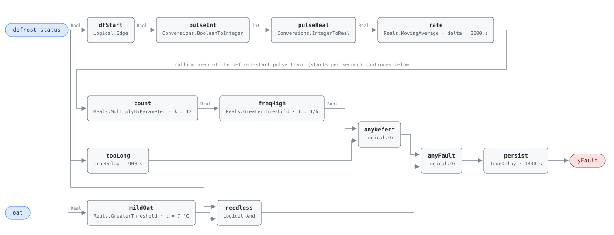

## Description

Defrost is a heat pump running backwards on purpose: the reversing valve swaps,
the outdoor coil becomes a condenser, and for five to fifteen minutes the unit
cools the outdoors with the heat it owed the building — usually with resistance
heat propping up the supply air so nobody notices. The question is whether the
unit is buying more of those minutes than the coil needs. There are three ways
to buy too many and the reference tests all three: cycling too often, a cycle
that will not terminate, and a cycle initiated where there is no ice to clear.
They share a fault code because they share a service call — somebody opens the
outdoor unit and looks at the coil, the defrost sensor, and the board. None of
it is visible from the space, which is what makes this a metered-energy fault.

## Detection Logic

```
starts   = rising edges of defrost_status
count    = MovingAverage(starts, count_window) × count_scale     cycles in the trailing hour

too_often = count > max_defrost_frequency
too_long  = defrost_status held continuously for max_defrost_duration
needless  = defrost_status AND oat > defrost_unnecessary_temp

yFault    = (too_often OR too_long OR needless) sustained continuously for alarm_delay
```

Block graph (`rule.cxf.jsonld`):



The frequency branch is AHU-0004's counter idiom applied to a boolean point:
`dfStart` reduces each cycle to a one-tick pulse and `rate`, a continuous-time
mean of `u·dt` over the window, returns `n · dt / count_window`, which
`count_scale = count_window / dt` = 3600/300 = 12 turns back into `n`. The count
is therefore tied to the host's tick interval in two ways a deployer must
honour: `count_scale` retunes with the tick, and because the pulses are *edges*
the fastest observable cadence is `count_window / (2 × dt)` — 6/h at the
defaults, inside a legal tick band of 57.1–450 s (see Deviations).

`tooLong` needs no counting: a `TrueDelay` on `defrost_status` matures when one
cycle has run continuously for `max_defrost_duration` and falls the instant the
cycle ends — inclusive at its boundary, where the two threshold comparisons are
strict. `mildOat` and `needless` are the third branch, and the conjunction
matters: a mild outdoor temperature is not a fault and a defrost cycle is not a
fault; a defrost cycle *at* a mild outdoor temperature is. `persist` applies the
reference's single 30-minute delay once, after the `Or` tree, so the branches
accumulate rather than each having to persist alone.

## Possible Diagnoses

1. Outdoor coil heavily fouled or iced — the coil genuinely needs the cycles it
   is taking, and the fix is cleaning rather than controls
2. Defrost sensor failure — the one cause that can produce all three branches,
   since it both initiates cycles that are not needed and fails to terminate
   the ones that are
3. Defrost control board malfunction, including a time-initiated defrost timer
   left at a setting the manufacturer no longer recommends
4. Refrigerant charge issue — low charge lowers coil temperature and brings on
   frost that would not otherwise form, showing here as cadence rather than as
   capacity (HP-0001 is the rule that sees it as capacity)

## Energy Impact

EFFICIENCY_LOSS, MEDIUM confidence, PROXY_ESTIMATION. Every defrost cycle costs
twice — the heat pulled back out of the building, plus the supplementary heat
brought on to cover the gap — and the reference puts the excess at 3–10% of
heating energy. `waste_kw ≈ defrost_fraction × hp_heating_kw` scales the unit's
heating draw by the share of hours spent in unnecessary defrost. PROXY, and
MEDIUM, for the same reason: the cycle counts are solid but the share of them
that was unnecessary is an inference, and a coil that is genuinely icing is
being correctly served by cycles this rule flags. Heating-dominant, worst in the
humid part of the season around 0–5 °C where frost forms fastest.

## Emissions Impact

Scope 2, PROXY_EMISSIONS, MEDIUM confidence; typically 200–1,500 kg CO₂e/yr from
excess defrost energy. All electric — compressor plus whatever supplementary
heat covers the cycle — so the avoided-emissions basis is the marginal operating
emissions rate (MOER). Cold mornings are both when the fault costs most and when
the grid is dirtiest, which pushes the marginal figure above the average one.

## Deviations

- **`comp_status` is dropped from the points list.** The reference's Required
  Points row lists it but its equation never uses it — all three branches read
  `defrost_status` and `oat`. Compressor state is what makes the *operating
  state* (heating mode) true, and operating states are declared in frontmatter
  here rather than binding a point the graph ignores. Precedent: VAV-0001
  drops `zone_airflow`, AHU-0029 drops `oat`.
- **`defrost_unnecessary_temp` has no default in the reference's tunables
  table** — the card names it in the equation and then lists only the other
  three. The 7.0 °C shipped here comes from the same document's remediation
  playbooks (step 1.b: defrost should not be needed above 7 °C / 45 °F), the
  nearest in-document authority and the number a technician would verify by hand.
- **The rolling count is built from a moving average, because the block set has
  no windowed counter.** `Integers.OnCounter` counts monotonically from a reset,
  so "cycles in the trailing hour" would need a host-driven hourly reset — a
  tumbling window whose verdict depends on where the boundary fell. AHU-0004
  established the idiom; `Logical.Edge` replaces `Integers.Change` because the
  counted signal is boolean.
- **`count_scale` is coupled to the host's tick interval:** `k = count_window /
  dt`, and the default 12.0 is correct only at the 300 s tick the vectors use. A
  host ticking every 60 s must set 60.0; leaving it at 12.0 reports a fifth of
  the true cadence and the branch never fires. The failure is silent — a mis-set
  scale still produces a plausible number — so it belongs on any deployment
  checklist.
- **The tick interval has a legal band, and its ceiling is half what a level
  counter would give.** A rising edge needs one false sample between two true
  ones, so the most cycles observable in a window is `count_window / (2 × dt)` —
  6/h at the defaults, and `max_defrost_frequency` must sit strictly below it
  (the shipped 4/h needs `dt < 450 s`). The floor is `Reals.MovingAverage`'s
  fixed 64-checkpoint ring: `dt ≥ count_window / 63 ≈ 57.1 s`.
- **Sampling floor on the point itself.** A defrost cycle shorter than one tick
  is invisible to the edge counter — the point may never be sampled true. The
  point dictionary flags this on `defrost_status`; at a 300 s tick against a
  5–10 minute cycle the margin is thin, and a host that can afford a 60 s tick
  should take it (and set `count_scale = 60.0`).
- **The first hour reads as a rate, not a count, and `alarm_delay` does not
  cover it.** While `t < count_window` the moving average divides by elapsed time
  rather than by the window, so the first defrost start of a run reads as 12/h —
  the pace, extrapolated. AHU-0004's `alarm_delay` equals its `count_window`,
  so `delayOnInit` blocks any verdict until the window fills; here it is 1800 s
  against 3600 s and does not, which is why the frontmatter requires the host to
  report NO_EVAL for the first hour.
- **The duration branch is inclusive at its boundary, where the reference is
  strict.** The reference writes `defrost_duration > max_defrost_duration`, but
  `Logical.TrueDelay` asserts when accumulated true-time *reaches* `delayTime`,
  so the realized test is `≥`. Observable resolution is one tick either way, and
  the timer restarts from the next rising edge rather than resuming.
- **Strict `>` on the other two thresholds.** CDL Reals has no `GreaterEqual`,
  so exactly 4 cycles an hour reads clear and 5 alarms, and a cycle at exactly
  7.0 °C does not count as needless. The frequency boundary is unambiguous rather
  than measure-zero — the recovered count takes integer values in steady state —
  while the temperature boundary is measure-zero on a real-valued signal.
- **The third branch cannot reach a verdict on its own at the reference's
  defaults**, and that is arithmetic rather than a wiring choice. `needless` is
  true only while a cycle runs, the single `AlarmDelay` is 30 minutes, and a
  normal defrost is 5–15, so a cycle long enough to fill the persistence window
  has already tripped the duration branch. What the branch contributes is
  timing — it starts the clock at the beginning of a mild-weather cycle, landing
  the alarm 900 s sooner — which is why repeated mild-weather defrosting is
  reported through the frequency branch instead. Calling unnecessary defrost on
  its own evidence needs `alarm_delay` below a typical cycle length, at the cost
  of twitchier other branches.
- **One `AlarmDelay` on the disjunction, not three.** The reference states a
  single 30-minute delay for the card and this rule applies it once, after the
  `Or` tree, so a cycle that is both overlong and needless does not need each
  branch to persist separately — only their union.
- **`Logical.Edge`'s `pre_u_start` is left at the CDL default (`false`)**, since
  the CXF contract sets only non-default parameters. The consequence is a
  spurious rising edge if the unit is already in defrost at controller start, and
  it costs nothing: the moving average integrates `u·dt` and `dt` is zero on the
  first tick, so that pulse encloses no area and never reaches the count.
- `delayOnInit = true` on both `TrueDelay` instances (CDL default is `false`),
  the library's standing choice. On `persist` a unit already faulted at load
  waits out the full 30 minutes; on `tooLong` a defrost already running is timed
  from the controller start rather than assumed to have run forever.
- Operating state (heating mode) is declared in frontmatter for host enforcement
  rather than encoded in the block graph. Severity 3 and `method: rule` are the
  reference's chapter 11 card; its §5.8.4 index carries no severity column.
- The reference publishes no test vectors. Every scenario in `vectors.json` is
  authored from the equation, and every assertion edge was derived by replaying
  the graph at the pinned engine rev rather than by closed-form arithmetic — the
  moving average's warm-up trajectory does not match hand-computed statistics.

## Notes

The three branches point at different service work even though they share a
playbook. Cadence with normal-length cycles is a coil or a charge problem; a
cycle that will not terminate is the defrost sensor or the board, and the branch
most likely to be a single failed part; cycles at mild outdoor temperatures are
almost always the sensor reading low. Step 2.b of the
[heat-pump-faults](../../../playbooks/heat-pump-faults.md) playbook works that
order, and its resolution test is deliberately stricter than this alarm — under
4 cycles/h *and* under 10 minutes each over 48 h, so a unit at 4 cycles an hour
of 14 minutes apiece clears every branch here while spending a fifth of its
heating hours in defrost. Check HP-0001 on the same unit before ordering a
coil cleaning: low charge frosts a coil sooner, and if both rules fire the
charge is the more likely root cause and the cheaper one to verify.
