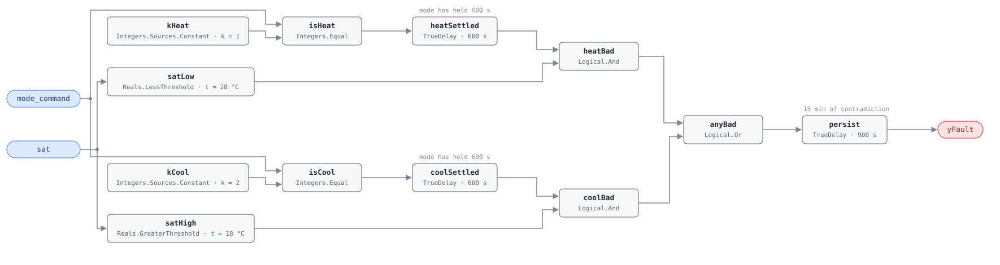

## Description

A heat pump is one refrigeration circuit run in either direction, and the
reversing valve chooses the direction. When the valve does not shift, the unit
keeps doing what it was doing last: cooling a building that asked for heat, or
heating one that asked to be cooled. Nothing looks broken — the compressor runs,
the fans run, the controller reports the mode it commanded — and the zone
thermostat responds by asking for more of what it is already not getting. That
feedback loop is why this is severity 2. The unit is not merely inefficient, it
is adding load in the wrong direction, so whatever else serves the space pays to
undo the work; the reference's estimator `hp_capacity_kw × (1 + 1/COP)` is
exactly that accounting.

## Detection Logic

```
in_heating = (mode_command = heating_mode_code) held for mode_switch_settle_time
in_cooling = (mode_command = cooling_mode_code) held for mode_switch_settle_time

heat_bad   = in_heating AND sat < sat_heating_min
cool_bad   = in_cooling AND sat > sat_cooling_max

yFault     = (heat_bad OR cool_bad) sustained continuously for alarm_delay
```

Block graph (`rule.cxf.jsonld`):



`kHeat` and `kCool` decode `mode_command` through two `Integers.Equal`
selectors, and each selector passes through its own `TrueDelay` before it is
allowed to judge anything. That settle delay is the whole reason the rule can be
this simple: for ten minutes after a changeover the duct is still full of air
from the previous mode, and a unit that switched correctly looks exactly like a
unit that did not.

The two temperature tests are absolute limits rather than a comparison against
return air, because `rat` is not among the points the reference gives this rule.
`satHigh` and `satLow` are strict, so a discharge sitting exactly at 18.0 °C in
cooling or 28.0 °C in heating reads healthy. Between the limits is a deliberate
dead band: lukewarm air — 22 °C in either mode — satisfies neither test, so a
partially shifting valve, or a unit so short of charge it barely moves heat
either way, lives there and is HP-0001's to find.

`anyBad` ORs the two branches so one output covers both directions, and
`persist` requires 15 continuous minutes. The chain matters more than either
delay alone: from a cold start in a bad mode the alarm lands at 1500 s, so
nothing shorter than 25 minutes of continuous wrong-direction operation raises
this fault — which is what keeps normal defrost cycles out of it, barely (see
Deviations).

## Possible Diagnoses

1. Reversing valve stuck or failed — usually mechanically seized; replacement
   runs $500–$2,000 plus refrigerant recovery
2. Reversing valve solenoid failure — the cheap end ($100–$300), and the one the
   playbook's click test isolates in a minute
3. Wiring issue between the controller and the solenoid: the valve is fine and
   never got the signal
4. Refrigerant charge too low for the valve to shift — the valve needs a
   pressure differential to move, so check charge before condemning the valve
5. Sequencing error upstream of the valve — the unit faithfully executing a mode
   the building did not want, usually a stuck `mode_command` in the BAS priority
   array

## Energy Impact

CRITICAL_WASTE, MEDIUM confidence, PROXY_ESTIMATION. The reference gives 20–50%
of mode energy and the estimator `waste_kw = hp_capacity_kw × (1 + 1/COP)`,
counting both the misdirected thermal output and the electricity that produced
it. PROXY because the rule sees a command and a temperature, not capacity or
power — `hp_capacity_kw` and `COP` come from the nameplate or from HP-0001's
fitted baseline. MEDIUM because the fault is unambiguous once detected but its
cost depends on how long it ran and what else was compensating. Both climates: a
heat pump has two ways to be in the wrong mode and this rule watches both.

## Emissions Impact

Scope 2, PROXY_EMISSIONS, MEDIUM confidence; typically 1,000–6,000 kg CO₂e/yr
while a unit runs in the wrong mode — the largest single-fault range in the heat
pump chapter. An all-electric heat pump puts the whole impact in scope 2, and
the avoided-emissions basis is the marginal operating emissions rate (MOER): a
valve stuck in heating on a hot afternoon draws its worst power at the hour the
grid is dirtiest.

## Deviations

- **`sat_cooling_max` and `sat_heating_min` are adopted, not transcribed.** The
  reference's equation names both, but its tunables table lists only
  `mode_switch_settle_time` and `AlarmDelay`. The playbook states the test
  relative to return air, which this card's point list does not carry, so fixed
  limits stand in: 18.0 °C is above any plausible cooling discharge (10–14 °C)
  and below occupied space temperature, 28.0 °C is below any plausible heating
  discharge (30–45 °C) and above room temperature. Both are judgment calls and
  both are wrong for low-lift and inverter-driven units at part load, which
  produce discharge temperatures near room temperature — retune or accept
  silence. The dead band between the limits is the honest cost of not having
  `rat`.
- **The reference's "`mode_command` changed AND after `mode_switch_settle_time`"
  becomes a dwell test, not an edge test.** The block graph has no "time since
  last change" quantity, so the condition is expressed as the selector having
  been continuously true for the settle time. The two agree where it matters —
  any change flips at least one selector and restarts its timer — and the dwell
  form is stronger at boot, where `delayOnInit = true` makes a unit already
  sitting in a mode wait out the settle rather than be judged on its first tick.
- **A normal defrost cycle is ridden out by `alarm_delay`, and only just.**
  During defrost the unit reverses into cooling while `mode_command` still reads
  HEATING, so `heatSettled` is already mature and `satLow` goes true as soon as
  the discharge cools; only the 15-minute `persist` stands between a defrost and
  a false alarm, and HP-0002 puts `max_defrost_duration` at exactly 15 minutes.
  Hosts should gate on `defrost_status` or raise `alarm_delay` above their unit's
  longest legitimate defrost. A defrost long enough to trip this rule is itself a
  fault, and HP-0002 will be reporting it.
- **`rat` is not consumed**, because the reference's required points for this
  card are `mode_command` and SAT only and the HP dictionary carries no `rat`
  entry to bind. Recorded as the obvious upgrade if it gains one: `sat > rat` in
  cooling / `sat < rat` in heating needs no adopted constants and has no dead
  band.
- **The 1/2 mode encoding is this library's convention**, matching the point
  dictionary's `mode_command` entry, and both codes are parameters (`kHeat.k`,
  `kCool.k`) so a host with its own enum rebinds constants rather than editing
  the graph. Precedent: AHU-0029's `expected_mode`.
- **An unmapped `mode_command` leaves the rule structurally silent.** Both
  selectors go false and no discharge temperature can raise a fault, however
  wrong it is. That silence is NO_EVAL, not a health claim, and the host must
  treat it as such — the same stance as AHU-0029, which faces the identical gap.
- **Strict comparisons at both limits.** CDL Reals has no `GreaterEqual` or
  `LessEqual`, so a discharge sitting exactly on a limit is not a fault. The
  disagreement is measure-zero on a real-valued signal, and both sides of both
  limits are pinned.
- `delayOnInit = true` on all three timers (CDL default is `false`), the
  library's standing choice: a unit already in the wrong mode when the controller
  restarted waits out the settle and the alarm delay instead of alarming on the
  first tick.
- Operating states (compressor running) and the defrost exclusion live in
  frontmatter for host enforcement rather than in the block graph, per the
  library's design stance.
- Frontmatter `clusters` is empty: the reference lists no cluster for this fault
  and this card does not invent one. The relationship to HP-0001 and HP-0002
  is carried by `related` and the shared playbook.
- The reference publishes no test vectors for this card; every scenario in
  `vectors.json` is authored from the equation.

## Notes

The [heat-pump-faults](../../../playbooks/heat-pump-faults.md) playbook orders
the service. Step 1.3 is the manual version of this rule — command a mode
change, wait ten minutes, compare the discharge against return air. Step 2.3 is
the diagnosis: listen for the solenoid click first, because no click is a
$100–$300 solenoid rather than a $500–$2,000 valve body; then the wiring; then
the charge. Expect company — a valve failing to shift cleanly usually degrades
COP first, so HP-0001 may be reporting on the same unit, and a unit short
enough of charge to stall the valve is short enough to lose its COP. Fix the
charge before replacing anything.
