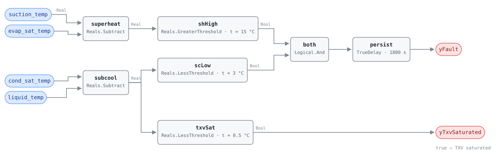

## Description

A machine short of refrigerant runs short of liquid. The expansion valve opens
further to keep the evaporator fed, and once it runs out of travel the
evaporator starves while the condenser loses its liquid seal: superheat climbs
and subcooling collapses at the same time. That divergence is the signature —
capacity loss on its own says nothing about cause. NIST SP 1087 imposed graded
charge faults on a TXV-equipped R410A heat pump in cooling and recorded exactly
this pair once the valve saturated (§5.4.3, Table 5.2, zone B), matching the
fixed-orifice charts of Breuker & Braun (1998b). This rule forms the two
differences from four refrigerant-side temperatures and alarms when both sit
past their commissioned bands for half an hour.

## Detection Logic

```
suction_superheat = suction_temp  − evap_sat_temp
liquid_subcooling = cond_sat_temp − liquid_temp

yTxvSaturated = liquid_subcooling < subcooling_two_phase_floor
                (sub-condition flag; false does NOT mean NO_EVAL)

yFault        = suction_superheat > superheat_high_band
                AND liquid_subcooling < subcooling_low_band,
                sustained continuously for alarm_delay
```

Block graph (`rule.cxf.jsonld`):



The conjunction is the diagnosis, not a noise filter. High superheat with
subcooling *high* is the liquid-line-restriction pattern (SP 1087 Table 5.2,
zone B), where refrigerant backs up ahead of the restriction; low subcooling
with superheat still normal is a valve that is compensating successfully.
Only the two together indict the charge.

Both comparisons are strict, so a unit exactly on either band reads healthy,
and both bands are per-unit commissioning values — the shipped defaults are
placeholders, not thresholds anyone measured on the machine in front of you.
`persist` requires 30 continuous minutes; `delayOnInit = true` holds that
window across a controller restart rather than alarming on the first tick.
`yTxvSaturated` reports whether the liquid line is still measurably subcooled.
It does not gate the alarm, and the reason it must not is the card's main
deviation.

## Possible Diagnoses

1. Refrigerant leak — brazed joints, Schrader cores, service-valve packing and
   flare connections, in that order of prevalence; a charge top-up without a
   leak search buys months, not years
2. The unit was charged short, at commissioning or after a repair that vented
   the circuit and was recharged by pressure rather than by weight
3. Severe condenser airflow restriction — SP 1087's zone-B chart moves
   superheat up and subcooling down for this fault too, and it separates only
   on condensing temperature, which rises rather than falls; this rule cannot
   see that (see Deviations)
4. Instrumentation: a P-T derivation configured for the wrong refrigerant, or a
   liquid-line probe with poor contact or missing insulation. Both fabricate
   the pattern on a correctly charged machine

## Energy Impact

EFFICIENCY_LOSS, MEDIUM confidence, PROXY_ESTIMATION.
`waste_kw = compressor_kw × d / (1 − d)`, the extra compressor runtime needed
to deliver the same cooling at a degraded EER. NIST SP 1087 sizes `d` directly:
every fault it tested except compressor leakage needed a fault level above 10%
to cost 5% of EER, and a 20% charge shortfall cost 6.5-13% of EER, the largest
hit in its Figure 5.17. Confidence is MEDIUM because the rule fires on a pattern,
not a severity — it reports that the charge is low, not by how much, so `d` is a
population number until the technician's gauge set supplies a real one.

## Emissions Impact

Scope 2, PROXY_EMISSIONS, MEDIUM confidence; typically 300-2,000 kg CO₂e/yr for
a commercial packaged heat pump, all of it compressor electricity, so the
avoided-emissions basis is the marginal operating emissions rate (MOER). A
leaking circuit also vents refrigerant, and R410A carries a GWP near 2,000 —
that release is a scope 1 emission this card does not estimate, because the
leak rate is not observable from any point the rule reads. A site with
refrigerant-tracking obligations should account for it separately.

## Deviations

- **The 0.5 °C subcooling floor is a sub-condition flag, not an evaluability
  gate.** SP 1087 uses it (§5.4.4) to choose *which* fault-direction chart
  applies, never to suppress evaluation, and the zone-B chart this rule encodes
  still lists falling subcooling as an undercharge symptom. Gating `yFault` on it
  would silence the rule exactly when the liquid line has flashed to two-phase —
  severe undercharge, not missing data — so the flag is named `yTxvSaturated`
  rather than `y…Ok`.
- **Fixed bands replace SP 1087's regressed no-fault baseline.** It compares each
  feature against a third-order polynomial regression on three variables (outdoor
  and indoor drybulb, indoor dew point); this library's only regression primitive
  is a host-fitted line (HP-0001). Charging-chart-style nominal targets stand in
  — a real simplification, named as one on RTU-0002's precedent, and the reason
  bands left at their defaults can alarm on a healthy machine forever.
- **Only the TXV-saturated row of the chart is encoded.** In SP 1087's zone A
  (valve still in control) undercharge moves *no* superheat at all — only
  subcooling, condensing temperature and the two air-side deltas — so a mild
  charge loss the valve is absorbing reads healthy here. Earlier investigators
  reported difficulty detecting undercharge reliably below about 40% charge loss
  (Breuker & Braun 1998b; Stylianou & Nikanpour 1996, via SP 1087 §2).
- **Two features, so severe condenser airflow restriction is not excluded.** It
  shares the zone-B superheat-up/subcooling-down pair and separates on condensing
  temperature moving up rather than down — a direction test that needs a baseline
  for the current operating condition — the host-fitted-baseline convention
  that later shipped RTU-0007. The card names it as diagnosis 3 rather than
  pretending to rule it out.
- **Grounding is cooling-mode only.** SP 1087 tested cooling exclusively, and in
  heating the coils swap roles, so the sensors sit on different heat exchangers
  even though the arithmetic is unchanged. `operating_states` says cooling; a
  heating-mode instance is an extrapolation from charge-diagnosis practice and
  needs its own commissioned bands.
- **Strict `>` and `<` at both bands.** CDL Reals has no `GreaterEqual` or
  `LessEqual`, so a unit sitting exactly on a band reads healthy. The
  disagreement is measure-zero on real-valued signals; both sides of both bands,
  and of the two-phase floor, are pinned by vectors.
- **Superheat is measured at the compressor suction, not the evaporator exit.**
  The point dictionary's `suction_temp` is a suction-line probe, and SP 1087
  notes suction superheat reads higher than evaporator-exit superheat on the same
  machine, which it attributes to heat transfer within the valve. Its 9 °C zone
  boundary is an evaporator-exit number fitted to one test rig and is
  deliberately not carried into this card as a parameter.
- **Compressor, defrost and steady-state gating stay host preconditions.** The
  graph computes the fault given valid data, per SCHEMA.md; `comp_status`,
  `defrost_status` and time-since-capacity-change are not among its inputs. The
  30-minute `alarm_delay` does not substitute — a post-start superheat overshoot
  starts the persistence timer rather than being excluded from it.
- **The pattern chart is a single-fault chart.** SP 1087 imposed one fault at a
  time, and Li & Braun (2007) showed this whole family of charts misreads
  simultaneous faults, whose feature residuals superpose. Two faults at once can
  cancel this rule's pattern or fake it; the diagnosis text is a ranking, not a
  verdict.
- `persist.delayOnInit = true` (CDL default is `false`), the library's standing
  choice. Severity 3 and `category: EFFICIENCY_LOSS` follow HP-0001 and
  RTU-0002, the library's other charge-and-capacity cards; no reference card
  exists to inherit them from.

## Notes

Do not read a cleared alarm as a repaired machine. The host gates this rule on
the compressor running, so every stop drops `yFault` for the same reason a
recharge does — the falling edge means "no longer diverging", nothing more. When
`yTxvSaturated` is true the technician should expect flash gas at the sight
glass and should weigh the recovered charge rather than trusting subcooling to
confirm the fix. HP-0001 sees the same fault as a COP shortfall without
naming it, and HP-0005 is the overcharge branch, which is why the three carry
each other in `related`. The
[heat-pump-faults](../../../playbooks/heat-pump-faults.md) playbook orders the
on-site work; its step 1 already sends the technician to superheat and
subcooling, which is the measurement this rule automates.
