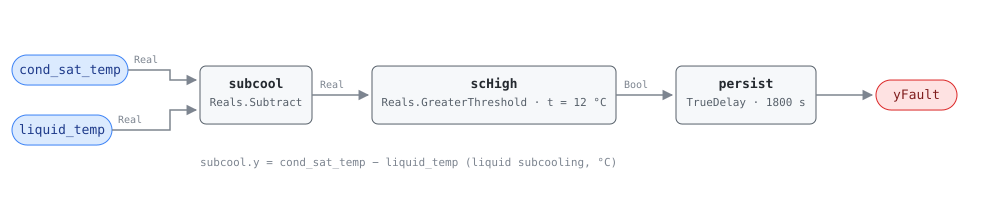

## Description

Overcharge is refrigerant the circuit has no room for. The surplus backs up into
the outlet end of the condenser, turning surface that should be condensing into
extra subcooling area, and the liquid line leaves colder relative to its own
condensing saturation temperature — subcooling rises, which is what this rule
reads. NIST SP 1087 imposed 10%, 20% and 30% overcharge on a TXV-equipped heat
pump in cooling and measured subcooling, condensing temperature and discharge
temperature all rising together while superheat did not move at all, because the
expansion valve went on holding it. The fault is cheap in energy and expensive
in compressor life: 20% too much refrigerant cost that unit 1.1-3.4% of EER, so
an efficiency rule such as HP-0001 will usually never see it.

## Detection Logic

```
liquid_subcooling = cond_sat_temp − liquid_temp

yFault = liquid_subcooling > subcooling_high_band,
         sustained continuously for alarm_delay
```

Block graph (`rule.cxf.jsonld`):



One subtraction, one comparison, one timer. `liquid_subcooling` is computed
in-graph rather than bound as a point: the point dictionary defines subcooling
as exactly this difference, and both operands are already boundary inputs.

There is deliberately no superheat term. On a unit with a thermostatic
expansion valve the valve holds superheat against the fault, and the source's
chart records superheat as unchanged for overcharge at every level it tested —
a rule that required a superheat move would be unfirable on the equipment it
targets. Nor is there an evaluability output: compressor state, mode and
defrost are host preconditions, and the source's own 0.5 °C TXV test is
implied by any subcooling large enough to fire this rule (see Deviations).

The comparison is strict, so a unit sitting exactly on the band reads healthy.
`persist` requires 30 continuous minutes and `delayOnInit = true` holds that
window across a controller restart.

## Possible Diagnoses

1. Refrigerant overcharge from service — topped up by pressure rather than by
   weight, or charge added to a unit whose actual complaint was airflow
2. Liquid-line restriction: a plugged filter-drier, a kinked line, or a
   clogged TXV inlet screen backs refrigerant up ahead of the restriction and
   raises subcooling identically. The source separates the two by condensing
   temperature falling and superheat rising, neither of which this rule reads
3. Non-condensable gas from a short or skipped evacuation — raises head
   pressure and subcooling together; confirm off-cycle by comparing standstill
   pressure against ambient saturation, which is why the source excluded it
   from its online method
4. A wrong reading rather than a wrong charge: `cond_sat_temp` derived with
   another refrigerant's P-T relation, or a liquid-line sensor with poor pipe
   contact or missing insulation
5. Flooded-condenser head-pressure control operating as designed at low
   ambient, which holds liquid in the condenser on purpose — check whether it
   is active before touching the charge

## Energy Impact

EFFICIENCY_LOSS, MEDIUM confidence, PROXY_ESTIMATION. Overcharge was the fault
EER tolerated best of the six the source imposed: 20% too much refrigerant cost
1.1-3.4% of EER across four operating conditions, and reaching a 5% hit took
32-42% overcharge — several times the charge error undercharge needs for the
same damage. `waste_kw ≈ eer_penalty × elec_power`. PROXY and MEDIUM because the
rule measures a temperature difference and borrows the penalty from published
lab results. The case for fixing it is only partly the meter: excess charge
raises head pressure and discharge temperature and pushes liquid toward the
compressor, a reliability cost this rule cannot size.

## Emissions Impact

Scope 2, PROXY_EMISSIONS, MEDIUM confidence; typically 50-400 kg CO₂e/yr for a
commercial packaged heat pump — HP-0001's range scaled down by this fault's
much smaller efficiency penalty. The waste is compressor electricity, so the
avoided-emissions basis is the marginal operating emissions rate (MOER). The
larger climate term is off that meter entirely: the excess charge must be
recovered rather than vented, and the R-410A still in most of this equipment has
a GWP above 2,000.

## Deviations

- **A fixed nominal band replaces the source's regressed reference model — the
  central simplification.** The source predicts each feature from a third-order
  polynomial in outdoor drybulb, indoor drybulb and indoor dew point, then
  tests the residual against a noise band it measured at 0.574 °C for
  subcooling. No CDL block expresses that regression, so this card tests an
  absolute subcooling the way manufacturer charging charts publish one.
  RTU-0002 names the same class of substitution for its fixed split baselines.
- **`subcooling_high_band` ships as a commissioning placeholder and the default
  is deliberately insensitive.** The source's no-fault rig ran about 5 °C of
  subcooling and 30% overcharge raised it only 2-3 °C, so at the shipped 12.0 °C
  this rule catches gross overcharge and nothing subtle. That is the price of a
  runnable default on an unknown unit; the retune is target subcooling plus
  ~3 °C, and it fails silently in both directions (set low, every hot afternoon
  alarms; set high, nothing ever does).
- **No superheat conjunct, by evidence rather than convenience.** The source's
  fault chart marks superheat unchanged for overcharge in every tested case,
  because the TXV was never driven out of its control range by this fault. The
  companion undercharge rule (HP-0004) is where superheat carries
  information — it is the feature that separates the two charge faults, not one
  that confirms either alone.
- **No `yTxvOk` evaluability output, unlike the undercharge branch.** The source
  uses subcooling above 0.5 °C at the valve inlet to decide which fault chart
  applies. Any subcooling large enough to trip this rule satisfies that test by
  construction, so the flag would be true whenever `yFault` is, and false only
  when the liquid line is effectively two-phase — a state in which "not
  overcharged" is a sound verdict, not NO_EVAL. Publishing it would invite
  hosts to discard a correct answer.
- **Discharge and condensing temperature are dropped from the pattern.** The
  source's overcharge signature is three simultaneous positive residuals
  (subcooling, condensing temperature, discharge temperature), but the other two
  are meaningful only against a conditions-regressed baseline: both track
  ambient and load directly, and no commissioning practice publishes a fixed
  nominal for either. Subcooling is the one feature of the three with a
  published target.
- **The rule stands alone; the source runs its chart only after an efficiency
  detector trips.** In the source's algorithm the rule chart is consulted only
  once EER falls 3% below the reference model. Not reproduced deliberately: its
  own results table shows 10-20% overcharge diagnosed correctly with EER
  degradation under 3% and the warning never firing, which is exactly the
  coverage this card adds over HP-0001.
- **A known confusion the rule cannot resolve.** A severe liquid-line
  restriction raises subcooling too — it appears with subcooling up in the
  source's saturated-valve chart — and so does non-condensable gas, steeply.
  This card names them in Possible Diagnoses rather than pretending to a
  differential diagnosis it has no points for; the playbook narrows it on site.
- **Heating-mode use is an authored extension.** The source tested cooling only,
  and on a reversible unit the reversing valve swaps which coil is the condenser,
  so one liquid-line sensor is generally valid in one mode. Run one instance per
  mode, each with its own sensor binding and its own band. The physics of charge
  inventory carries over; this lab data does not.
- **Compressor, mode and defrost gating stay host preconditions**, per the
  library's stance that the graph computes the fault given valid data. Defrost
  matters more here than elsewhere: reversing the circuit scrambles both
  refrigerant temperatures for minutes, and every reading during and just after
  is noise to this rule (HP-0002 and HP-0003 precedent).
- **Strict `>` at the band.** CDL Reals has no `GreaterEqual`, so a unit exactly
  on the band reads healthy where a technician would call it high — measure-zero
  on a real-valued signal, and both sides are pinned by vectors.
- `persist.delayOnInit = true` (CDL default is `false`), the library's standing
  choice: a unit already overcharged at controller start waits out the full 30
  minutes rather than alarming on the first tick.
- **Single-fault provenance.** The source's chart, like every chart of this
  family, is fit from single-fault tests and misreads combinations. One boolean
  on one feature inherits no ranking error, but read the diagnosis list as a
  family rather than a verdict whenever a second fault is plausible.
- Severity 3, `category: EFFICIENCY_LOSS` and `clusters: []` are authored, not
  inherited — there is no reference card for this fault. `method: rule`
  describes this graph, not the source, whose own diagnosis is a probabilistic
  classifier over regressed residuals. Every scenario in `vectors.json` is
  library-authored and replayed against the pinned engine rev.

## Notes

Read alongside HP-0001, which will usually be silent here by design, and
HP-0004, the undercharge branch — the two firing together is a contradiction
and means a sensor or a P-T lookup is wrong, not that the unit is both over- and
undercharged. Confirm at the service ports before recovering anything; the
[heat-pump-faults](../../../playbooks/heat-pump-faults.md) playbook orders the
charge work, and resolution is subcooling back inside the manufacturer's
charging-chart target with the recovered refrigerant weighed rather than
guessed. Rule out the liquid-line restriction first: pulling charge out of a
unit with a plugged drier makes the machine worse.
