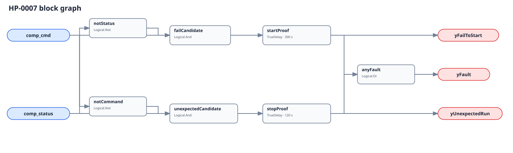

## Description

This rule checks whether the heat-pump compressor did what its final Boolean command
requested. Commanded on without independent proof is a fail-to-start; proven on
without command is unexpected operation. The direction identifies the mismatch,
not its cause, and neither diagnostic output is an evaluability gate.

## Detection Logic

```
fail_to_start  = comp_cmd AND NOT comp_status
unexpected_run = NOT comp_cmd AND comp_status

yFailToStart   = fail_to_start sustained for start_proof_time
yUnexpectedRun = unexpected_run sustained for stop_proof_time
yFault         = yFailToStart OR yUnexpectedRun
```



Each direction has its own `TrueDelay(delayOnInit=true)`. Agreement clears both
lanes immediately. A direct mismatch reversal clears the old diagnostic and
starts the other timer from zero; elapsed time never transfers between lanes.

## Possible Diagnoses

1. Compressor, contactor, inverter, capacitor, disconnect, or power failure.
2. High/low-pressure, temperature, current, oil, or OEM safety lockout.
3. Final command incorrectly bound upstream of anti-cycle or permissive logic.
4. Bad compressor proof, command/status wiring, or multi-compressor aggregation.
5. OEM defrost, pump-down, protection sequence, or local service control.

## Energy Impact

The effect is direction-dependent. Unexpected operation can waste measured
electrical energy during the mismatch. Fail-to-start is primarily availability,
comfort, and diagnostic-coverage loss; these two booleans cannot price it.

## Emissions Impact

Scope 2 is proxy-only for unexpected operation: multiply independently measured
device kW by mismatch hours and an appropriate operating emissions factor. Do
not claim avoided energy or emissions for fail-to-start without another model.

## Deviations

- **Both timers are adopted commissioning values.** No cited source establishes
  universal heat-pump compressor proof windows. Configure them independently around
  the actual sequence, proof device, sampling, and network latency.
- **The command is final and device-scoped.** An upstream enable, demand, or
  fleet request can disagree with status while downstream logic works correctly.
- **Status is independent proof.** Command echo makes the graph tautological;
  proof type determines whether electrical operation, rotation, or delivery was
  actually demonstrated.
- **No whole-rule suppression is encoded.** Fail-to-start can invalidate another
  rule's running premise, but unexpected operation may leave that rule physically
  meaningful; current metadata cannot suppress by direction.
- **`delayOnInit=true` is explicit on both lanes.** Evaluator restart into an
  existing mismatch must serve the full configured proof time.
- **No empirical FPR or TPR is claimed.** Current simulation telemetry cannot
  provide both an independent final command and field-like proof for this device.
- **The 300 s start allowance is an adopted commissioning placeholder for
  final-command-to-proof latency.** It is not permission to bind upstream demand;
  ordinary anti-short-cycle timing belongs before comp_cmd.
- **Fleet OR aggregation has a documented blind spot: a lag compressor can fail while
  the lead keeps both OR signals true.** Per-compressor instances are required whenever
  telemetry permits.
- **A brief compressor-off interval during defrost is raw fail-to-start if the final
  command stays true.** The host excludes the transition unless the OEM final command
  already represents it.

## Notes

Use yFailToStart to question the running premise of HP-0001 through HP-0006 and the
compressor-status premise of related RTU-0001. yUnexpectedRun may leave those
measurements meaningful, so no whole-rule suppression is encoded.
