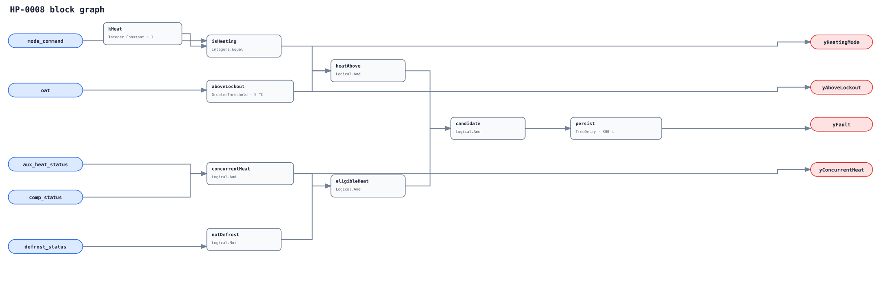

## Description

This rule detects a proven auxiliary heat source operating concurrently with
the heat-pump compressor above the configured outdoor lockout in heating mode,
outside defrost. It targets prohibited concurrent operation, not emergency
heat, required low-temperature supplementation, or balance-point optimization.

## Detection Logic

```
heating_mode   = mode_command == heating_mode_code
above_lockout  = oat > aux_heat_lockout_oat
concurrent_heat = aux_heat_status AND comp_status
candidate = heating_mode AND above_lockout AND concurrent_heat
            AND NOT defrost_status

yHeatingMode = heating_mode
yAboveLockout = above_lockout
yConcurrentHeat = concurrent_heat
yFault = candidate sustained for sustained_duration
```



The OAT comparison is strict. Diagnostic outputs are immediate;
`TrueDelay(delayOnInit=true)` applies only to the complete signature. Any
false candidate subcondition resets timing and clears a mature alarm.

## Possible Diagnoses

1. Auxiliary lockout or dual-fuel switchover misconfigured or disabled
2. Staging/thermostat sequence energizes backup heat too early
3. OAT sensor bias, bad location, stale value, or wrong unit conversion
4. Auxiliary proof bound to command, availability, or a non-space-heating load
5. Compressor-capacity fault causing an authorized recovery mode not host-gated
6. Defrost, emergency, demand-response, or commissioning state omitted from gating

## Energy Impact

Unnecessary resistance or fuel backup can displace more efficient compressor
heating. Estimate only from verified auxiliary stage input during fault hours,
after proving that the installed sequence did not require the extra capacity.

## Emissions Impact

Scope 2 applies to electric auxiliary heat and compressor power; Scope 1 can
apply to fuel backup. Use measured or nameplate stage input and appropriate
time-varying electricity or fuel emissions factors.

## Deviations

- **5 °C is not a portable default.** It is an adoption-blocking placeholder;
  the applicable value is the installed balance/lockout or switchover strategy.
- **Confidence is MEDIUM rather than the brief's proposed HIGH.** Auxiliary
  role/proof, dual-fuel behavior, site setpoint, and emergency/recovery modes
  must be established before concurrent operation is avoidable.
- **Auxiliary semantics are provisional.** Brick and 223 provide generic
  heating/status patterns but no exact auxiliary role; topology and independent
  proof must identify the real supplemental source.
- **Defrost is encoded; other exceptions are host gates.** Emergency, failure,
  demand-response, and recovery state semantics are site-specific.
- **No automatic suppression is added.** HP-0007 direction should lead diagnosis,
  but unexpected compressor proof can leave this concurrent-energy signature valid.
- **No empirical FPR or TPR is claimed.** Current datasets do not expose aligned
  auxiliary-production proof, defrost state, and the configured site lockout.
