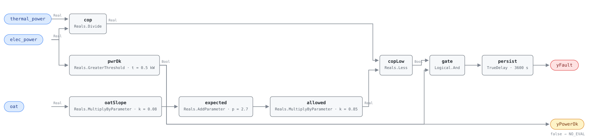

## Description

A heat pump's efficiency is a moving target. The same machine that returns four
units of heat per unit of electricity on a mild afternoon returns two on a cold
night, and neither number is a fault — the lift across the refrigerant circuit
is what changed. So there is no COP a heat pump is supposed to hold, and any
diagnostic built on a fixed threshold either alarms every winter or never alarms
at all.

What there is, for a given machine in a given mode, is a line. Plot measured COP
against outdoor air temperature across a couple of weeks of normal operation and
the points fall close enough to a straight line to predict the next one. This
rule evaluates that line. The host fits it — fourteen days of learning, R² above
0.6 — and writes the slope and intercept in as parameters; the graph computes
what the unit should be doing at today's outdoor temperature and asks whether it
is within 15% of it. Everything statistical about this fault happens before the
first tick.

Barandier (2023) found refrigerant undercharge to be the most frequent heat pump
fault, and undercharge is exactly what this rule sees best: it degrades COP
across the whole operating range without producing a single reading that looks
wrong on its own. The unit still heats, the space is still comfortable, and the
only symptom is a compressor that runs longer than the one on the roof next door.

## Detection Logic

```
measured_cop = thermal_power / elec_power
expected_cop = cop_baseline_slope × oat + cop_baseline_intercept
allowed_cop  = cop_ratio_threshold × expected_cop

yPowerOk = elec_power > elec_power_min          (false ⇒ host reports NO_EVAL)
yFault   = measured_cop < allowed_cop AND yPowerOk,
           sustained continuously for alarm_delay
```

Block graph (`rule.cxf.jsonld`):



`oatSlope` and `expected` are the fitted line, one multiply and one add, and
they are the whole statistical content of the rule at runtime. `allowed` scales
the line down by the tolerance, so the comparison is against a second line
parallel to the first rather than against a number. At the shipped placeholders
that gives an expected COP of 3.5 at 10 °C against an allowance of 2.975, an
expected 2.3 at −5 °C against 1.955, and an expected 4.3 at 20 °C against 3.655.
The `same_cop_is_healthy_on_a_cold_day` and `same_cop_is_a_fault_on_a_warm_day`
vectors are the regression test for that: identical power readings, opposite
verdicts, decided entirely by where `oat` put the line.

`cop` is the only division in the rule and its denominator is a live signal that
goes to zero every time the compressor stops. That is what `pwrOk` is for. With
both meters reading zero the quotient is NaN; with a standby trickle and no heat
output it is a clean, believable 0.0, which is the more dangerous of the two
because nothing downstream would flag it. `pwrOk` drives both the boundary
output `yPowerOk` and the second input of `gate`, so a unit below the floor
holds `yFault` down and the host knows the silence means "not evaluated" rather
than "healthy". Compare RTU-FC-051, whose divisor is a selected constant and
needs no such guard, and AHU-FC-055, whose divisor is a temperature difference
that can pass through zero from either side.

The comparison is strict, so a unit sitting exactly on the allowed line reads
healthy and one a hundredth below it alarms. `persist` then requires 60
continuous minutes of shortfall, which is long enough to ride out a defrost
cycle, a capacity step, or a load transient the compressor has not caught up
with.

## Possible Diagnoses

1. Refrigerant undercharge — the most common heat pump fault per Barandier
   (2023), and the first thing to measure. Check subcooling and superheat at the
   service ports
2. Refrigerant overcharge, which degrades COP the same way and is less common
3. Condenser or evaporator coil fouling — the same pathology RTU-FC-051 detects
   from the air side, and worth ruling out with a filter change before anything
   is opened up
4. Compressor degradation: worn valves or bearings show as elevated amp draw
   against nameplate for the same delivered capacity
5. Non-condensable gases in the refrigerant circuit, usually from a service
   procedure that skipped or shortened the evacuation

## Energy Impact

EFFICIENCY_LOSS, MEDIUM confidence, BASELINE_COMPARISON. The estimator is the
ratio the rule already computes:
`waste_kw = elec_power × (1 − measured_cop / expected_cop)`. A unit drawing
2.0 kW at COP 2.8 against a 3.5 baseline is spending 0.4 kW on the degradation
and the rest on heat. The reference puts the range at 5–25% of compressor
energy, which is wide because it spans a small charge loss at one end and a
badly fouled coil or a failing compressor at the other.

Confidence is MEDIUM rather than HIGH for a reason that is structural, not
statistical: the baseline is this unit's own recent behavior, so the rule
measures degradation *since the learning period* and is blind to anything that
was already wrong when the line was fitted. A heat pump commissioned undercharged
learns an undercharged baseline and reads healthy forever. Climate sensitivity is
both — the fault costs in whichever mode the fitted line belongs to, and a unit
that is degraded in heating is usually degraded in cooling too, which is why the
reference asks for the two modes to be evaluated separately rather than averaged.

## Emissions Impact

Scope 2, PROXY_EMISSIONS, MEDIUM confidence; typically 300–2,500 kg CO₂e/yr for
a commercial packaged heat pump. All of it is electricity at the compressor, so
the avoided-emissions basis is the marginal operating emissions rate (MOER).
The timing is worth noting: degradation costs most at the extremes of the
outdoor temperature range, when the unit runs longest and the grid is at its
dirtiest, so the emissions saved by a charge correction are worth more than the
annual average kWh figure suggests.

## Deviations

- **`cop_baseline_slope` and `cop_baseline_intercept` ship as placeholders.**
  The reference does not give numbers here and could not: it specifies
  `expected_cop = regression_model.predict(OAT)`, a model the host fits over
  `learning_period_days` (14 d) against `R² > 0.6`. This library's split puts
  the fitting in the host and the fitted line in the graph, so the two
  coefficients are ordinary `set_param` targets. The shipped 0.08 /°C and 2.7
  describe a generic air-source heat pump in heating (COP ≈ 2.1 at −8 °C, 3.5 at
  10 °C, 4.3 at 20 °C) and exist so the document is runnable as delivered.
  **They are not site values, and a wrong pair fails silently in both
  directions** — fit the line 20% high and every hour alarms, fit it low and
  nothing ever does. Precedent: VAV-FC-050's `ventilation_requirement` carries
  the same warning for the same reason.
- **`cop_baseline_slope` is allowed to be negative, and this is the documented
  exception to the library's no-negative-parameters rule.** The standing
  convention is to express a negative constant as `Sources.Constant` plus
  `Subtract` so no parameter carries a sign. A regression slope is inherently
  signed: it is positive for a heating-mode fit (COP rises with outdoor
  temperature) and negative for a cooling-mode fit (COP falls as it gets hotter),
  and the same rule instance must accept either without being rewired. Forcing
  the sign into the topology would mean two different graphs for one fault.
  Note this is about the *parameter*, not the signal — `oat` is routinely
  sub-zero, and `MultiplyByParameter` handles that with no special treatment
  (the `cold_day_genuinely_degraded` vector runs at −5 °C).
- **The degradation test is expressed as a ratio, not as the reference's
  fraction.** The reference writes
  `(expected_cop − measured_cop) / expected_cop > cop_degradation_threshold`
  with a 15% default. This rule computes `measured_cop < 0.85 × expected_cop`,
  which is the same predicate for any positive `expected_cop` and avoids a
  second division whose denominator is a fitted line — a line that, for a
  cooling-mode fit extrapolated far enough, passes through zero and changes
  sign. The consequence for hosts is the units: `cop_ratio_threshold` is a
  fraction of the baseline that must be *retained* (0.85), not a percentage that
  may be *lost* (15). Writing `15` into it does not disable the rule quietly; it
  makes the rule alarm permanently, since every measured COP is below 15 ×
  expected.
- **`elec_power_min` and `yPowerOk` are adopted, not transcribed.** The
  reference names no power floor; its evaluability gate is
  `min_runtime_for_eval`, a time-since-transition test the block graph cannot
  see. But the graph divides by a live signal, and per SCHEMA.md a test
  computable from the rule's own inputs belongs in the graph as a boundary
  output rather than as prose. The 0.5 kW default is a library adoption sized
  for a small commercial packaged unit; a host with a 20 kW compressor should
  raise it, and one with a small variable-speed unit that genuinely modulates
  down to 0.4 kW must lower it or lose evaluability across the bottom of the
  turndown range.
- **`min_runtime_for_eval` (15 min) and `learning_period_days` (14 d) stay host
  preconditions.** Both gate on things outside the graph's view — time since a
  capacity transition, and a fitting run that happens offline. The 60-minute
  `alarm_delay` covers the pull-down after a start in steady operation but does
  not substitute for the precondition: a unit that takes 20 minutes to settle
  spends a third of the alarm window looking degraded rather than being excluded
  from it.
- **The fitted line is extrapolated without limit.** Nothing in the graph knows
  the outdoor temperature range the regression was fitted over, so at a far
  enough `oat` the expected COP drifts into values the fit never supported and,
  for a cooling-mode fit, eventually goes negative — at which point `allowed`
  is negative too, every positive measured COP clears it, and the rule goes
  silently quiet. The block set has no domain guard to express this, so it is a
  frontmatter precondition. A host that wants it enforced can clamp `oat` with
  `Reals.Limiter` upstream of the rule.
- **Mode separation is instance-level.** The reference evaluates heating and
  cooling separately, and this rule has no mode input: it carries exactly one
  line and one alarm. A reversible unit runs two instances with two fitted
  pairs, and the host enables whichever matches the mode currently commanded.
  Merging them into one instance would need a `Switch` on `mode_command` and
  four coefficients, which is a different rule and not the one the reference
  specifies.
- **Strict `<` at the allowance, where the playbook reads inclusively.** The
  card's equation is a strict inequality, but the heat pump playbook's step 1.a
  says "a 15% or greater drop below the baseline curve indicates degradation".
  CDL Reals has no `LessEqual`, so the strict form is the expressible one and a
  unit sitting exactly on the allowed line reads healthy. The disagreement is
  measure-zero and both sides are pinned (`cop_exactly_at_the_allowance`,
  `cop_just_below_the_allowance`); the boundary is bit-exact rather than
  approximate because the vectors put a power of two in the divisor.
- **`method: statistical` describes the baseline's provenance, not the runtime.**
  The graph performs one division, one multiply-add, one scale and one
  comparison. The classification is the reference's and it is honest: the
  coefficients come from a regression, and the library records that rather than
  relabelling the card. RTU-FC-051 carries the same note for the same reason.
- `persist.delayOnInit = true` (CDL default is `false`), the library's standing
  choice: a unit already below its line at controller start waits out the full
  hour rather than alarming on the first tick.
- Operating states and preconditions are declared in frontmatter for host
  enforcement rather than encoded in the block graph, per the library's design
  stance. Severity 3 and `method: statistical` are the reference's chapter 11
  card; its §5.8.4 index carries no severity column.
- **No test vectors are transcribed, because the reference publishes none.**
  Every scenario in `vectors.json` is authored from the equation and replayed
  against the pinned engine rev.

## Notes

Read `yPowerOk` before reading `yFault`. The two scenarios
`alarm_clears_after_charge_restored` and `compressor_stop_forces_no_eval` are
indistinguishable in `yFault` alone — in both the alarm asserts at 3600 s and
drops at 5400 s — and they mean opposite things. A host that treats the falling
edge of `yFault` as a repair will close this fault every time the heat pump
finishes a cycle.

The [heat-pump-faults](../../../playbooks/heat-pump-faults.md) playbook orders
the on-site work by prevalence: charge first (subcooling and superheat), then
overcharge, then the coils, then compressor amp draw, then non-condensables. Its
resolution test is COP returning to within 10% of the baseline curve over seven
days, which is tighter than the 15% this rule alarms at — a unit recovered to
12% degraded clears the alarm without being fixed.

The coil branch of the diagnosis is the one worth checking against another rule.
RTU-FC-051 sees evaporator fouling from the air side as a collapsed temperature
split, and on packaged heat pump equipment the two rules can be run together on
the same unit: fouling trips both, while a charge problem trips this one and
leaves the split alone until the loss is large enough to matter. Neither can see
superheat, which is where the two causes actually separate.

One caution about the learned baseline that has no fix in the rule. Because the
line is fitted from the unit's own history, re-fitting it after a fault has
developed bakes the fault in as the new normal — the rule then reports healthy
on a machine everybody agrees is degraded. Whatever schedules the learning run
should refuse to re-fit while this fault is active, and a commissioning-time fit
on a unit whose charge was never verified is worth exactly as much as that
verification.
