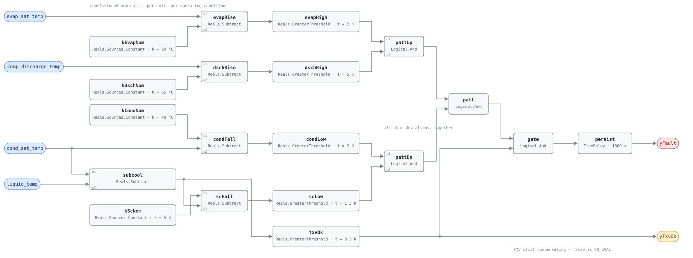

## Description

A reversing valve fails two ways and HP-FC-052 only catches the first: a valve
that never shifts, caught by discharge air that contradicts the commanded mode.
This card catches the second — a valve that shifts correctly and then leaks
internally, letting hot discharge gas bypass the slide straight back to the
suction line. The unit still heats when told to heat, so the air-side test sees
nothing and capacity quietly falls instead. NIST SP 1087 imposed graded leakage
on an instrumented R410A residential heat pump and found it the most
EER-sensitive of the six faults studied: 5.0% leakage cost 5.5% EER, while
every other fault needed more than 10% fault level to lose the same 5%.

## Detection Logic

```
subcooling = cond_sat_temp − liquid_temp

evap_rise  = evap_sat_temp       − evap_sat_nominal  > evap_sat_rise_min
disch_rise = comp_discharge_temp − disch_nominal     > disch_rise_min
cond_fall  = cond_sat_nominal    − cond_sat_temp     > cond_sat_fall_min
subc_fall  = subcool_nominal     − subcooling        > subcool_fall_min

yTxvOk = subcooling > txv_control_min_subcool   (false ⇒ host reports NO_EVAL)
yFault = evap_rise AND disch_rise AND cond_fall AND subc_fall AND yTxvOk,
         sustained continuously for alarm_delay
```

Block graph (`rule.cxf.jsonld`):



The conjunction is the diagnosis, not a robustness measure. Condenser airflow
restriction also raises evaporating and discharge temperature and drops
subcooling, but pushes condensing temperature *up*; undercharge drops
condensing temperature and subcooling but leaves evaporating and discharge
temperature alone. Drop either conjunct and the rule stops naming this fault.

`yTxvOk` is the source's own control-limit test: above roughly 0.5 K of
subcooling the valve inlet is single-phase liquid and the valve is still
compensating, which is the regime its direction chart describes. Deploy knowing
the consequence — the evaluable subcooling window is
`(txv_control_min_subcool, subcool_nominal − subcool_fall_min)`, so a leak
severe enough to collapse subcooling past the floor reads NO_EVAL, not FAULT.

All five comparisons are strict. `persist` requires 30 continuous minutes, and
`delayOnInit = true` holds that window across a controller restart.

## Possible Diagnoses

1. Reversing valve internal bypass leakage — an eroded or worn slide seal; the
   valve body is replaced rather than repaired, $500–$2,000 plus refrigerant
   recovery
2. Compressor internal leakage — worn discharge valves or scroll flanks produce
   the same refrigerant-side pattern from a different component, and the source
   imposed both under one fault label. The service call separates them; this
   rule cannot
3. Valve parked off-seat — a weak solenoid, a blocked pilot line, or low charge
   leaving too little differential to seat the slide, which then leaks by
   definition
4. Stale nominals — an instance commissioned at one operating condition and
   evaluated at another. Check the commissioning record before condemning
   hardware
5. Refrigerant-side instrumentation — a discharge sensor reading high, or a
   host P-T lookup configured for the wrong refrigerant, each move a conjunct
   with nothing in the rule to contradict them

## Energy Impact

EFFICIENCY_LOSS, MEDIUM confidence, PROXY_ESTIMATION. NIST SP 1087 Table 5.12
measured EER degradation tracking leakage close to one-for-one across four test
conditions: 5.0% leakage → 5.5% EER lost, 9.3% → 8.9%, 27.2% → 23.0%, 38.2% →
33.5%. The estimator is `waste_kw = elec_power × eer_degradation_fraction`,
with the fraction taken from that relationship or from HP-FC-050's fitted
baseline on the same unit. PROXY because this rule reads four temperatures and
no power at all. MEDIUM because the direction evidence is a controlled
fault-imposition study but the magnitudes come from one lab unit in one mode.

## Emissions Impact

Scope 2, PROXY_EMISSIONS, MEDIUM confidence; typically 200–1,500 kg CO₂e/yr for
a commercial packaged heat pump, all of it compressor electricity, so the
avoided-emissions basis is the marginal operating emissions rate (MOER). Note
what is *not* here: an internally leaking valve loses nothing to atmosphere, so
there is no scope 1 refrigerant component to add — the whole impact is the
extra electricity, and it is worst at high lift, when the unit runs longest and
the grid is dirtiest.

## Deviations

- **Fixed nominal targets replace the source's regressed reference model.** NIST
  SP 1087 classifies each feature's residual against a third-order polynomial
  fitted in three variables (indoor drybulb, outdoor drybulb, indoor dew point).
  The block set's only regression primitive is a host-fitted line (HP-FC-050),
  so the four nominals become commissioning constants valid near the condition
  they were recorded at — the same named simplification RTU-FC-051 makes when
  it fixes its per-stage split baselines.
- **The shipped nominals are the source's rig, not your unit.** 10 °C
  evaporating, 66 °C discharge, 40 °C condensing and 5 K subcooling are the
  no-fault steady-state readings of NIST SP 1087 §3.2.3, taken on an R410A
  residential split at 26.7 °C indoor / 27.8 °C outdoor. They make the card
  runnable as delivered and nothing more.
- **The deviation bands are adopted, not transcribed.** The source's neutral-case
  thresholds run 0.3–1.0 K at 99% credibility, derived from lab instrumentation
  *and* a fitted model. Against a fixed nominal the operating-condition swing
  that model absorbed lands in the residual instead, so the shipped bands are
  several times wider. Narrow them only as far as a site's own commissioning
  spread allows.
- **Superheat is not consumed, though the source lists it as a feature.** Its
  chart marks superheat neutral for this fault and for every other TXV-in-control
  pattern, so a neutrality conjunct would discriminate nothing while adding
  `suction_temp` and two thresholds. Measurement point matters here: the
  source's superheat is at the evaporator exit where the TXV holds it, whereas a
  superheat computed from `suction_temp` sits downstream of the bypass and would
  read high — which is a reason for charge rules to distrust suction-line
  superheat while this fault is live, not a reason to test it here.
- **The evaluability test is the source's general control-limit criterion, not
  its rig-specific zone split.** §5.4.2 grounds it physically — subcooling above
  ~0.5 K at the valve inlet means single-phase liquid and a valve still
  compensating — while the 9 °C superheat boundary the report also uses is a
  fitted artifact of that rig's flow-coefficient curve. Only the general form
  belongs in a portable graph.
- **Not a suppression relationship with HP-FC-052.** That card asks whether the
  valve switched at all, from discharge air; this one asks whether a switched
  valve holds its seal, from refrigerant temperatures. Neither failure implies
  the other and both can be absent at once, so the link is carried by `related`
  and `suppresses`/`suppressed_by` stay empty.
- **Cooling mode only.** The source imposed every fault in cooling and publishes
  no heating-mode direction chart. Symmetry is physically plausible and
  unverified, and this library does not ship unverified direction charts; a
  heating-mode instance needs its own grounding and its own nominals.
- **A leak below roughly 5% of refrigerant flow is out of reach.** The source's
  own classifier misread 2.4–2.5% leaks as no-fault or as undercharge at EER
  losses of 1.3–3.4% (Table 5.18) — with lab instrumentation and a regressed
  baseline. A fixed-nominal rule is strictly weaker, so treat silence as "not
  this fault yet", never as a clean valve.
- **Single-fault reasoning only.** The direction chart is fitted from
  single-fault tests and its classifier assumes independence across features
  (Li & Braun 2007). Two simultaneous faults can cancel a conjunct or fabricate
  one; this card names one hypothesis, and the playbook's charge check is what
  rules out the common companion.
- **Strict comparisons at all five limits.** CDL Reals has no `GreaterEqual`, so
  a feature sitting exactly on its band edge reads healthy and subcooling
  exactly at `txv_control_min_subcool` reads NO_EVAL. The disagreement is
  measure-zero on real-valued signals and both sides of every limit are pinned
  by vectors.
- `persist.delayOnInit = true` (CDL default is `false`), the library's standing
  choice: a unit already showing the full pattern when the controller restarts
  waits out the 30 minutes rather than alarming on the first tick.
- Operating state, the compressor-running gate and the defrost exclusion live in
  frontmatter for host enforcement rather than in the block graph, per the
  library's design stance. Defrost is the sharp case: it reverses the circuit on
  purpose, which is this rule's fault pattern by design.
- The source publishes no deployable test vectors; every scenario in
  `vectors.json` is authored from its Table 5.2 direction chart and replayed
  against the pinned engine rev.

## Notes

Check charge first: undercharge shares two of this rule's four conjuncts, is far
more common, and is cheap to rule out. The
[heat-pump-faults](../../../playbooks/heat-pump-faults.md) playbook orders that
work. Expect HP-FC-050 on the same unit — a leak large enough for this rule to
see costs 5% EER or more, a third of the way to that card's alarm. Read
`yTxvOk` before `yFault`: a severe leak can drive subcooling under the
control-limit floor and silence the rule when it matters most. `evap_sat_temp`
and `cond_sat_temp` are host-derived P-T conversions, and a lookup configured
for the wrong refrigerant biases three of the four conjuncts at once.
