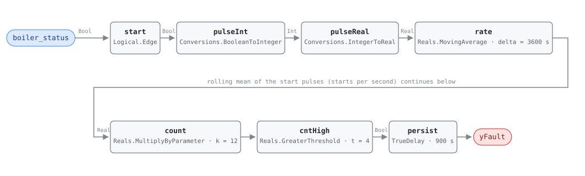

## Description

Every boiler start pays twice: a pre-purge that pushes the previous cycle's heat
up the stack, a burner run through the part of its range where the fuel/air
ratio is worst, and a post-purge that does it again. The vessel takes a thermal
step with each one — fire side at flame temperature in seconds, water side
lagging — and the differential works the tube sheet, refractory and welds. The
reference puts the efficiency penalty at 3–5% and the avoided damage at
$10K–$100K, which is the argument for severity 2 on a fault whose energy number
is modest. None of the causes is visible from the water temperature, which is
why this shows up as a start count rather than a comfort complaint; the rule
reports that the burner starts more often than the plant should need, and the
service call decides why.

## Detection Logic

```
start  = rising edge of boiler_status                      one tick wide
count  = MovingAverage(start, count_window) × count_scale   starts in the trailing hour
yFault = count > max_starts_per_hour, sustained continuously for alarm_delay
```

Block graph (`rule.cxf.jsonld`):



`Reals.MovingAverage` is a continuous-time integral mean, so a one-tick pulse of
height 1.0 encloses exactly one tick interval of area: `n` starts inside the
window give `rate = n · dt / count_window`, and `count_scale = count_window / dt`
recovers `n` exactly (four starts an hour at a 300 s tick is precisely 4.0 in
IEEE-754). **`count_scale` must be retuned to the host tick** — left at 12.0 on
a 60 s tick the count reads a fifth of the true cadence and the rule never
fires, and a mis-set scale gives a plausible number rather than an error. The
legal tick band is `57.15 s ≤ dt < 360 s` (Deviations); 300 s is recommended and
is the only tick these vectors exercise.

`cntHigh` is strict, so four starts an hour reads clear and five alarms;
`persist` then requires 15 minutes above the ceiling and carries
`delayOnInit = true`. The count is rolling, not tumbling: a crossing survives
`count_window` minus the span of the starts that caused it, so the same five
starts in one hour alarm or not depending on how tightly they are packed, and
the alarm outlives the cycling by up to a full hour. During the first
`count_window` the average divides by elapsed time rather than by the window and
reports an extrapolated pace that `alarm_delay` is too short to cover — the host
NO_EVAL precondition for that hour is load-bearing.

## Possible Diagnoses

Transcribed from the reference's HW-0001 card:

1. Boiler oversized for the current load — the fix is staging, a lead boiler
   with more turndown, or a buffer tank
2. Aquastat differential too small, so the burner satisfies and relights a
   minute later. Check this first: it is free and remote
3. Staging logic cycling between boilers, which no single boiler's own controls
   would cause — the reason this rule is bound per boiler
4. Short-circuiting in the piping — primary/secondary imbalance returning supply
   water to the boiler inlet, which reads as load satisfaction
5. Control valve hunting downstream, modulating plant load faster than the
   boiler can follow (AHU-0004 is the AHU-side view of the same instability)

## Energy Impact

PROTECTIVE, MEDIUM confidence, QUALITATIVE_ONLY. The rule sees one boolean and
cannot price a start, so there is no waste term computable from its inputs. Size
the opportunity host-side: cycling hours × rated fuel input × the 3–5%
efficiency penalty (Energy Impact Reference §4.4), with the $10K–$100K of
avoided boiler damage as the larger and more probabilistic term. Confidence is
MEDIUM because the efficiency figure depends on cycle length, return water
temperature and how far the vessel gets from steady state, none of which this
rule measures. Heating-dominant: the plant only runs in the heating season.

## Emissions Impact

Scope 1, QUALITATIVE_EMISSIONS, MEDIUM confidence. This is combustion at the
building, so the 3–5% loss is fuel burned on site rather than purchased
electricity whatever the grid is doing. The reference records the range as
"protective; indirect via boiler degradation" and sets the avoided-emissions
basis to N/A, which this card keeps — the larger term is the embodied carbon of
a pressure vessel replaced years early.

## Deviations

- **`min_run_time` is a tunable, not a graph parameter.** The reference lists it
  at 10 min beside `max_starts_per_hour` and then prints one line of logic,
  never saying how a per-cycle duration enters the verdict. Recorded as a
  transcription gap rather than filled in with invented logic; the starts-per-hour
  ceiling subsumes the protective intent, and RTU-0001 documents the identical
  gap.
- **The rolling count is built from a moving average, because the block set has
  no windowed counter.** `Integers.OnCounter` counts monotonically from a reset,
  so a trailing hour would need a host-driven reset — a tumbling window whose
  verdict depends on where the boundary falls. AHU-0004 established the idiom
  and RTU-0001 carried it to a compressor.
- **`count_scale = count_window / dt` couples the rule to the host tick, and the
  failure is silent.** A host ticking every 60 s must set 60.0; too low and the
  rule never fires, too high and it alarms on a healthy boiler. It belongs on
  the deployment checklist beside the point binding.
- **The legal tick band is `57.15 s ≤ dt < 360 s`.** The floor is
  `Reals.MovingAverage`'s fixed 64-checkpoint ring: `dt ≥ count_window / 63`.
  The ceiling is the edge counter — a rising edge needs a false sample between
  two true ones, and observing the first faulted cadence (5/h) needs
  `5 ≤ count_window / (2 · dt)`, i.e. `dt ≤ 360 s`; 360 s itself is excluded
  because at one half-period per tick detection depends on sampling phase.
  RTU-0001's looser `dt < 450 s` only makes the threshold exceedable at all,
  and misses the ordinary 5/h boiler.
- **Nyquist is necessary, not sufficient: the constraint is the shorter of the
  two intervals.** The honest binding rule is
  `dt ≤ min(shortest firing, shortest off period)`, which for a boiler with a
  10-minute minimum run and a tight aquastat is the off period. At the 300 s
  tick a boiler that restarts within 300 s of shutting down has starts swallowed
  and the count reads low. The failure direction is silence — right for a
  protective rule, worth knowing when a technician insists the boiler is cycling.
- **The first `count_window` reads as a pace, not a count, and `alarm_delay`
  does not cover it.** While `t < count_window` the average divides by elapsed
  time, so two starts in the first ten minutes report an extrapolated rate and
  `persist` matures on it (engine-pinned: `yFault` at 1200 s, clearing at 1800 s
  as the divisor grows). AHU-0004 is immune because its `alarm_delay` equals
  its `count_window`; this rule, like RTU-0001, is not, which is why the
  first-hour NO_EVAL precondition is load-bearing.
- **The startup edge pulse is spurious and inert.** `Logical.Edge` compares `u`
  against `pre_u_start` on the first tick, so a boiler already firing when the
  rule loads registers a start at t = 0. It never reaches the count: `dt` is
  zero on that tick, so the pulse encloses no area. `pre_u_start` is left at the
  CDL default per SCHEMA.md's "set only non-default values".
- **Strict `>` on a discrete count**, as the reference writes it: four starts an
  hour is clear and five alarms. The boundary is unambiguous rather than
  measure-zero, because the recovered count is exact in steady state —
  `12.0 × (4 × 300/3600)` evaluates to precisely 4.0.
- **The counting window is half-open.** `rate` compares the accumulated integral
  now against its value one `count_window` ago, so a start exactly that old has
  just left the window. It errs toward silence, and it is what makes the alarm
  outlive the cycling: the lag is `count_window` minus the span of the last five
  starts, a full hour when the boiler stops after a single burst.
- **`TrueDelay` asserts at exactly `T + delayTime`,** so a count that falls back
  on the same tick the timer matures reports nothing. The realized test is
  "above the ceiling for strictly more than `alarm_delay`", read at tick
  resolution; five starts spread over 45 minutes rather than 40 is the whole
  difference between an alarm and silence.
- **`persist.delayOnInit = true`** (CDL default `false`), the library's standing
  choice: a plant already cycling above the ceiling when the controller restarts
  waits out the full 15 minutes rather than alarming on the first tick.
- **Operating state is declared, not gated.** "Heating season / HW plant
  enabled" is the reference's own operating-state line; there is no plant-enable
  point in the equation to gate on, and inventing one would move the rule's
  boundary.
- **`clusters: []`.** `clusters/clusters.json` defines no cluster containing a
  hot water plant rule, and this card does not edit the cluster set. CLU-07
  (Unnecessary Plant Operation) is where HW-0003 would belong; this fault is
  not part of that syndrome.
- **No test vectors are transcribed, because the reference publishes none.**
  Every scenario in `vectors.json` is authored from the equation, and each
  assertion edge was derived by replaying the graph at the pinned engine rev
  rather than by closed-form arithmetic — the moving average's warm-up and decay
  trajectories do not match hand-computed sample statistics.
- Severity 2, phase 2, `method: rule` and the tunable defaults are the
  reference's chapter 14 card. `g36: null` — this is a research-derived rule
  (Shohet et al. 2020; Meng et al. 2021), not a G36 clause.

## Notes

Bind `boiler_status` to the burner's flame status, and bind it per boiler: an
enable that stays true all morning reports zero starts, and an OR across a
multi-boiler plant never falls while any boiler fires, so every lag-boiler start
is invisible.

Check diagnosis 2 remotely before anyone drives out — pull supply water
temperature alongside `boiler_status`, and a burner shutting down within a
degree or two of setpoint and relighting immediately is the aquastat
differential, free to widen. HW-0002 reads the same boiler from the efficiency
side: a plant tripping both may have one problem, while HW-0002 alone with a
steady fire is a combustion or heat-transfer finding.
