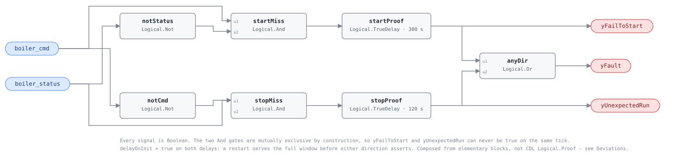

## Description

An enable is a request; firing is an outcome, and on a boiler the distance
between them is a whole burner-management sequence — prepurge, pilot trial for
ignition, main-flame establishing, each with its own proving switch. When the
sequence does not complete, the burner controller locks out and stays locked
out while the BAS keeps writing an enable into a boiler that has already decided
not to run. From the safety system's point of view nothing is broken; a lockout
is the burner control doing its job. What is broken is availability, and in
January a locked-out lead boiler is an emergency even though every component
behaved correctly. The mirror case — firing with no enable, from a switch left
in HAND or a welded contactor — burns fuel nobody asked for.

## Detection Logic

```
yFailToStart   = (boiler_cmd  AND NOT boiler_status)  sustained for start_proof_time
yUnexpectedRun = (boiler_status AND NOT boiler_cmd)   sustained for stop_proof_time

yFault         = yFailToStart OR yUnexpectedRun
```

Block graph (`rule.cxf.jsonld`):



Seven blocks: a negation, an And and a delay per direction, and one Or. The two
And gates cannot be true on the same tick, and each delay drops its output the
moment its And does, so the flags are mutually exclusive by construction — a
mismatch that changes direction takes the second window from zero
(`hand_switch_flip_never_asserts_both_directions`).

Both flags are diagnostic. Neither is an evaluability output and there is no
NO_EVAL condition inside this graph: the rule is evaluable whenever both points
are delivered, and whether they are is the host's delivery-quality job. Silence
means command and status agree, which is the healthy answer in both states.

`delayOnInit = true` on both delays. A restart serves the full window before
either direction can assert, which does real work here: a plant coming back up
is exactly when a boiler *is* mid-light-off, and the CDL default would report
the sequence this rule was built to wait for.

## Possible Diagnoses

Read the flags first; they split the list in two.

**yFailToStart — enabled, not firing:**

1. **The burner management system has locked out** — flame failure, low-water
   cutoff, high limit, low gas pressure, a combustion-air proving switch. The
   controller holds a code until someone resets it, and that code names the
   fault this rule can only point at.
2. **No fuel to burn.** A manual gas cock closed after service, a tripped safety
   shutoff valve, a regulator or gas-train pressure switch out of range. Common
   after any work on the fuel train.
3. **The burner cannot spin.** Combustion-air blower overload tripped, drive
   faulted, disconnect open, coupling or belt gone.
4. **Nothing is wrong.** The boiler is enabled and satisfied, its burner off by
   its own operating control — the precondition gate, and the first thing to
   rule out on a plant that has not implemented it.
5. **The status point failed low** — a current switch set above the burner's
   actual draw, a flame-relay contact, or a point bound to the wrong boiler.

**yUnexpectedRun — firing, not enabled:**

6. **Local control has the machine** — Hand/Off/Auto in HAND at the burner
   panel, or the boiler firing on its own aquastat with the BAS out of the loop.
   The most common cause, usually left over from a service call.
7. **The command never reaches the boiler, or never leaves.** Welded contactor
   or relay, an output wired to the wrong terminal, an enable inverted at the
   interposing relay.
8. **The status point is stuck true** — a latched current switch, or a point
   bound to a boiler that really is running.

## Energy Impact

PROTECTIVE, MEDIUM confidence, QUALITATIVE_ONLY. The directions have opposite
economics. A boiler that will not fire wastes no fuel; it costs unmet heat and
whatever carries the load instead, neither of which this library prices. A
boiler firing unbidden wastes its whole fuel input, directly measurable wherever
the host binds `fuel_power`. MEDIUM because two booleans disagreeing is
unambiguous evidence of *something* while the diagnosis stays wide open, and
because the status point is uncorroborated — diagnoses 5 and 8 are that point
failing.

## Emissions Impact

Scope 1, QUALITATIVE_EMISSIONS. Fuel burned at the boiler is a direct emission,
so the unexpected-run direction abates Scope 1 at the plant rather than Scope 2
at the meter — HW-0003's basis, and the reason a heating-plant waste term is
worth more per kWh than the same number on a fan. The fail-to-start direction
carries no emissions term of its own; whatever picks up the load carries it,
and electric backup heat usually carries it badly.

## Deviations

- **Composed from `Logical.Not` + `Logical.And` + `Logical.TrueDelay` per
  direction plus one `Logical.Or`, rather than `CDL.Logical.Proof`.** Proof is
  exported at the pinned rev and loads (a probe graph exported a content id),
  but four of its published behaviors, each reproduced on that probe, break this
  template: it starts checking as soon as *either* the `feedbackDelay +
  debounce` timer lapses or the measurement has been stable for `debounce`,
  whichever is first, so a status stably false all night gets no proof window at
  all (`yLocFal` asserted on the same tick the command rose); one window serves
  both directions, so 300 s to start and 120 s to stop cannot both be expressed;
  both outputs latch true together on an unstable measurement, a third meaning
  the mutual-exclusivity contract cannot carry, and hold until a stable-equality
  edge; and its internal delay-on-init is fixed, alarming from the first tick.
  None of that is a defect — it is the block designed for fans and pumps, whose
  status follows the command in seconds.
- **`start_proof_time` 300 s.** G36 gives a newly enabled boiler five minutes to
  prove correct operation at a stage change (§5.21.3) and a chiller five minutes
  from its start command (§5.1.15.5.b.1.ii); a pump gets 15 s, and the spread is
  the burner sequence. Still a commissioning value on the HP-0001 convention:
  prepurge, trial for ignition, flame establishing and any listed recycle
  attempt live in the burner manufacturer's sequence of operation, and no
  portable number covers both a fire-tube with a 90-second purge and a
  condensing boiler that lights in twenty.
- **`stop_proof_time` 120 s, deliberately not G36's 60 s.** The pump number is
  for a device that stops when its starter opens; a burner runs a controlled
  shutdown and post-purge that a derived status point can stay true through.
  Double the pump window buys that margin in the direction where a false alarm
  costs the most credibility and the least energy — G36 rates it Level 4 against
  Level 2 for the other.
- **One severity for two directions.** G36 splits them (Level 2 commanded-on,
  Level 4 commanded-off); one card carries one severity, set by the worse
  direction — a lead boiler that will not fire. Hosts wanting the split read the
  flags, which is what they are for.
- **This is an availability rule and must never be read as a safety layer.** A
  failed proof usually means the burner management system locked out, which is
  the safety system working. G36 makes the same architectural choice: a boiler
  is declared faulted by its own safety-shutdown alarm — network or hardwired
  contact — and by leaving-water temperature, never by a status proof
  (§5.1.15.5.b.1.iii). Where that contact reaches the BAS it is the better
  signal and it names the cause; this card is the coverage rule for the many
  plants that never bring it in, and it sits downstream of every interlock
  rather than beside them.
- **The satisfied-boiler gate is host-side and the rule is wrong without it.**
  G36 solves the same problem for chillers by evaluating status only at the
  first start, on the stated grounds that status comes and goes when equipment
  cycles on low load. Reproducing that needs edge and latch state the family
  template does not carry, and it would put an operating-state decision inside a
  graph the design stance keeps status-blind. The precondition names it instead,
  where the host can meet it with the setpoint it already has.
- **No evaluability output; both boolean flags are direction flags.** No in-rule
  condition makes "no mismatch" anything other than an answer. What can make the
  verdict meaningless is a stale or missing point, and that is delivery quality
  — the host's job under the design stance, not a boolean this graph could
  compute from the two points it is judging.
- **`delayOnInit = true` on both delays** (CDL default `false`), the library's
  standing choice, load-bearing here: an engine restart during a plant restart
  lands mid-light-off, and the default would report the burner-management
  sequence as a failure to complete it.
- **`suppresses: []`.** A boiler that will not fire leaves the loop cold, but
  HW-0004 and HW-0007 already require the plant to be making heat as a host
  precondition, so an edge here would duplicate a gate those cards own. HW-0001
  is `related` in both directions rather than suppressed: a lockout-retry cycle
  produces real starts and HW-0001 should count them (see Notes).
- **`g36: null` despite four G36 citations.** The field carries the clause a
  transcribed fault condition came from, and this rule transcribes none: G36
  defines *proven* (§5.1.6) and specifies this alarm for pumps (§5.21.10.5), but
  its hot water plant AFDD routine (§5.21.11) has no command-versus-status fault
  at all. The citations live in `source`.
- **`playbooks: [hot-water-plant-faults]`, with a gap.** It has no step for a
  boiler that will not prove; the nearest content is Step 2.5, low water flow
  tripping a safety, filed under short-cycling, and its Applies-To row does not
  name this rule. Both edits belong to the playbook's owner; the Notes carry the
  field procedure meanwhile, on the RTU-0009 precedent.
- **Name, severity 2, `category: PROTECTIVE` and `method: rule` are authored**,
  mirrored from PMP-0001 and VFD-0001, the library's other command-versus-proof
  cards. No published test vectors exist for this rule; every scenario in
  `vectors.json` is authored from the equation and replayed against the pinned
  engine rev.

## Notes

Read the burner controller before the trend. A locked-out boiler annunciates
*why*, and that code is worth more than everything in this card — the rule's
contribution is noticing at 3 a.m. on a Sunday instead of when the building
opens cold. Run it beside HW-0001: a burner that locks out, retries, proves
flame for a minute and locks out again shows up as short-cycling first and as a
flickering `yFailToStart` here (`flame_pulse_clears_and_restarts_the_proof` pins
that shape), and both firing together mean the same visit. PMP-0003 is the pump
instance of the same template; its start window is 15 s against this card's 300,
which is the burner sequence measured in parameters.
