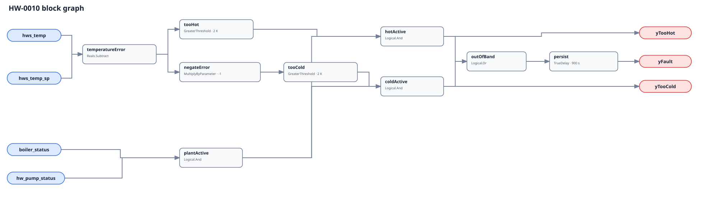

## Description

This rule reports a firing, circulating hot-water plant that cannot hold the
same target its supply-temperature point is meant to control. The direction is
diagnostic, not causal: cold water may reflect capacity, flow, fouling, staging,
or an intentional limit the host failed to exclude; hot water may reflect
overshoot, aggressive staging, a bad target, sensor bias, or the wrong header.

## Detection Logic

```text
error       = hws_temp - hws_temp_sp
too_hot     = error > tracking_error
too_cold    = -error > tracking_error
plant_active = boiler_status AND hw_pump_status

yTooHot  = plant_active AND too_hot
yTooCold = plant_active AND too_cold
yFault   = TrueDelay(yTooHot OR yTooCold, sustained_duration)
```

Block graph (`rule.cxf.jsonld`):



Both comparisons are strict, so exactly +/-2 K is clear. The single delay is
after their OR: a directly sampled hot-to-cold jump without an in-band tick
preserves persistence, while an in-band, boiler-off, or pump-off tick resets it.
`delayOnInit=true` requires the complete interval after evaluator startup.

## Possible Diagnoses

1. Boiler capacity, fuel input, heat exchanger, or minimum-flow limitation.
2. Poor temperature-loop tuning, excessive integral action, or plant delay.
3. Stage command, firing proof, distribution pump, or control-valve problem.
4. Active setpoint not reaching the local boiler or mixing controller.
5. Temperature sensor bias, poor placement, stale delivery, or wrong header.
6. A real demand, reset, safety, emissions, or high-limit condition omitted
   from the host gate.

## Energy Impact

The finding is qualitative. Sustained over-temperature can increase pipe loss
and keep a condensing plant above its efficient return-temperature region;
under-temperature can increase terminal/pump effort or shift load to other heat.
The graph has no fuel or delivered-load model, so it does not invent savings.

## Emissions Impact

Any scope-1 effect follows the change in boiler fuel use and cannot be inferred
from error direction alone. Quantification requires measured fuel or a validated
load-and-efficiency model; this rule reports no generic emissions reduction.

## Deviations

- This is a library-authored application of NIST regulation concepts and the
  CHW-0007 graph, not a source-transcribed boiler rule.
- The shipped 2 K allowance is adopted and tunable; neither NIST nor LBNL
  publishes it as a portable boiler threshold.
- The LBNL dataset is cited for point/fault coverage only. No LBNL replay was
  available locally for this slice, so no LBNL-derived TPR or FPR claim is
  recorded; the frontmatter separately records limited healthy EnergyPlus FPR
  evidence.
- Confidence is MEDIUM rather than the brief's proposed HIGH because common-
  header topology, sensor bias, and intentional plant limits remain material
  confounders even with the stated host gates.
- Direction flags include the active-plant gate. When the plant stops, they and
  `yFault` clear immediately; the host must report NO_EVAL outside the stated
  operating state.

## Notes

Read HW-0009 when command and proof disagree, HW-0008 when the target itself is
not resetting, and HW-0002/HW-0004 when temperature tracking coexists with
efficiency or low-delta-T evidence. These rules may co-occur and do not suppress
one another.
