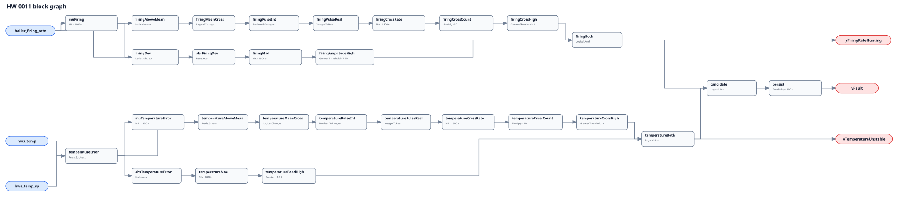

## Description

This rule looks for a plant that is repeatedly moving its heat input and its
controlled water temperature without settling. It requires both actuator-side
and process-side evidence, rejecting harmless modulation with stable water and
temperature disturbance behind a steady burner. The two diagnostic outputs
show which half is present before the combined finding matures.

## Detection Logic

```text
firing_mean  = MovingAverage(boiler_firing_rate, evaluation_window)
firing_count = MovingAverage(Change(boiler_firing_rate > firing_mean), window)
               * count_scale
firing_mad   = MovingAverage(abs(boiler_firing_rate - firing_mean), window)
yFiringRateHunting = firing_count > max_crossings_per_window
                   AND firing_mad > min_firing_rate_mad

temperature_error = hws_temp - hws_temp_sp
temperature_mean  = MovingAverage(temperature_error, evaluation_window)
temperature_count = MovingAverage(Change(temperature_error > temperature_mean), window)
                    * count_scale
temperature_mae   = MovingAverage(abs(temperature_error), window)
yTemperatureUnstable = temperature_count > max_crossings_per_window
                     AND temperature_mae > temperature_allowance

yFault = TrueDelay(yFiringRateHunting AND yTemperatureUnstable,
                   alarm_persistence)
```

Block graph (`rule.cxf.jsonld`):



Each `Change` pulse is converted Boolean -> Integer -> Real before its moving
average. `count_scale` converts a one-tick pulse area back to an event count.
Diagnostics age out with their trailing windows; the final delay drops on the
tick either diagnostic clears and uses `delayOnInit=true`.

## Possible Diagnoses

1. Temperature-loop gain too high or integral time too short for plant delay.
2. Burner minimum-fire limit interacting with plant load or stage sequencing.
3. Noisy, quantized, biased, poorly placed, or intermittently stale HWS sensor.
4. Competing header, boiler-local, mixing-valve, and supervisory controllers.
5. Lead/lag transfers or an invalid aggregate firing signal admitted by host.
6. A real load/setpoint transition or safety/application limit not excluded.

## Energy Impact

The finding is qualitative. Hunting can add fuel and distribution loss through
overshoot, increase purge/light-off loss if modulation becomes cycling, and add
wear. The rule carries neither fuel nor useful-load data and cannot assign a
savings percentage from its rolling statistics.

## Emissions Impact

Scope-1 emissions may rise when hunting increases boiler fuel use, purge, or
light-off loss. The graph has no fuel channel, so it cannot quantify that change
or claim a portable emissions benefit.

## Deviations

- Mean crossings replace literal direction reversals, following VFD-0004 and
  VAV-0005. Periodic cycles normally produce two of either, but drift with
  ripple can differ; parameter names state the implemented statistic.
- The brief's 15-point excursion becomes 7.5 MAD points only for a square wave.
  A sine requires about 23.6 points peak-to-peak to reach MAD 7.5.
- `temperature_allowance` is rolling MAE, not repeated instantaneous exits
  from a +/-1.5 K band. A +/-1.5 K square is equality-clear; a sinusoid needs
  amplitude above about 2.36 K. The mean-crossing lane intentionally admits a
  one-sided oscillatory offset, pinned in vectors.
- This is an application of NIST regulation concepts, not its two-sided CUSUM.
- Event counts are tick-coupled. The 64-checkpoint ring requires
  `dt >= 1800/63 = 28.6 s`, while strict `count > 6` requires `dt < 300 s`.
  Sixty seconds is the exercised cadence; COV and sub-tick reversals can hide
  events.
- Partial-window divisors can extrapolate a warm-up burst, so the first 1800 s
  and every excluded discontinuity are host NO_EVAL despite raw outputs.
- No simulation FPR/TPR is claimed. EnergyPlus lacks realistic burner PI
  dynamics and no local LBNL dataset copy was available for a faithful replay.

## Notes

If only `yFiringRateHunting` is true, inspect modulation feedback, burner
limits, and staging before retuning. If only `yTemperatureUnstable` is true,
look for a sensor, load, flow, or competing controller. When both are true,
first prove the host did not admit a legitimate transition.
