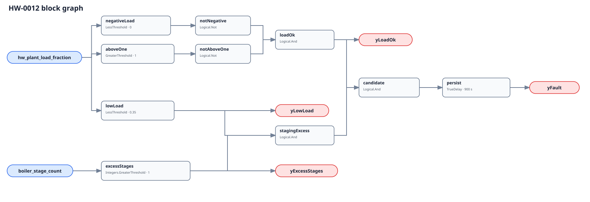

## Description

This rule identifies a configured boiler fleet keeping more firing units on
than its commissioned staging map permits at low useful load. The point is not
that two boilers are universally wrong: unequal machines, modular burners,
minimum-flow requirements, redundancy, emissions, and minimum run time can make
two units correct. Those facts define the adoption contract and are why both
shipped decision thresholds deliberately block portable deployment.

## Detection Logic

```text
negative_load = hw_plant_load_fraction < 0
above_one     = hw_plant_load_fraction > 1
yLoadOk       = NOT negative_load AND NOT above_one

yLowLoad      = hw_plant_load_fraction < low_load_fraction
yExcessStages = boiler_stage_count > max_stages_at_low_load

yFault = TrueDelay(yLoadOk AND yLowLoad AND yExcessStages,
                   sustained_duration)
```

Block graph (`rule.cxf.jsonld`):



The load-validity interval includes exactly 0 and 1. Exact load 0.35 and exact
stage count 1 are clear because both decision comparisons are strict. The graph
uses `CDL.Integers.GreaterThreshold` directly. `delayOnInit=true` requires the
full interval on evaluator startup and any false conjunct resets the timer.

Read `yLoadOk` first. A negative load makes raw `yLowLoad=true`, but it gates
`yFault` off and means NO_EVAL; non-finite/freshness checks remain host-side.

## Possible Diagnoses

1. Stage-down threshold, timer, or minimum-run logic set too conservatively.
2. Lead/lag sequence leaving a second boiler latched after load falls.
3. Enabled/available units mistakenly counted as proven firing units.
4. Load numerator, commissioned capacity, or fleet membership derived wrong.
5. Boiler sizes/turndown make the adopted scalar stage rule invalid.
6. Redundancy, exercise, freeze, emissions, or minimum-flow mode not excluded.

## Energy Impact

At the same useful load, excess firing machines can add jacket and standby loss,
operate each burner below its efficient modulation region, and add purge or
light-off cycles. Magnitude depends on equipment and sequence. Without measured
fuel and a commissioned alternative staging model, the result remains
qualitative and no generic savings percentage is claimed.

## Emissions Impact

Any scope-1 impact follows the site-specific fuel penalty of the actual staging
sequence. This rule has neither a fuel measurement nor a counterfactual staging
model, so it does not assign an emissions quantity.

## Deviations

- The brief classed 0.35 and one stage as adopted tunables. They are reclassified
  `NO_PORTABLE_DEFAULT`: source material does not establish them, and boiler
  sizing, turndown, topology, and policy change the correct values materially.
- The load denominator is one stable commissioned eligible-fleet capacity, not
  ambiguously "current" capacity. Availability changes require a new explicit
  configuration and evaluation restart.
- Range validity is implemented in-graph as `yLoadOk`; finite values, source
  quality, and derivation provenance cannot be proven by inverted comparisons.
- The LBNL plant has useful healthy staging channels but no injected over-stage
  fault. No local dataset was available and EnergyPlus's target loop has only
  one real boiler, so this card records no simulation validation claim.
- No Boiler Control Instability cluster is created. Short cycling, hunting, and
  over-staging can co-occur, but no one trigger reliably occurs first or shares
  one repair that clears all members.

## Notes

Investigate HW-0001 for resulting starts, HW-0011 for unstable modulation and
temperature, and HW-0002 for measured efficiency degradation. Never reduce
stages until manufacturer turndown, minimum flow, venting, emissions, safety,
redundancy, and minimum-time requirements have been checked.
