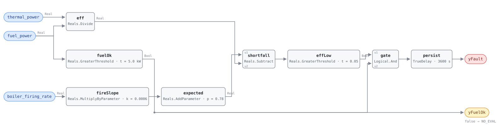

## Description

A boiler's efficiency is not a constant, and it is not supposed to be. The same
burner that returns 84% of its fuel as useful heat at full fire returns less at
minimum fire, where jacket and standby losses are spread across a smaller
output — or more, if the boiler condenses, because a cooler flue and a wetter
heat exchanger are exactly what low fire produces. Which way the curve runs is a
fact about the machine, so there is no efficiency figure a boiler is supposed to
hold and no fixed threshold that would not either alarm all winter or never
alarm at all.

What there is, for a given boiler, is a line. Measure efficiency against firing
rate across a fortnight of normal operation and the points fall close enough to
a straight line to predict the next one. This rule evaluates that line. The host
fits it — fourteen days of learning — and writes the slope and intercept in as
parameters; the graph computes what the boiler should be returning at today's
fire and asks whether it is within five efficiency points of it. Everything
statistical about this fault happens before the first tick.

Five points is a lot of gas. On a boiler burning a megawatt through a heating
season that is the difference between a service visit and a five-figure fuel
bill, and none of the causes announce themselves: scale on the water side and
soot on the fire side both insulate the heat exchanger without changing anything
an operator watches, and a burner drifting rich burns fuel that leaves as
unburned hydrocarbons up the stack. The boiler still makes its setpoint. It just
takes more gas to get there.

## Detection Logic

```
measured_eff = thermal_power / fuel_power
expected_eff = eff_baseline_slope × boiler_firing_rate + eff_baseline_intercept

yFuelOk = fuel_power > fuel_power_min            (false ⇒ host reports NO_EVAL)
yFault  = (expected_eff − measured_eff) > efficiency_threshold AND yFuelOk,
          sustained continuously for alarm_delay
```

Block graph (`rule.cxf.jsonld`):



`fireSlope` and `expected` are the fitted line, one multiply and one add, and
they are the whole statistical content of the rule at runtime. `shortfall`
subtracts the measured efficiency from it and `effLow` compares that difference
against the threshold, which is the reference's equation written out unchanged:
the test is an absolute difference in efficiency points, not a ratio. At the
shipped placeholders that means an expected 0.792 at 20% fire, 0.810 at 50%, and
0.840 at 100%, with the alarm line five points under each.
`same_efficiency_is_healthy_at_low_fire` and
`same_efficiency_is_a_fault_at_high_fire` are the regression test for that:
identical meter readings, opposite verdicts, decided entirely by where
`boiler_firing_rate` put the line.

`eff` is the only division in the rule and its denominator is a live signal that
goes to zero every time the burner stops. That is what `fuelOk` is for. With
both meters at zero the quotient is NaN and every comparison against it is
false; with a standing pilot and no useful output it is a clean, believable 0.0,
which is the more dangerous of the two because nothing downstream would question
it. `fuelOk` drives both the boundary output `yFuelOk` and the second input of
`gate`, so a boiler below the floor holds `yFault` down and the host knows the
silence means "not evaluated" rather than "healthy".

`persist` then requires 60 continuous minutes of shortfall, which is long enough
to ride out a light-off, a firing-rate step, or a return-temperature swing the
burner has not caught up with.

## Possible Diagnoses

Transcribed from the reference's HW-FC-051 card:

1. Fouled heat exchanger or scale buildup on the water side. Scale is an
   excellent insulator — a millimetre of it costs several efficiency points —
   and it is the cause that develops slowly enough for a fitted baseline to
   catch it while it is still cheap to fix
2. Burner misalignment or fouling. Soot on the fire side does the same thing
   from the other direction, and a sooted burner is usually also a
   badly-adjusted one
3. Incorrect fuel/air ratio. Too much excess air carries heat up the stack; too
   little leaves fuel unburned and makes carbon monoxide. Both read here as lost
   efficiency and only a combustion analyser separates them
4. Flue gas recirculation problem — an FGR damper or valve out of position
   changes the combustion temperature and the NOx/efficiency trade the burner
   was commissioned on
5. Refractory degradation. Cracked or missing refractory lets heat into the
   boiler jacket instead of the water, and on an older firetube boiler it is the
   cause most likely to be found only when someone opens the front

## Energy Impact

EFFICIENCY_LOSS, HIGH confidence, BASELINE_COMPARISON. The estimator is the
quotient the rule already computes:
`waste_kw = fuel_power × (1 − measured_eff / expected_eff)`. A boiler burning
1000 kW at 0.74 against a 0.81 baseline is wasting about 86 kW of gas, and the
reference's range — 5–15% of fuel — brackets that. PNNL-13890's case study puts
$730/yr on a 300-hp boiler, which is the low end and is still more than the
combustion analysis that finds it.

Confidence is HIGH, which is the reference's rating and is defensible because
both terms of the quotient are metered quantities rather than inferences. Two
caveats belong beside it and neither changes the rating. The baseline is the
boiler's own recent behaviour, so the rule measures degradation *since the
learning period* and is blind to anything already wrong when the line was
fitted — a boiler commissioned with a badly-set fuel/air ratio learns that ratio
as normal. And `thermal_power` is usually derived rather than metered, so its
accuracy is the flow meter's. Heating-dominant by construction: the boiler only
runs in the heating season.

## Emissions Impact

Scope 1, PROXY_EMISSIONS, HIGH confidence; the reference's typical range is
1,000–10,000 kg CO₂e/yr, computed as the efficiency loss against a static
0.181 kg CO₂e/kWh natural gas factor. This is combustion at the building, so
unlike the library's electric efficiency faults there is no grid to hedge
against: the avoided-emissions basis is the static Scope 1 factor and the saving
is the same whatever hour of the day the boiler runs. That also makes it the
rare fault where the emissions arithmetic is simply the energy arithmetic times
a constant.

## Deviations

- **The comparison is an absolute difference in efficiency points, exactly as
  the reference writes it, and this is a deliberate divergence from the sibling
  cards.** The reference's equation is
  `(expected_efficiency − measured_efficiency) > efficiency_threshold` with a 5%
  default, and the graph implements that literally: one `Reals.Subtract` and one
  `Reals.GreaterThreshold`. CHW-FC-050, one chapter earlier, writes its chiller
  test as `(measured − expected)/expected > degradation_threshold` — a
  *relative* loss — and HP-FC-050 converts its own relative form into a
  multiplied-through ratio (`measured < 0.85 × expected`) precisely to avoid
  dividing by a fitted line. Neither move is available or needed here: there is
  no second division to remove, because the reference never asked for one. The
  consequence is a real semantic difference worth knowing at deployment: an
  absolute threshold is a *larger* relative tolerance the lower the baseline
  sits. Five efficiency points is 6.1% of an 0.82 baseline and 5.6% of an 0.90
  one, so against a 5% relative test this rule is the more forgiving of the two
  everywhere, and most forgiving on the boilers with the least efficiency to
  spare.
- **`efficiency_threshold` carries a fraction, not a percentage, and the failure
  mode is silence.** The reference prints "5%"; the graph compares against a
  difference of two dimensionless quotients, so the parameter is 0.05. A host
  that writes `5` into it is asking for a 500-point shortfall, which no boiler
  can produce, and the rule goes quiet forever with no error. HP-FC-050's
  `cop_ratio_threshold` has the mirror-image trap — writing 15 there makes it
  alarm permanently — and the two cards are worth reading together before
  retuning either.
- **`eff_baseline_slope` and `eff_baseline_intercept` ship as documented
  placeholders.** The reference does not give numbers and could not: it
  specifies `expected_efficiency = baseline_model.predict(boiler_firing_rate)`,
  a scikit-learn `LinearRegression` the host fits over `learning_period_days`
  (14 d). This library's split puts the fitting in the host and the fitted line
  in the graph, so the two coefficients are ordinary `set_param` targets. The
  shipped 0.0006 /% and 0.78 describe a conventional non-condensing boiler
  (0.792 at 20% fire, 0.810 at 50%, 0.840 at full fire) and exist so the
  document is runnable as delivered. **They are not site values, and a wrong
  pair fails silently in both directions** — fit the line five points high and
  every hour alarms, fit it low and nothing ever does. Precedent: HP-FC-050's
  COP line and VAV-FC-050's `ventilation_requirement`.
- **The slope is allowed to be negative, which is the documented exception to
  the library's no-negative-parameters rule.** The standing convention is to
  express a negative constant as `Sources.Constant` plus `Subtract` so that no
  parameter carries a sign. A regression slope is inherently signed, and here
  the sign is a fact about the boiler type rather than about the fit: a
  conventional boiler's efficiency rises with fire (less relative standby loss),
  a condensing boiler's falls (higher return temperatures and a hotter flue at
  high fire), and the same rule instance must accept either without being
  rewired. HP-FC-050 carries the identical exception for the identical reason.
- **`alarm_delay` is adopted, not transcribed, because the source line
  truncates.** The reference's tunables line for this card reads "Tunable
  Parameters: efficiency_threshold = 5%, learning_period_days = 14," — a trailing
  comma and then the section ends. Whatever followed did not survive the
  extract. The 60 minutes shipped here comes from the two nearest authorities in
  the same document: CHW-FC-050, the chiller card with the same
  fitted-baseline-degradation shape one chapter earlier, prints
  `AlarmDelay = 60 min` in its own tunables table, and HP-FC-050 carries the
  same 60 minutes for the same reason. Sixty minutes is also the shortest delay
  that reliably outlasts a light-off transient on a large boiler. A host with
  faster metering may shorten it; nothing else in the rule depends on the value.
- **`fuel_power_min` and `yFuelOk` are adopted, not transcribed.** The reference
  names no fuel floor and no evaluability gate at all for this card. But the
  graph divides by a live signal, and per SCHEMA.md a test computable from the
  rule's own inputs belongs in the graph as a boundary output rather than as
  prose. `yFuelOk` is not an echo of `fuel_power` — it is the comparison the
  division needs, and the host reads it as the NO_EVAL flag. The 5.0 kW default
  is sized to sit above a standing pilot on a small commercial boiler and is
  arbitrary on a 3 MW firetube, where minimum fire alone is hundreds of
  kilowatts. Both sides of the floor are pinned
  (`fuel_power_exactly_at_the_floor`, `fuel_power_just_above_the_floor`) and the
  NaN case has its own vector (`boiler_off_divide_by_zero`).
- **The heating-value convention is a precondition the rule cannot check.**
  `fuel_power` is derived from fuel flow times a heating value, and the higher
  and lower heating values of natural gas differ by about 10%. An efficiency
  computed on HHV against a baseline fitted on LHV is low by roughly eight
  efficiency points — more than this rule's entire threshold — so the fault
  would read as permanent degradation on a healthy boiler. The point dictionary
  states the constraint on `fuel_power`; this card can only carry it into
  `preconditions`, because nothing in three signals reveals which convention
  produced them. It is the single most likely way to deploy this rule wrongly.
- **The nominal boundary case is a FAULT, and that is arithmetic rather than a
  choice.** A five-point shortfall cannot be represented exactly at these
  magnitudes: `0.05` as a double is an *odd* multiple of 2⁻⁵⁶, while every
  double in [0.5, 1) is a multiple of 2⁻⁵³, so no difference of two efficiencies
  in that range can equal the threshold — the case the vectors would want to pin
  does not exist in the arithmetic. The nearest case,
  0.760 measured against an 0.810 baseline, evaluates to 0.050000000000000044
  and trips the strict `>`. One unit in the last place lower — a measured
  efficiency on the next double above 0.76 — gives 0.04999999999999993 and
  clears. `nominal_five_point_shortfall_faults` and
  `one_ulp_of_efficiency_clears_the_threshold` pin both, which is as tightly as
  the boundary can be bracketed. HP-FC-050 could claim a bit-exact boundary
  because its vectors put a power of two in the divisor; this card cannot, and
  says so rather than implying a precision it does not have.
- **The fitted line is extrapolated without limit.** Nothing in the graph knows
  the firing-rate range the regression was fitted over, so at a far enough fire
  the expected efficiency drifts into values the fit never supported — above 1.0
  for a steep positive slope, or below the measured value's floor for a steep
  negative one. The block set has no domain guard to express this, so it is a
  frontmatter precondition. A host that wants it enforced can clamp
  `boiler_firing_rate` with `Reals.Limiter` upstream of the rule. HP-FC-050
  documents the same open end on its own regressor.
- **One regressor, which is the reference's choice and a real blind spot.** The
  equation fits efficiency against firing rate alone. For a condensing boiler
  the dominant variable is return water temperature — the same burner at the
  same fire condenses at 40 °C return and does not at 60 °C, and the efficiency
  difference is several points — so a plant whose return temperature moves with
  the weather will show scatter this line cannot explain, and either the fit's
  quality collapses or the rule alarms on cold-return days. The point dictionary
  carries no HW return temperature today and the reference's Required Points
  list has three entries; adding a second regressor would be a different card.
  Sites with condensing boilers should expect to widen `efficiency_threshold` or
  restrict the operating states this rule is evaluated in.
- **`learning_period_days` (14 d) stays a host precondition.** It gates a
  fitting run that happens offline, outside any tick, and there is nothing in
  the block graph that could observe it.
- **`method: statistical` describes the baseline's provenance, not the
  runtime.** The graph performs one division, one multiply-add, one subtraction
  and two comparisons. The classification is the reference's and it is honest:
  the coefficients come from a regression. HP-FC-050 and RTU-FC-051 carry the
  same note.
- `persist.delayOnInit = true` (the CDL default is `false`), the library's
  standing choice: a boiler already below its line when the controller restarts
  waits out the full hour rather than alarming on the first tick.
- **`playbooks: []`.** Nothing in `playbooks/` covers boiler combustion service —
  the nearest neighbour, `heat-pump-faults`, orders refrigerant work — and the
  schema tolerates an empty list. The grounding is in `source` (PNNL-13890's O&M
  best practices chapter is the operative document for boiler tune-ups) and in
  the diagnosis list above. VAV-FC-054 set the precedent for declining rather
  than stretching.
- **`clusters: []`.** `clusters/clusters.json` defines no cluster containing a
  hot water plant rule, and this card does not edit the cluster set. CLU-06 is
  its chilled-water analogue: CHW-FC-050 triggers a plant-inefficiency syndrome
  that this fault would head on the heating side if such a cluster existed.
- **No test vectors are transcribed, because the reference publishes none for
  this card.** All fifteen scenarios in `vectors.json` are authored from the
  equation and replayed against the pinned engine rev.
- Severity 3, phase 2, `method: statistical`, `confidence: HIGH`, and the 5%
  threshold are the reference's chapter 14 card. `g36: null` — research-derived
  (Meng et al. 2021; Shohet et al. 2020), not a G36 clause.

## Notes

Read `yFuelOk` before reading `yFault`. `alarm_clears_after_burner_service` and
`fuel_meter_dropout_forces_no_eval` are indistinguishable in `yFault` alone — in
both the alarm asserts at 3600 s and drops at 7200 s — and they mean opposite
things. A host that treats the falling edge of `yFault` as a repair will close
this fault every time the boiler shuts down for the night.

The order to work the diagnoses in is the order of what a combustion analyser
can see. Stack temperature and oxygen, measured at high fire and at low fire,
separate the fuel/air ratio (diagnosis 3) and the FGR problem (4) from the
heat-transfer causes (1, 2, 5) in about twenty minutes: a boiler with clean
combustion numbers and a hot stack is fouled or scaled, and one with high excess
air is a burner adjustment. Refractory is what is left when the front is open
anyway.

Whatever schedules the learning run should refuse to re-fit while this fault is
active. Because the line is fitted from the boiler's own history, re-fitting
after degradation has developed bakes it in as the new normal, and the rule then
reports healthy on a machine everybody agrees is wasting gas. The same caution
applies to a commissioning-time fit on a boiler whose combustion was never
verified — the fit is worth exactly as much as that verification.

HW-FC-050 reads the same boiler from the cycling side and is worth checking
first. Short-cycling depresses seasonal efficiency through purge losses without
any of the five diagnoses above being true, so a boiler tripping both rules may
have one problem rather than two. This rule firing alone, on a boiler holding a
steady fire, is the combustion or heat-transfer finding it appears to be.
