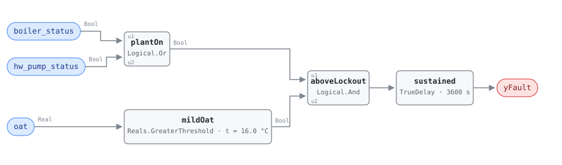

## Description

The reference calls the outdoor air lockout one of the simplest and
highest-return fixes in its catalogue, and the arithmetic is why: above about
16 °C a commercial building does not need its heating plant, so every therm the
boiler burns and every kilowatt the pump draws is waste in full — not a
percentage of waste, the whole thing. By the PNNL 151-building study it is
present in more than a quarter of buildings: lockouts left out of a sequence,
set to a temperature nobody revisited, overridden one cold April morning and
never released. The pump half matters as much as the boiler half and is easier
to miss — a circulator running all summer costs its full draw, keeps the piping
warm and pushes heat into ceilings the cooling plant then removes, which is why
the equation is a disjunction rather than a boiler test with a pump footnote.

## Detection Logic

```
yFault = (boiler_status OR hw_pump_status)
     AND oat > heating_plant_lockout_temp
     sustained continuously for lockout_check_duration
```

Block graph (`rule.cxf.jsonld`):



`plantOn` is evaluated tick by tick rather than per point, so a lead pump handing
over to a boiler keeps the condition continuously true across the handover; a
rule written as two per-point tests would miss that hour. `mildOat` is strict, so
exactly 16.0 °C is not above the lockout.

`sustained` is the whole timing story: one `Logical.TrueDelay` at 60 minutes,
which is simultaneously the reference's `lockout_check_duration` and the only
persistence this card has (see Deviations). An hour rides out a morning warm-up
finishing as the sun comes up, a boiler completing the cycle it was in when the
outdoor temperature crossed, and a flow proof chattering on a pump changeover.
Persistence is continuous, not accumulated — a dip back under the lockout
discards the elapsed time rather than pausing it — and `delayOnInit = true`, so
a plant already running above its lockout at restart waits out the full hour.
The alarm falls the instant the plant stops, with no release delay.

## Possible Diagnoses

Transcribed from the reference's HW-FC-052 card:

1. Boiler lockout sequence never programmed — the most common cause and a $0
   remote fix
2. Lockout setpoint set too high — a plant locked out at 21 °C looks programmed
   and behaves almost as badly; this survives a casual review of the sequence
3. Lockout overridden by an operator, usually a shoulder-season cold snap with
   no expiry on the override
4. Domestic hot water demand keeping the boiler on — not a fault, and invisible
   to this rule; a host precondition rather than a diagnosis (see Deviations)
5. OAT sensor reading incorrectly low — also not a plant fault, also invisible
   here, and free to rule out against a weather station first

## Energy Impact

CRITICAL_WASTE, HIGH confidence, DIRECT_MEASUREMENT. While the fault is active
the entire plant draw is waste — `waste_kw = boiler_current_kw + hw_pump_kw`,
the reference's formula — because there is no heating load for any of it to
serve. No baseline, no efficiency, no proxy. Climate sensitivity is "both": the
cost peaks in the swing seasons, when outdoor temperatures spend weeks above the
lockout, and in a cooling-dominant climate the shed pipe heat also loads the
chillers. Confidence is HIGH because both halves are directly measured, subject
to the sensor caveat that is diagnosis 5.

## Emissions Impact

Scope 1 + 2, DIRECT_EMISSIONS, HIGH confidence; the reference's typical range is
2,000–15,000 kg CO₂e/yr for a plant running above its lockout. The split is
worth keeping: the boiler's fuel is Scope 1 on a static combustion factor, the
pump's electricity is Scope 2 on the marginal operating emissions rate, and the
two respond to different levers. A site that has decarbonised its electricity
still owns the whole Scope 1 half.

## Deviations

- **There is one timer, and it is the reference's `lockout_check_duration`.**
  The tunables line ends at "`lockout_check_duration = 60 min,`" and no
  `AlarmDelay` appears for this card anywhere in the chapter. Rather than adopt
  one and stack two hours of delay on a fault that is fully decided in one, the
  rule reads the duration as the persistence, which is what "sustained for
  lockout_check_duration" says in the equation. A host wanting a separate alarm
  persistence must add it downstream.
- **Diagnoses 4 and 5 are host preconditions, not detections.** A boiler firing
  in July for a DHW load and one firing because the lockout was never programmed
  produce identical values on all three points, as do a correctly locked-out
  plant and one whose OAT sensor reads 8 °C low. The DHW case generates false
  positives at scale — combined heating/DHW plants are common in older buildings
  — and the OAT case generates silent misses, which is worse and has no in-rule
  remedy. Both are recorded in `preconditions` so a host can gate or cross-check.
- **Strict `>` at the lockout temperature,** as the reference writes it; CDL
  `Reals` has no `GreaterEqual` in any case. A plant running at exactly 16.0 °C
  reads clear. The disagreement is measure-zero and errs toward silence, but a
  BAS that quantises outdoor temperature to whole degrees will sit on the
  boundary often, and should set the parameter between two quantisation levels.
- **The disjunction is plant-level, and the OR across boilers is correct here.**
  This rule asks whether *anything* is running, so an OR of individual boiler
  statuses preserves the question exactly — the opposite of HW-FC-050, which
  counts transitions of a specific burner and is destroyed by the same
  aggregation. Both cards state the constraint.
- **`TrueDelay` asserts at exactly `T + delayTime`,** so the realized test is
  "above the lockout for strictly more than `lockout_check_duration`" at tick
  resolution: a plant that stops on the maturity tick is never reported, and one
  that runs a single tick longer asserts for that tick and clears.
- **`operating_states: all`, deliberately.** Every other rule in the hot water
  chapter is gated to the heating season; this one detects a plant behaving as
  though it were the heating season when it is not, so gating it that way would
  delete it. The graph needs no operating state — two proofs of operation and a
  temperature.
- **`clusters: []`.** `clusters/clusters.json` defines no cluster containing a
  hot water plant rule. CLU-07 (Unnecessary Plant Operation) is the syndrome
  this fault belongs to on the heating side and this card is a candidate member;
  adding it is the cluster owner's edit.
- **The energy formula's inputs are not this rule's inputs.**
  `waste_kw = boiler_current_kw + hw_pump_kw` needs a fuel measurement and a
  pump power measurement, and the hot water point dictionary carries neither as
  a plant-power point. The host supplies them — `fuel_power` from HW-FC-051's
  point set where metered, pump draw from the pump or drive family — and the
  formula is otherwise transcribed unchanged.
- **No test vectors are transcribed, because the reference publishes none.** All
  twelve scenarios in `vectors.json` are authored from the equation and replayed
  against the pinned engine rev.
- Severity 3, phase 2, `method: rule`, `category: CRITICAL_WASTE` and both
  tunable defaults are the reference's chapter 14 card. `g36: null` — a PNNL
  retro-commissioning finding (RetuningOpps H01), not a G36 clause.

## Notes

Settle the DHW question before deployment, not after. On a combined heating/DHW
plant this rule alarms every summer day, and the right response is not to widen
the parameter — 16 °C is correct — but to exclude the rule, gate it host-side on
the heating loop's isolation valve or the DHW valve position, or bind
`boiler_status` to a boiler that does not serve DHW where the plant has a
dedicated one. Widening the lockout converts a false positive into a real fault.

Check the outdoor air sensor before dispatching anyone: it is diagnosis 5, it is
free, and the same sensor feeds whatever reset schedules the building has, so
finding it resolves more than this fault. AHU-FC-052 is the same finding at
another scale; where both fire, fix the plant first, and expect one cause — a
commissioning phase that got cut.
