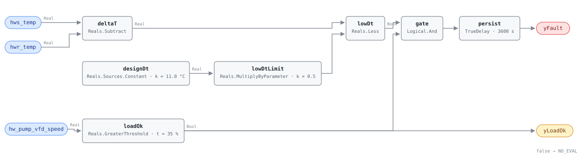

## Description

A heating loop is sized on a temperature difference. Design the coils for 11 K
between supply and return and the pumps move enough water to carry the peak
heating load; let that difference fall to 4 K and the same load needs nearly
three times the flow. The pumps speed up, the standby pump starts, and a plant
that was carrying the building on one boiler starts a second one to make water
the first could have made if the water had come back cool enough to use.

On the chilled water side that syndrome shows up as return water that is too
cold. Here the sign is the other way round and the consequence is worse than
the arithmetic suggests: low delta-T on a heating loop means the return water
comes back **too hot**. A condensing boiler needs return water below roughly
55 °C to condense flue gas at all, so a loop whose return has crept up has not
only doubled its pumping — it has quietly moved the boiler out of the operating
regime the plant was bought for, and the 5-10 points of efficiency that go with
it are lost every hour the loop runs that way.

Nothing about it looks broken. Zones hold setpoint, the boiler makes its supply
temperature, and the only symptom is a plant working much harder than the
building it serves. It is measured at the loop because that is where it adds
up: a bypassed three-way valve here, an oversized control valve there, a zone
valve that no longer seats — each one is too small to see from the terminal
unit that owns it, and together they show in the return header.

This rule is a library extension. The HVAC FDD Reference's chapter 14 specifies
three hot water rules (HW-FC-050 through 052) and this is not one of them; the
logic comes from PNNL-27338 §4.6, the load gate and the parameter shapes come
from CHW-FC-053, and the numbers that neither source fixes are adopted and
argued below.

## Detection Logic

```
delta_t   = hws_temp − hwr_temp                     (supply minus return: the heating sign)
low_limit = design_delta_t × low_dt_fraction        (11.0 × 0.5 = 5.5 K)

yLoadOk = hw_pump_vfd_speed > min_pump_speed_for_eval   (false ⇒ host reports NO_EVAL)
yFault  = delta_t < low_limit AND yLoadOk,
          sustained continuously for alarm_delay
```

Block graph (`rule.cxf.jsonld`):



`deltaT` is CHW-FC-053's block with its inputs the other way round: supply on
`u1`, return on `u2`. That single ordering is the whole heating-side inversion,
and it is the one line of this rule a reviewer should check first, because a
graph that subtracts in the cooling direction reports a permanent fault on a
perfectly healthy heating loop and looks exactly like a rule that works.

`designDt` and `lowDtLimit` assemble the trip line inside the graph rather than
shipping a pre-multiplied 5.5. Both numbers stay separate `set_param` targets
because they are retuned for different reasons: `design_delta_t` changes when
the loop does, `low_dt_fraction` when the site decides how much of design counts
as failure. CHW-FC-053 and VFD-FC-051 assemble their limits the same way.

`lowDt` is a strict `Reals.Less`, so a loop sitting exactly on the trip line
reads healthy, and the boundary is bit-exact rather than approximate: 11.0
halves to exactly 5.5, and `delta_t_exactly_at_the_threshold` reaches that same
double from 65.5 − 60.0. `delta_t_just_below_the_threshold` and
`delta_t_just_above_the_threshold` pin 10 mK either side.

`loadOk` is the rule's evaluability story. PNNL-27338's §4.6 test has no load
gate at all and its own prose concedes the confound; without one, every night
setback and every mild afternoon on a properly reset loop reads as a fault,
because a loop moving almost no water cannot produce a delta-T whatever its
coils are doing. Pump speed is the only load-shaped signal the HW dictionary
carries — see Deviations for what that substitution costs.

`persist` then requires 60 continuous minutes. Low delta-T is a loop condition,
not an event; an hour of it is a finding, and anything shorter is a valve
stroking or a boiler catching up after a setback recovery.

## Possible Diagnoses

Library-authored — PNNL-27338 §4.6 specifies a threshold test, not a list of
causes, so this is the heating-side reading of the five mechanisms CHW-FC-053
inherits from its own reference, plus the ones that only exist on a hot loop:

1. Three-way valves bypassing at coils, unit heaters, and cabinet heaters. The
   classic cause, and it gets worse as the building warms up, because that is
   when the bypass port is open widest
2. Oversized two-way control valves. A valve that passes design flow at 20%
   open has no authority left below that, so it sits nearly shut and still
   overflows its coil — heat transfer per pass collapses while flow does not
3. Zone valves failing open, leaking by, or left in hand. Two-position valves
   on unoccupied zones are the version nobody trends
4. Loop bypasses and balancing valves left open from a commissioning that never
   finished, and reverse flow through a primary/secondary decoupler when the
   secondary pumps out-run the primary
5. Coils that cannot transfer their duty: fouling on the water side, and air
   trapped at the high points of a loop that is not being vented, which is a
   heating-side failure with no chilled-water analog
6. Distribution pressure above what the loop needs, which forces flow through
   valves that are already throttling. HW-FC-054 detects that directly, and
   when both rules fire it is the one to fix first
7. A supply temperature reset pushed too far down. Cooler supply water makes
   every valve open further for the same duty, which raises flow and lowers
   delta-T; the fix is the reset schedule, not the coils
8. A loop oversized for the building it ended up serving. The case with no
   repair, where the delta-T is telling the truth

Causes 1 through 5 are local defects that this loop-level rule aggregates: a
building with forty heating coils can reach the trip line with four of them
misbehaving and thirty-six fine, which is what makes the finding hard to chase
and worth having.

## Energy Impact

EXCESS_CONSUMPTION, MEDIUM confidence, PROXY_ESTIMATION. The pump term is
CHW-FC-053's estimator with heating-loop values —
`excess_pump_kw ≈ hw_pump_kw × (design_dt − actual_dt) / design_dt` — reading
the delta-T shortfall as the fraction of pumping that buys nothing: a loop at
5 K on an 11 K design spends more than half its pump energy moving water that
comes back too hot to be worth having moved. PNNL-27338 publishes no savings
range for §4.6, so the 5-15% of pump energy carried in `savings_range` is the
chilled-water figure from CHW-FC-053's reference, and it is the weaker half of
the claim.

The stronger half is the boiler. Condensing plant is specified on a return
temperature, and a loop that cannot make its delta-T delivers return water
above the condensing threshold for most of the heating season — the plant then
runs at its non-condensing efficiency and the 5-10 points that were paid for in
the equipment budget are simply not collected. On a non-condensing plant the
equivalent penalty is staging: boilers cycling on to serve a load one of them
could have carried, with the short-cycling losses HW-FC-050 measures.

Confidence is MEDIUM because the finding is loop-level and the repair is not.
The rule is reliable about the symptom and says nothing about which of eight
causes to send someone after. Climate sensitivity is heating-dominant: the
syndrome exists only while the loop is circulating hot water, and it costs most
in the hours when it is circulating hardest.

## Emissions Impact

Scope 1 + 2, PROXY_EMISSIONS, MEDIUM confidence. The split matters here more
than the total. The pump energy is purchased electricity on a marginal
operating emissions rate; the condensing-mode and staging penalties are fuel
burned on site, on a static combustion factor. A site that has decarbonised its
electricity supply still owns the whole Scope 1 half of this fault, and on a
condensing plant that half is the larger one — which makes loop delta-T a
better decarbonisation argument than its pump-energy headline suggests.

No published emissions range exists for this fault; the sibling CHW rule's
200-2,000 kg CO₂e/yr is a cooling-side pump-and-staging figure and does not
transfer, so this card declines to invent one and leaves the estimate to the
host's own fuel and electricity factors.

## Deviations

- **This rule is a library extension, not a transcription.** The HVAC FDD
  Reference's ch.14 specifies HW-FC-050, 051 and 052 and stops; `faults/hw/README.md`
  frames those three as the chapter's content and FC-053 through 057 as
  library-authored rules grounded in PNNL-27338 §4. The name, severity 3 and
  `method: rule` here are that index's, which is the one thing about this card
  that is not open to argument. Everything else — the graph, the parameters,
  the diagnosis list, the energy claim — is authored here from §4.6 and from
  CHW-FC-053, and the numbers PNNL-27338 does not fix are marked ADOPTED in
  `params` and argued below.
- **The delta-T is inverted relative to CHW-FC-053, and the inversion is the
  whole port.** `deltaT` computes `hws_temp − hwr_temp`; the chilled-water card
  computes `chwrt − chwst`. Same block, same trip line, opposite operand order,
  because on a heating loop the supply is the hot side. The consequence that
  matters clinically is that a low delta-T here means the *return* is too hot,
  which is why this card carries a condensing-boiler argument that its sibling
  has no reason to make. The consequence that matters for deployment is that
  the failure mode of getting it wrong is silent: subtract in the cooling
  direction and every healthy loop reports a permanent fault.
- **`design_delta_t = 11.0 K` is ADOPTED, and the 0.1 K between it and
  PNNL-27338's number is deliberate.** §4.6 writes the test as
  `20 °F − avg(HWST − HWRT) > 10 °F`: a 20 °F (11.1 K) design with the trip at
  half of it. This card ships 11.0 K for two reasons. The parameter is a
  per-loop site value that must be read off the plant's drawings before the
  rule means anything — the shipped number is a placeholder, exactly as
  CHW-FC-053's 5.6 K is — so a tenth of a kelvin of transcription fidelity buys
  nothing. And 11.0 halves to exactly 5.5, a double with trailing zero mantissa
  bits, which makes the strict comparison *observable*: `65.5 − 60.0` lands on
  the trip line exactly. With 11.1 the line falls at 5.55, and no pair of
  realistic hot-water temperatures can reach it — the difference of two doubles
  in the 32-128 range carries that binade's coarser ulp, 5.55's low mantissa
  bits are not zero, and every candidate pair lands an ulp off the line, so the
  strictness could only ever be asserted, never tested. The cost is that the
  shipped trip line sits 0.06 K below PNNL's, which is an order of magnitude
  inside any hot-water sensor's error.
- **`low_dt_fraction = 0.5` is PNNL-27338's ratio, factored out into its own
  parameter.** §4.6 ships a single subtraction against a fixed 10 °F; this rule
  reconstructs the same trip line as `design × fraction` so both numbers survive
  as independent `set_param` targets. A single `Reals.LessThreshold` with
  `t = 5.5` would compute the identical verdict with one block instead of
  three, and a site with a 20 K condensing-retrofit design delta-T would have
  had to recompute the product to retune it. Precedent: CHW-FC-053, and
  VFD-FC-051's assembled speed floor before it.
- **The load gate is entirely adopted — §4.6 has none.** The deep-read memo is
  explicit that PNNL's hot-water delta-T test, unlike this library's
  chilled-water rule, does not exclude lightly loaded periods, and that the
  report's own §4.6 prose names low demand as a confound without encoding a fix.
  Shipping that literally would mean alarming through every night setback and
  every mild shoulder-season afternoon, on loops whose delta-T is small for the
  correct reason. The gate is the CHW sibling's design imported wholesale, and
  it is the largest single departure from the cited algorithm.
- **`hw_pump_vfd_speed` substitutes for CHW-FC-053's `chiller_load`, and the
  substitution is not free.** The HW dictionary has no load analog:
  `boiler_firing_rate` is the nearest existing point and is the wrong one —
  firing rate describes what the boiler is doing, not how much water the
  distribution system is moving, and delta-T at low fire is a different physical
  regime rather than a lightly loaded one. Pump speed at least sits on the
  hydraulic side of the question, and PNNL-27338 itself uses pump speed as its
  HW load heuristic in §4.2 and §4.4. What it costs: (a) the proxy is partly
  endogenous — low delta-T raises flow, which raises pump speed, so the fault
  helps satisfy its own gate. That direction is benign (the rule stays evaluable
  exactly when the syndrome bites) but it means the gate excludes *quiet* loops,
  not lightly loaded ones. (b) On a constant-speed pump the feedback reads full
  speed forever and the gate protects nothing; on a drive with a minimum speed
  above 35% it never falls below the floor either. (c) On a drive whose feedback
  latches its last command while the pump is stopped, the gate reads true on a
  dead loop. All three are `preconditions` text, because none is separable
  inside the rule.
- **`min_pump_speed_for_eval = 35%` is ADOPTED from §4.4 rather than ported from
  the CHW sibling.** CHW-FC-053's floor is 40% of chiller load, which is not a
  pump speed and does not convert. 35% is the number PNNL-27338 uses in §4.4 to
  mean a hot water loop with little demand (`avg_pump_vfd < 35%` is half of that
  section's high-supply-temperature test), so it is the same report's reading of
  the same signal on the same equipment. It also sits below the 45% §4.2 calls
  working hard, so this rule and HW-FC-054 read the speed axis consistently: a
  loop between 35% and 45% is evaluable here and uninteresting there.
- **Strict `<` at the trip line, strict `>` at the load floor, six vectors.**
  CDL `Reals` has no `LessEqual` or `GreaterEqual` in any case, and PNNL's own
  arithmetic is a strict comparison. A loop at exactly 5.5 K reads healthy and a
  pump at exactly 35.0% reads NO_EVAL. Both disagreements are measure-zero on
  real-valued signals and both err toward silence; all six sides are pinned
  (`delta_t_exactly_at_the_threshold` and its 10 mK neighbours,
  `pump_speed_exactly_at_the_evaluability_floor` and its 0.1% neighbours).
- **`yLoadOk` is an evaluability output, not an echo of an input.** It is a
  comparison of a boundary input against a parameter, which is what SCHEMA.md
  asks such an output to be; exposing it adds no logic and changes no verdict,
  and it is the only thing that lets a host tell "delta-T is fine" from "the
  loop was too quiet to ask". Same stance as CHW-FC-053's `yLoadOk` and
  HP-FC-050's `yPowerOk`. `pumps_slow_after_alarm` is the vector that makes the
  distinction concrete: `yFault` falls at 5400 s there exactly as it does in
  `delta_t_recovers_after_alarm`, and only the second output says which of the
  two happened.
- **Persistence stands in for PNNL's window average.** Every AIRCx algorithm
  averages a 15-60 minute data window and compares the average (§1.2); this rule
  consumes instantaneous points and requires the condition continuously.
  `intermittent_low_delta_never_alarms` pins the miss — delta-T alternating
  between 4 K and 12 K every 20 minutes never accumulates a full hour and never
  alarms, though a loop spending half its day below the line is a genuine
  finding. A steady syndrome, which is what a bypassing valve or an oversized
  control valve produces, reads the same either way.
- **There is no boiler-on conjunct, and that is a real blind spot.** A loop
  circulating with no heat input equalises: supply and return converge, delta-T
  goes to zero, and this rule alarms at full confidence on a plant with no
  distribution defect at all. `loop_circulating_with_no_heat_input` pins it at
  0.5 K and 70% pump speed. Adding `boiler_status` as a third conjunct would
  suppress that case, and was rejected: it would rebuild HW-FC-052's plant-level
  disjunction inside a distribution rule, it would silence the rule during the
  off-cycles of a plant that is firing normally, and it would trade a documented
  false positive for an undocumented false negative. The honest placement is
  `operating_states` plus a host gate, which is where the library's design
  stance puts operating-state questions anyway.
- **Nothing guards against an inverted delta-T either.** A swapped supply/return
  pair, or a pair mounted on the wrong side of a decoupler, produces a negative
  delta-T, which is below any positive trip line and alarms permanently.
  `supply_and_return_sensors_swapped` pins that at −10 K so it cannot change
  silently. A `Reals.Limiter` or a second comparison against zero could suppress
  it, but on a heating loop a genuinely negative delta-T is also what a reverse
  flow through a decoupler looks like, so a guard would hide a real hydraulic
  fault to hide a wiring one. Commissioning check: swap the leads and watch the
  sign, once, before trusting the rule.
- **The rule is blind to which coil is responsible, and to how many.** Eight
  diagnoses, one loop-level aggregate. That is the design rather than a
  simplification — the individual defects are usually too small to detect one at
  a time, which is why the syndrome is measured in the return header. The
  air-side companions are AHU-FC-015 and FCU-FC-005 (inactive heating coil
  temperature rise, which is diagnosis 3 seen from the duct) and VAV-FC-052
  (reheat valve open with the zone satisfied); all are `related`, none is wired.
- **`alarm_delay = 3600 s` is adopted from CHW-FC-053.** PNNL-27338 specifies a
  data window and a minimum sample count, not an alarm persistence, so there is
  no reference number to transcribe. An hour matches the sibling and HW-FC-052,
  and a heating loop's thermal mass makes anything shorter noise.
- `persist.delayOnInit = true` (the CDL default is `false`), the library's
  standing choice: a loop already below the line when the controller restarts
  waits out the full hour rather than alarming on the first tick.
- **`playbooks` cites two, and neither Applies-To row names this card yet.**
  `low-delta-t` is written around the chilled-water plant but its own energy row
  already claims PNNL-27338 detects low delta-T "for both CHW and HW systems",
  and its Step 1 arithmetic transfers unchanged once the subtraction is read in
  the heating direction. `hot-water-plant-faults` names low loop delta-T in its
  energy row for the same reason. Both Applies-To rows are the index owner's
  edit, not this card's; the same sequencing CHW-FC-053 recorded when its
  playbooks landed after the card.
- **`clusters: []`.** `clusters/clusters.json` has no hot water cluster; CLU-06
  is chilled water by name and by membership, and nothing in it would survive
  being asked to hold a boiler plant. A hot-water plant syndrome (this rule,
  HW-FC-054, HW-FC-055 and HW-FC-056 all describe one plant giving away pump and
  fuel energy) is a reasonable future cluster and the cluster owner's edit.
- **`suppresses` and `suppressed_by` are both empty.** HW-FC-054 is the closest
  candidate — distribution pressure above what the loop needs is diagnosis 6
  here — but it is a cause of low delta-T rather than a reason to disbelieve it,
  and both findings stay true and separately actionable while the other is
  active. Suppression edges also have to be declared on both cards, and
  HW-FC-054's is authored in this same batch with the matching empty pair.
- **No published test vectors exist for this algorithm.** PNNL-27338 §4.6
  specifies thresholds, not cases, so all fifteen scenarios in `vectors.json`
  are authored: three ordinary cases, three sides of the trip line, three of the
  evaluability floor, the mid-run collapse, the recovery and evaluability-release
  edges, the intermittent miss, and the two pinned blind spots.
- Operating states and preconditions are declared in frontmatter for host
  enforcement rather than encoded in the block graph, per the library's design
  stance.

## Notes

Read `yLoadOk` before reading `yFault`. A loop that is off, or coasting through
a mild afternoon with its pumps at 25%, holds `yLoadOk` false for hours at a
time, and every `yFault = false` underneath it means "not evaluated" rather than
"delta-T is fine".

Check whether the plant is condensing before deciding what this finding is
worth. On a condensing boiler the return temperature is not a symptom, it is an
input to the efficiency curve, and a loop stuck at half its design delta-T is
holding the return above the condensing threshold for most of the season — the
fuel penalty then dominates the pump penalty by a wide margin. On a
non-condensing plant the same alarm is mostly a pumping and staging finding and
can be scheduled rather than chased.

Where to look first, in the order that costs least. Trend delta-T against
outdoor air for a week before sending anyone: a delta-T that degrades as the
weather warms points at bypasses and valves with no authority left at low load,
while one that is flat and low across the whole range points at oversized
valves, an over-aggressive supply temperature reset, or a loop oversized for
the building. Vent the high points — air-bound coils are cheap to fix and
common on loops that have been drained for work. Then check the largest coils,
because the syndrome is a sum and the big air handlers dominate it.

HW-FC-054 is the rule to read alongside this one. High distribution pressure
forces water through valves that are already throttling, which lowers delta-T,
so a site seeing both should treat the pressure finding as the trigger and this
one as its consequence — and re-check delta-T after the DP setpoint comes down
rather than assuming it followed.
