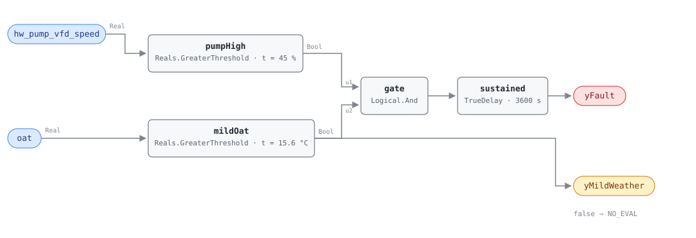

## Description

A variable-speed heating loop tells you what its pressure setpoint costs by how
fast the pumps have to run. On a mild day the heating valves are mostly closed
and a pump holding a properly reset differential pressure should be near its
minimum; find it still turning at 80% and the loop is being pressurised to a
number nobody chose for that day — almost always the design-day setpoint the
balancer left behind. The evidence is the pump, not the pressure: the setpoint
is being *tracked* perfectly in nearly every building carrying this fault, which
is exactly why the waste is invisible on a DP trend. Pump power follows the cube
of speed, so the economics are unusually good — the repair is a reset schedule
and a lower base setpoint, both remote. This rule is a library extension; the
reference's ch.14 stops at HW-FC-052 and both thresholds come from
PNNL-27338 §4.2.

## Detection Logic

```
yMildWeather = oat > mild_weather_oat                    (false ⇒ host reports NO_EVAL)
yFault = hw_pump_vfd_speed > high_pump_speed AND yMildWeather,
         sustained continuously for alarm_delay
```

Block graph (`rule.cxf.jsonld`):



Four blocks, and both comparisons are PNNL-27338 §4.2's own numbers. `pumpHigh`
and `mildOat` are strict, so a drive sitting exactly at 45.0% reads clear and
outdoor air exactly at 15.6 °C is NO_EVAL rather than a fault.

`mildOat.y` feeds both the conjunction and the `yMildWeather` boundary output,
and that second consumer is the whole NO_EVAL story: on a cold day a pump at 80%
is doing what it was bought to do, so `yFault = false` there means the question
was not asked. It also separates a repair from the weather turning — when the
alarm and its evaluability drop on the same tick, nothing was fixed.

`sustained` requires 60 continuous minutes and carries `delayOnInit = true`.
Continuous means continuous: a dip below the speed threshold discards the
elapsed time rather than pausing it, so the clock restarts from the second
crossing. `TrueDelay` asserts at exactly `T + delayTime`, making the realized
test "above both thresholds for strictly more than `alarm_delay`" at tick
resolution.

## Possible Diagnoses

Library-authored — PNNL-27338 §4.2 specifies a threshold test, not causes:

1. No DP reset schedule at all — the usual finding and the reason this rule
   exists. HW-FC-055 tests the setpoint trend directly and is the confirming rule
2. A reset that exists but resets from the wrong thing, or across too narrow a
   range — outdoor-air-based reset on an internally-driven load, or a 10 kPa
   span on a loop that could give up 60
3. The base setpoint itself too high — a commissioned schedule whose *whole*
   range sits above what the loop needs looks healthy on a setpoint trend and
   still fails this test, which is the case HW-FC-055 cannot see
4. Balancing valves throttled hard at the far end of the loop, so the pumps
   overcome a restriction a rebalance would remove
5. The DP sensor in the wrong place — at the pump discharge rather than near the
   hydraulically most remote coil, forcing the loop to carry a distribution loss
   no coil ever sees
6. Manual override or hand mode on the drive, which reads identically to a
   setpoint that is too high
7. Oversized pumps against a load the building never reached — the case with no
   repair beyond a trim or a lower setpoint, where the speed is telling the truth

## Energy Impact

EXCESS_CONSUMPTION, MEDIUM confidence, PROXY_ESTIMATION. The waste is pump
electricity and the arithmetic is the affinity law:
`pump_waste_kw ≈ hw_pump_kw × [1 − (1 − speed_reduction/100)³]`, CHW-FC-052's
estimator on the heating loop's drives — a loop that could run at 55% instead of
80% is giving away roughly two thirds of its pump power. §4.2 publishes no
savings range, so `savings_range` carries the DP-reset figure this library uses
on the chilled water side (0.5-2% of site energy, PNNL-25985 EEM-10/11); treat
it as an order of magnitude. Confidence is MEDIUM because the evidence is one
step removed — the rule does not measure the setpoint, and diagnoses 4 through 7
fail the test honestly.

## Emissions Impact

Scope 2, PROXY_EMISSIONS, MEDIUM confidence. All of the direct waste is
purchased electricity for the distribution pumps, so the scope does not vary by
site the way a boiler fault's does and the marginal operating emissions rate is
the right factor. There is a second-order Scope 1 term this card does not
quantify: over-pressurising the loop costs valve authority and therefore
delta-T, and that penalty belongs to HW-FC-053, which measures it directly.

## Deviations

- **This rule is a library extension, not a transcription.** The reference's
  ch.14 specifies HW-FC-050, 051 and 052 and stops; `faults/hw/README.md` frames
  FC-053 through 057 as library-authored rules grounded in PNNL-27338 §4. The
  name, severity 3 and `method: rule` are that index's, both thresholds are
  §4.2's, and the graph is HW-FC-052's shape; the rest is authored here.
- **`hw_dp` and `hw_dp_sp` are deliberately not bound.** A DP *tracking*
  comparison measures whether the pressure controller is working, and in almost
  every building carrying this fault it is working perfectly. A DP *threshold*
  would need a per-loop number with no published basis — 60 kPa is generous on
  one loop and starvation on another, and §4.2 does not test pressure either.
  Pump speed already normalises for the loop, because it is what the plant must
  do to hold whatever setpoint it has. Binding the pressure points as context
  would also make them binding obligations for signals the graph never reads, so
  `points` stays at two.
- **`yMildWeather` is an evaluability output, and HW-FC-052's identical
  comparison deliberately is not.** There the mild weather *is* the fault claim,
  so a cold day is a healthy verdict; here it is what makes a pump-speed reading
  interpretable at all, so `yFault = false` below the floor must not be read as
  a clean loop. Exposing the conjunct adds no logic and changes no verdict, and
  it is a comparison against a parameter rather than an echo of an input, which
  is what SCHEMA.md asks such an output to be. Same shape as CHW-FC-053's
  `yLoadOk`.
- **15.6 °C and 16.0 °C are two different parameters and must stay that way.**
  This rule's `mild_weather_oat` is §4.2's 60 °F converted and rounded to a
  tenth; HW-FC-052's `heating_plant_lockout_temp` is the reference's ch.14
  number. One is the temperature above which a heating plant should be off, the
  other the temperature above which pump speed becomes evidence — a host that
  consolidates them retunes two rules with one edit.
- **Strict `>` on both comparisons.** CDL `Reals` has no `GreaterEqual`, and
  §4.2's own arithmetic is strict. Both disagreements are measure-zero and both
  err toward silence, but a BAS that quantises drive speed to whole percent or
  outdoor air to whole degrees will sit on a boundary often, and should set the
  parameters between two quantisation levels.
- **Persistence stands in for PNNL's window average.** §4.2 tests `avg_pump_vfd`
  and `avg_OAT` over a 15-60 minute window (§1.2); this rule consumes
  instantaneous points and requires the condition continuously, so a 10-minute
  dip to 40% restarts the hour where an average would have carried through it.
  The trade — never alarming on a transient, but talkable-out-of a finding by a
  loop that oscillates around the threshold — is worth it on a fault whose whole
  character is that it sits still for months.
- **No run-status conjunct.** The rule reads speed alone and relies on a stopped
  pump reporting 0%. Adding `hw_pump_status` would guard against drives that
  latch their last commanded speed while stopped, at the cost of a third point
  and a second binding obligation for what is a wiring question rather than a
  plant one. It is `preconditions` text instead, alongside the multi-pump
  binding rule (lead drive or host-computed maximum, never an average across a
  lead/standby pair).
- **The domestic-hot-water confound is HW-FC-052's, and is not detectable here
  either.** A plant circulating in July for a service water or process load runs
  its pumps in mild weather for a legitimate reason and produces identical values
  on both points. Exclude the rule, bind a pump that does not serve DHW, or
  accept summer noise — never raise `mild_weather_oat`, which converts a false
  positive into a silent miss across the whole shoulder season.
- **`suppresses` and `suppressed_by` are both empty, and the HW-FC-055 pairing
  is why that is worth saying.** The tempting edge is "HW-FC-055 suppresses
  HW-FC-054", and it is wrong in both directions: a commissioned reset whose
  entire range sits too high fails this test and passes HW-FC-055's (diagnosis
  3), while a flat setpoint low enough to keep the drives under 45% fails
  HW-FC-055's and passes this one. Where both fire they are cause and
  consequence, and suppressing the consequence would delete the energy claim
  that justifies writing the reset schedule. `related`, not suppression.
- **`playbooks: [hot-water-plant-faults]`, not `missing-reset`.** The hot water
  playbook's Step 3 ends on this finding — high HW differential pressure
  setpoints, reset from the most-open valve — and its energy row names the same
  PNNL-27338 measures. `missing-reset` is the natural home for HW-FC-055, whose
  verification step is a setpoint trend; this rule's is a pump-speed trend
  against outdoor air. The playbook's Applies-To row is the index owner's edit.
- **`clusters: []`.** `clusters/clusters.json` has no hot water cluster, and
  CLU-02 (Missing Reset Strategy) is triggered by AHU-FC-057 with AHU and CHW
  members; this rule is a plausible future member and adding it is the cluster
  owner's edit.
- **`alarm_delay = 3600 s` is adopted.** PNNL-27338 specifies a data window and
  a minimum sample count, not an alarm persistence; an hour matches HW-FC-052
  and HW-FC-053, and this fault moves on a scale of months.
- `sustained.delayOnInit = true` (CDL default `false`), the library's standing
  choice: a plant already pumping hard in mild weather at controller restart
  waits out the full hour rather than alarming on the first tick.
- **No published test vectors exist for this algorithm.** §4.2 specifies
  thresholds, not cases, so every scenario in `vectors.json` is authored from
  the equation and replayed against the pinned engine rev.
- Operating states and preconditions are declared in frontmatter for host
  enforcement rather than encoded in the block graph, per the library's design
  stance.

## Notes

Read `yMildWeather` before `yFault`. Through most of a heating season this rule
is not evaluating anything, which is the intended behaviour: it has one useful
window, the mild hours.

Verify with a scatter plot before dispatching anyone. Plot pump speed against
outdoor air for a fortnight of the shoulder season: a loop with a working reset
draws a slope, a loop with this fault draws a horizontal band, and the height of
that band is roughly what the setpoint is costing. If the DP setpoint trend is
flat the finding is HW-FC-055's as well and the schedule is the repair; if it
moves and the pumps still do not slow down, the base setpoint is too high.

Then find the DP sensor — diagnosis 5 survives every remote fix, because no
reset schedule written against a sensor at the pump discharge can give back a
distribution loss no coil ever sees. Re-check the loop's delta-T after the
setpoint comes down; this fault and HW-FC-053 travel together.
