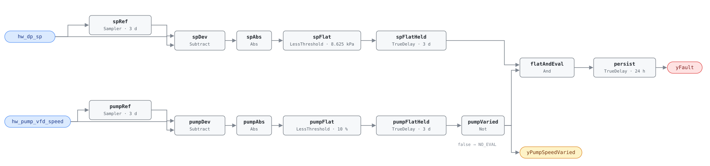

## Description

The hot water loop holds one differential-pressure setpoint all winter while
the pumps modulate underneath it. Whatever the design-day pressure was, that is
what the loop gets in November and in March, and the coil valves throttle away
the surplus. Pump power follows the cube of pressure, so the arithmetic is the
same one that makes the chilled water case worth chasing: a fifth off the
setpoint is roughly half the pump energy, and what buys it is a sequence, not a
pump.

This rule is a **library extension**. The HVAC FDD Reference's chapter 14
specifies three hot water rules — short-cycling, efficiency degradation, and
the OAT lockout — and no reset checks at all. The detection here is grounded in
PNNL-27338 §4.3.2, whose hot-water measure-identification algorithm flags a
loop whose DP setpoint moves less than 2.5 psi across a day. That threshold and
the shape of the test are the reference material; the window, the activity
conjunct, and every block in the graph are this library's, and the whole
argument for each is in Deviations.

The pump-speed conjunct is what makes a flat setpoint mean something. A loop
that is off, or one whose pumps sit at a fixed speed because nobody enabled the
drive's speed control, holds its setpoint flat for reasons that have nothing to
do with a missing reset. Requiring the speed to have moved says the loop is
alive and modulating — and when it has not moved, `yPumpSpeedVaried` goes false
and the host reports NO_EVAL rather than a fault.

## Detection Logic

```
baseline(x)      = x sampled and held every evaluation_window (3 days)
sp_flat          = |hw_dp_sp − baseline(hw_dp_sp)| < sp_flat_tolerance,
                   continuously for evaluation_window
pump_flat        = |hw_pump_vfd_speed − baseline(hw_pump_vfd_speed)|
                   < pump_variation_tolerance,
                   continuously for evaluation_window

yPumpSpeedVaried = NOT pump_flat     (false ⇒ host reports NO_EVAL)
yFault           = sp_flat AND yPumpSpeedVaried, sustained for alarm_delay
```

Block graph (`rule.cxf.jsonld`):



This is CHW-FC-051's detector with the heating loop's points bound to it, and
the mechanism is unchanged. Two symmetric chains compare each signal against a
sample-and-hold baseline refreshed once per window (`Discrete.Sampler`, which
emits the live input on its first tick, so there is no startup artifact).
`spFlatHeld` asserts only after the setpoint has stayed within tolerance of
that baseline continuously for a full window; any reset activity of 8.625 kPa
or more restarts it. `pumpFlatHeld` does the same for pump speed, and its
negation is `yPumpSpeedVaried`: "not varied" means a full window of continuous
flatness, so the signal is optimistically true during the first window after
startup — harmless, because `yFault` needs the same full window before it can
fire at all.

Both dwell timers fire on the same tick when the loop is flat in both signals,
so the fault conjunction is false by construction on that tick and there is no
boundary race; `pump_speed_within_variation_tolerance` pins it. `persist`
(24 h) filters the remainder. Worst-case time to alarm from cold start:
`evaluation_window + alarm_delay` — 4 days. A loop that goes flat mid-run
alarms 4 days after the setpoint settles, which `sp_goes_flat_mid_run` pins at
exactly 388,800 s for a 12 h startup transient.

## Possible Diagnoses

The reference algorithm publishes a detection test and no diagnosis list; these
are this library's, in the order a technician should work them.

1. Loop DP reset never programmed. The common case, and a desk fix
2. Reset programmed but disabled, or the setpoint overridden to a fixed value
   and the override never released
3. Valve-position or zone requests never reach the pump controller, so a
   correctly written reset has nothing to respond to
4. DP sensor mounted at the pump discharge rather than at the hydraulically
   most remote coil, which makes a correct reset impossible to commission and
   is a pipe-fitting job rather than a programming one
5. Reset running but writing to a different point than the one trended — a
   monitoring artifact, not a plant fault, and the cheapest thing on the list
   to rule out

## Energy Impact

EXCESS_CONSUMPTION, HIGH confidence, PROXY_ESTIMATION. The savings figure is
the hot water playbook's: HW supply-temperature reset and DP reset together
are worth 1–3% of site energy, with no published split between the two. The
mechanism on this half is the cubic pump law — the same relationship that makes
CHW-FC-052 one of the better-paying findings in the chilled water plant — and
it is climate-weighted toward heating-dominant sites simply because that is
where the loop runs for months rather than weeks.

Confidence is HIGH for the detection, not for the dollar figure. That a flat
setpoint on a modulating loop means no reset is about as direct as inference
gets; what the reset would have saved depends on how much surplus pressure the
loop was carrying, which nothing in these two points can measure.

## Emissions Impact

Scope 2, PROXY_EMISSIONS, HIGH confidence. The waste here is pump electricity,
so it prices at the marginal operating emissions rate and shrinks as the grid
does — unlike HW-FC-057's fuel-side twin, which a site owns no matter how clean
its electricity gets. Typical range 300–3,000 kg CO₂e/yr for a distribution
loop carrying an uncommissioned setpoint, by analogy with CHW-FC-052's
equivalent chilled water case; no HW-specific figure is published.

## Deviations

- **This rule extends the reference rather than transcribing it.** The HVAC FDD
  Reference's ch.14 covers HW-FC-050, 051 and 052 only, so there is no
  reference card behind this one: no published Description, Operating States,
  diagnosis list, tunable-parameter line or test vectors. The detection is
  paraphrased from PNNL-27338 §4.3.2 via the deep-read memo; `name`, `severity`
  and `method` come from `faults/hw/README.md`, which owns the index. Everything
  else on this card is authored, and the bullets below say which choices had no
  published spec behind them.
- **Daily MAX−MIN → rolling sampled baseline plus dwell.** PNNL's reset checks
  run once a day at midnight over the prior day's setpoint array; this engine
  has no windowed min/max block and no batch clock, and the library settled
  this question at AHU-FC-057/058 and again at CHW-FC-051/052. Each chain
  compares its signal against a `Discrete.Sampler` hold refreshed once per
  window, with the tolerance set to half the reference range — the library's
  half-range convention, because a signal that swings ±t about a baseline
  spans 2t. Detection is equivalent for a setpoint that moves and returns, and
  slightly conservative for monotonic drift inside one window: a setpoint
  ramping steadily by 17 kPa across three days crosses the tolerance and clears
  the dwell, where a range test would still call the day flat.
- **2.5 psi becomes an 8.625 kPa half-range.** PNNL states the threshold in
  psi; the point dictionary carries `hw_dp_sp` in kPa and rules do no unit
  conversion, so the conversion happens here, once: 2.5 psi = 17.24 kPa,
  half-range 8.62 kPa, shipped as **8.625 kPa** (a 17.25 kPa range). The
  0.08% difference from an exact conversion is far below any BAS's setpoint
  resolution, and 8.625 is exactly representable in binary floating point,
  which is what lets `sp_at_flat_tolerance` pin the boundary to the bit rather
  than to within a rounding error.
- **The 3-day window is adopted from CHW-FC-052, not from PNNL.** PNNL's window
  is one calendar day, which works there because the daily batch discards its
  evidence at every midnight. A rolling dwell does not: a one-day dwell plus a
  24 h alarm delay would fire on any quiet weekend, since a lightly loaded
  Saturday and Sunday are two days of a setpoint nobody is moving. Three days
  spans a weekend plus a working day, and it is the window the reference itself
  specifies for the chilled water DP-reset sibling, which is the closest thing
  to a published figure available for this test. Sites trending slowly or
  running seven-day schedules can raise it; `evaluation_window` drives all four
  timing parameters together and hosts must set them as a group.
- **Pump-speed range is the activity conjunct, and it is not CHW-FC-052's valve
  test.** CHW-FC-052 requires the most-open coil valve to sit below a threshold,
  which excludes the one benign explanation for a flat DP setpoint: a reset
  that is working correctly and has been driven to its upper limit by a
  starving coil. The hot water dictionary has no valve aggregate to bind, so
  that test is unavailable, and pump-speed range is the honest analog — it is
  the load proxy PNNL's own hot water algorithms use (§4.2.2 tests
  `avg_pump_vfd > 45%` for a high DP setpoint, §4.4.2 tests
  `avg_pump_vfd < 35%` for a high supply temperature). What it buys is
  different and weaker, and the difference matters: pump-speed range answers
  "is this loop alive and modulating," not "is any coil starving." The
  pinned-at-maximum case is only partly excluded — a loop pinned at its DP
  limit by a starving coil usually runs its pumps flat out, which collapses the
  speed range and correctly yields NO_EVAL, but a loop that still modulates
  below full speed against a maxed-out setpoint will read as a missing reset
  here. The planned HW-FC-054 (high loop DP) is the rule that separates those
  two on the same loop; until it lands, diagnosis 4 is the thing to check
  before dispatching.
- **The 20-point minimum speed range is adopted, and argued rather than cited.**
  PNNL's §4.3.2 has no activity gate at all — it is a bare range test on the
  setpoint trend — so there is no published figure to transcribe and the number
  shipped here (as `pump_variation_tolerance = 10 %`, half-range) follows
  CHW-FC-051's adopted `min_load_range` in both shape and intent: a low bar
  that a live loop clears easily, not a discriminating threshold. A
  variable-speed heating loop that never swings 20 points of speed across three
  days is either riding its minimum-speed floor, running against a fixed
  bypass, or reporting a dead feedback — and NO_EVAL is the right answer in all
  three cases. Sites with genuinely stiff loops should lower it, in the
  knowledge that lowering it makes the rule fire more often, not less.
- **NO_EVAL surfaced as `yPumpSpeedVaried`, where CHW-FC-052 ships no
  evaluability output at all.** The two rules treat their second point
  differently on purpose. CHW-FC-052's valve test is a conjunct of the fault
  condition — a starving coil makes the flat setpoint legitimate, not
  unmeasurable — and exposing it would have echoed one boundary input through
  one threshold, which this library does not do. The pump-speed test here is an
  evaluability question: a loop that is not moving cannot be judged either way,
  which is CHW-FC-051's `yLoadVaried` semantics exactly. It also earns its
  place as an output rather than an echo, being a stateful window test over the
  signal's own baseline rather than a comparison a host could recompute from
  the input alone. Boolean block logic has no tri-state, so the host must read
  it first: false means NO_EVAL, never healthy.
- **`Reals.MovingAverage` rejected, and the tick band that follows.** The
  engine implements it with a fixed 64-checkpoint ring, so a window needs
  `dt ≥ evaluation_window/63` — 4,114 s (1 h 9 min) at three days — before the
  window stops silently dropping its oldest samples. No BAS ticks that slowly,
  so the block is unusable here; AHU-FC-057 found this and every reset rule
  since has inherited the finding. The sampler-and-dwell chain has no lower
  bound on tick period at all. Its upper bound is what you want to see: a reset
  excursion shorter than one tick is invisible to the flatness test, so trend at
  5–15 min. These vectors run at 5 min.
- **Strict comparisons, and both measure-zero boundaries pinned.**
  `Reals.LessThreshold` is `u < t`, so a signal sitting exactly on a tolerance
  falls on the *not-flat* side: a setpoint deviating exactly 8.625 kPa from its
  baseline clears the flatness dwell, and a pump speed deviating exactly 10
  points counts as varied. Equality is measure-zero in continuous data and
  perfectly reachable in a BAS that scales setpoints to fixed increments, so
  both boundaries are pinned from both sides in the vectors —
  `sp_at_flat_tolerance` / `sp_within_flat_tolerance` and
  `pump_speed_at_variation_tolerance` / `pump_speed_within_variation_tolerance`.
  The delay edges are pinned the same way, to the tick: the alarm asserts at
  exactly 345,600 s from a cold start and at exactly 388,800 s when the
  setpoint goes flat 12 h into the run, and `yPumpSpeedVaried` drops at exactly
  259,200 s.
- **`alarm_delay` = 24 h implemented as `TrueDelay` on the fault conjunction**;
  the evaluation window itself is enforced by the two flatness dwells.
  `delayOnInit = true` on every `TrueDelay` (startup conservatism per
  AHU-FC-050), so a rule loaded onto a loop that is already faulted still waits
  the full window plus delay before it says so. The 24 h delay is the value
  every reset rule in this library carries; PNNL's daily batch has no analog
  to it, since its whole evaluation is one shot per midnight.
- **Two playbooks, where the house habit is one.** `missing-reset` owns the
  reset family's verification step — plot the setpoint against its driver over
  the window — and its Applies-To already reaches past the AHU rules to the CHW
  pair. `hot-water-plant-faults` owns the hot water remedies and already
  carries this fault's fix in its step 3 (reset the loop DP from the most-open
  valve position). Neither covers the fault alone and both index owners are
  other writers, so this card lists both rather than stretching one.
- **Blind spots.** The rule reads the setpoint, never the pressure: a loop whose
  setpoint resets correctly while the pumps fail to track it is a different
  fault. Diagnoses 1–3 produce one signature and cannot be separated here.
  Diagnosis 4 — a DP sensor at the pump discharge — is worse than invisible,
  because it produces a plausible flat setpoint that this rule reports as a
  missing reset, which is why the playbook's first step is to find the sensor
  before programming anything. A loop whose pumps are off for the window holds
  both signals flat; `yPumpSpeedVaried` catches the common case, but a loop
  cycling on and off around a fixed speed can present a varying speed and a
  legitimately flat setpoint. And nothing here notices a reset that moves the
  setpoint in the wrong direction — a reset written backwards is a working
  reset as far as a range test is concerned.

## Notes

Fix path is the [missing-reset](../../../playbooks/missing-reset.md) playbook
for the verification step and
[hot-water-plant-faults](../../../playbooks/hot-water-plant-faults.md) for the
remedy: plot `hw_dp_sp` against `hw_pump_vfd_speed` over the window, confirm the
DP sensor sits at the hydraulically most remote coil rather than at the pump,
then program the reset from valve position or zone requests. Both playbooks'
Applies-To rows are their own owners' to extend.

`clusters` is deliberately empty. CLU-02 ("Missing Reset Strategy") is an
AHU-scoped cluster triggered by AHU-FC-057, and membership is
`clusters/clusters.json`'s to declare, not this card's — the same call
CHW-FC-051 and CHW-FC-052 made one system upstream. A plant that fails both
HW-FC-055 and HW-FC-057 has one root cause, which is that nobody commissioned
the hot water resets, and it should be dispatched as one visit.
