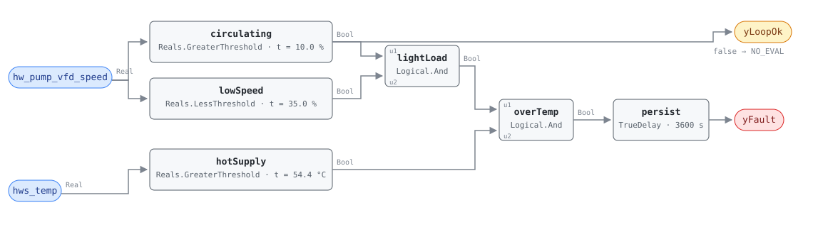

## Description

A hot water plant that cannot lower its supply temperature spends the whole
heating season paying design-day prices for mild-day heat. The boiler makes
water hot enough for the coldest hour of the year, the loop carries it past
every coil and through every metre of pipe, and on a 10 °C afternoon the
building takes almost none of it. What is left is standing loss — heat leaking
out of the distribution system into ceilings and shafts — plus a boiler running
at the least efficient end of its own curve, which on a condensing boiler means
never condensing at all, because the return water comes back as hot as the
supply went out.

This rule reads that condition off two signals. The pump speed says how much of
the plant's output the building is actually drawing: on a loop under
differential-pressure control the drive slows as the coil valves close, so a
pump loafing at 20% is a building asking for very little. The supply
temperature says what the plant is making anyway. Light draw with
full-temperature water is the signature, and it is nearly always the
water-side symptom of a supply-temperature reset that is missing, disabled, or
bottomed out too high — which is why HW-FC-057 sits next to this card and looks
at the same failure from the setpoint side.

This is a library-authored rule, not a transcription. The HVAC FDD Reference's
chapter 14 specifies three hot water faults — short-cycling, combustion
efficiency, and the OAT lockout — and this is none of them. The logic and both
published thresholds come from PNNL-27338 §4.4.2, one of the five hot-water
measure-identification algorithms in that report and one this library had no
analog for; the persistence, the evaluability floor, and every test vector are
the library's own and are argued below.

## Detection Logic

```
yLoopOk = hw_pump_vfd_speed > min_pump_speed_for_eval   (false ⇒ host reports NO_EVAL)

yFault  = yLoopOk
      AND hw_pump_vfd_speed < low_load_speed_threshold
      AND hws_temp > high_hws_temp_threshold,
          sustained continuously for alarm_delay
```

Block graph (`rule.cxf.jsonld`):



Six blocks. `lowSpeed` and `hotSupply` are PNNL's two conditions, both strict
and both reading their thresholds as parameters, so a site retunes either with
`set_param` without touching the graph. `lightLoad` and `overTemp` are the
conjunction, chained rather than expressed as a `MultiAnd`: no card in this
library uses `MultiAnd`, and the ones that conjoin three or more conditions
chain `Logical.And` blocks (RTU-FC-055 chains three), so a reader who has seen
one of those graphs can read this one.

`circulating` is the third comparison and the one PNNL does not specify. The
low-speed side of a low-speed test is exactly where a stopped pump lives: a
plant on overnight setback reads 0% speed with 65 °C water still standing in
the boiler, satisfies both of the published conditions perfectly, and is not a
fault at all. `pump_off_with_hot_standing_water` is that scenario, and it
reports nothing because `circulating` is false. The same comparison is exposed
as `yLoopOk` so a host can tell "the loop is circulating and the water is
appropriate" from "nobody is pumping and the rule has no opinion" — two
readings that both come out as `yFault = false`.

`persist` requires 60 continuous minutes. Persistence is continuous, not
accumulated: a pickup that takes the pumps to 40% for ten minutes discards the
elapsed time rather than pausing it (`pump_speed_rises_and_restarts_the_clock`,
alarm at 6000 s), and the alarm falls on the tick the condition ends with no
release delay (`supply_temperature_resets_down_after_the_alarm`).

## Possible Diagnoses

Authored for this card. PNNL-27338 specifies detection thresholds and, for most
of its measures, an automatic setpoint correction the host writes back to the
BAS; it publishes no diagnosis list, and the reference has no HW-FC-056 card to
transcribe.

1. No HW supply temperature reset programmed. The common case and a remote fix:
   the plant runs one setpoint all year because nobody wrote the reset sequence.
   HW-FC-057 detects the same failure directly, at the setpoint
2. Reset programmed but its low end is too high. A schedule that bottoms out at
   65 °C looks correct in the sequence and behaves nearly as badly in the mild
   hours, which is most of the heating season. This is the diagnosis that
   survives a casual review of the controls
3. Reset disabled or overridden during a cold snap and never released — the
   same failure mode the after-hours family sees on fans, with the same cause
   (an override with no expiry)
4. Boiler minimum-temperature protection setting the floor. Many non-condensing
   boilers hold a minimum supply or return temperature to keep flue gas from
   condensing in the heat exchanger, and where that limit is what stops the
   reset going lower, the finding is real but the fix is not a sequence: it is a
   blending valve, a buffer arrangement, or a condensing retrofit
5. Boiler-local control ignoring the BAS. The aquastat or burner controller runs
   its own high limit and the BAS reset never reaches the fire. Cross-check
   `hws_temp` against `hws_temp_sp`: a setpoint that resets while the water does
   not is this diagnosis, and it is the one case where HW-FC-057 stays quiet
   while this rule fires
6. Emitters that genuinely need the temperature. An old cast-iron or fin-tube
   system sized for 82 °C water cannot be reset far without losing capacity in
   the coldest hours, and at low load it may still be operating as designed.
   Not a controls fault — a plant-design finding, and the reason the threshold
   is called out as site configuration rather than shipped as law

## Energy Impact

EXCESS_CONSUMPTION, MEDIUM confidence, PROXY_ESTIMATION. The library's hot water
playbook puts HW supply-temperature reset and DP reset together at 1–3% of site
energy, from PNNL-27338's own measure set; neither that source nor this card
splits the two, and no estimator here converts a flagged hour into kilowatts.
What can be said about the mechanism is definite. Standing loss is proportional
to how much hotter the water is than everything around it, so every degree of
reset that a plant cannot deliver is paid for continuously along the whole
distribution system, in every hour the loop is warm. The boiler-side term
depends on the machine: a non-condensing boiler loses a little efficiency
running hotter than it must, and a condensing boiler loses a great deal, because
supply temperature drags return temperature with it and condensing stops when
the return water stays above roughly the flue gas dew point.

Confidence is MEDIUM, and the reason is the threshold rather than the
measurement. Both inputs are direct readings and the comparison is unambiguous;
what the rule does not know is the plant's design supply temperature. On a
building with modern coils sized for 60 °C water, 54.4 °C at low load is a
finding. On a 1950s radiator system it may be Tuesday. The rule reports the
condition; the site decides what its emitters can accept, which is why
`high_hws_temp_threshold` is documented as per-plant configuration and why the
first playbook step is to look at the reset schedule before anything else.

Climate sensitivity is heating-dominant, weighted toward the mild end. The
fault costs nothing in the coldest hours — when the building really is drawing
design-temperature water, the pump is fast and the rule is silent — and costs
the most across the long mild stretch where most heating hours actually live.

## Emissions Impact

Scope 1, PROXY_EMISSIONS, MEDIUM confidence. The waste here is fuel, not
electricity: the pump is doing useful work at whatever speed the loop needs, and
what gets thrown away is the extra fuel burned to hold water hotter than the
building is asking for, plus the heat that leaks out of the pipe on the way.
That makes this one of the few findings whose emissions a decarbonised grid does
not touch, and it makes the condensing case worth separating in a report: a plant
whose supply temperature keeps its return water above the dew point is paying a
combustion-efficiency penalty on every therm, not just a distribution one.

No factor is applied here. The host multiplies whatever fuel figure it can
bound (see `runtime_estimation`) by a static combustion emissions factor, the
same basis HW-FC-052 uses for its Scope 1 half.

## Deviations

- **This rule is a library extension, not a transcription.** The HVAC FDD
  Reference v1.0 ch.14 specifies exactly three hot water rules — HW-FC-050
  (short-cycling), HW-FC-051 (combustion efficiency), HW-FC-052 (OAT lockout) —
  and publishes no card, no tunables table, and no test vectors for anything
  resembling this one. The detection logic and both published thresholds are
  paraphrased from PNNL-27338 §4.4.2 via this repository's deep-read memo;
  `faults/hw/README.md` carries the canonical framing for the whole
  HW-FC-053..057 batch, and `name`, `severity: 3` and `method: rule` are that
  index's, which owns them.
- **130 °F ships as 54.4 °C, which is 0.044 K below the exact conversion.**
  PNNL's threshold is 130 °F = 54.444… °C. The library works in °C and shipping
  the exact repeating value would put a fifteen-digit literal in the graph to
  express a number the source stated to three significant figures, so the
  parameter is 54.4. The direction is worth stating: the shipped value is very
  slightly more sensitive than the source's, by four hundredths of a kelvin,
  which is an order of magnitude finer than any hot water sensor a building
  owns. `high_hws_temp_threshold` is per-plant configuration in any case.
- **`min_pump_speed_for_eval` is ADOPTED, and it is the largest departure from
  the source.** PNNL's algorithm is two conditions with no plant-running gate,
  and read literally it is unsound on the low side: a stopped pump reads 0%,
  which is the lightest possible load, while the water in a boiler stays hot for
  hours after the burner and the pumps stop. Every overnight setback and every
  summer weekend would report the fault. PNNL's platform gates every one of its
  algorithms on data sufficiency (`data_window`, `no_required_data`,
  `max_dx_time`, §1.2/§2.1) — the same class of concern SCHEMA.md routes to
  preconditions and evaluability outputs — but nothing in the published §4.4.2
  logic excludes a stopped pump, and that gap has to be closed somewhere. It is
  closed here: `hw_pump_vfd_speed > min_pump_speed_for_eval`
  is a conjunct of the fault condition and is also exposed as `yLoopOk`.
  Precedent for the shape is CHW-FC-053's `min_load_for_eval` / `yLoadOk` and
  VFD-FC-050's `min_cmd_for_eval` / `yCmdOk`; per SCHEMA.md this is a comparison
  of an input against a parameter, not an echo of an input.
- **The floor ships at 10%, well below the fault threshold, on purpose.** Its
  only job is to exclude a pump that is stopped or barely turning; the band
  between it and `low_load_speed_threshold` is where the fault lives, and a
  distribution pump at 15% is genuinely circulating and genuinely lightly
  loaded, which is precisely the regime worth reporting. VFD-FC-050 sets its
  analogous floor at 20% because it is asking whether a drive is tracking a
  command, a question that needs more signal than "is water moving". Note the
  direction before retuning: raising this number narrows the fault band and
  produces fewer findings, and raising it above 35% deletes the rule.
- **`alarm_delay` is ADOPTED at 60 minutes.** PNNL publishes no fault
  persistence for this measure — its shape is a 15–60 minute rolling average
  evaluated against the thresholds, with the daily-batch treatment reserved for
  its four reset checks. Sixty minutes is the top of that averaging range and
  the library's standing persistence for plant-level findings: HW-FC-052 holds
  its lockout condition for an hour, CHW-FC-053 holds its low delta-T for an
  hour, and both are the same kind of slow, thermal, plant-wide condition as
  this one. An hour also rides out the transient that would otherwise dominate:
  morning warm-up, when the loop is hot and the pumps have not yet ramped
  because the coil valves are still opening.
- **Continuous persistence replaces PNNL's window average.** The reference
  averages both signals across the window and compares the averages; this rule
  consumes instantaneous points and requires the conjunction to hold on every
  tick for the full hour. For a steady condition — which is what a missing reset
  produces — the two agree. They differ on intermittency, and this one is
  stricter: a loop that alternates 20 minutes hot-and-loafing with 20 minutes
  busy never accumulates the hour and never alarms, though its window average
  might trip. CHW-FC-053 made the same trade for the same reason and pinned it
  the same way; here `pump_speed_rises_and_restarts_the_clock` is the vector
  that makes the miss concrete. The library has no windowed-average block worth
  using for this: `Reals.MovingAverage`'s fixed 64-checkpoint ring needs a tick
  period of at least window/63 before it silently drops samples, which is
  tolerable at an hour and useless at the multi-day windows the reset cards
  need — and adopting it here for consistency with a family that rejected it
  would be the wrong kind of consistency.
- **Pump speed alone is the load proxy; no OAT conjunct.** PNNL's neighbouring
  high-DP measure (§4.2.2, this library's HW-FC-054) crosses pump speed with
  mild outdoor air, and its supply-temperature measure (§4.4.2) deliberately
  does not — the pump speed *is* the load measurement, and a lightly loaded
  building on a cold, sunny, internally-driven afternoon is exactly as valid a
  finding as one in April. Adding an OAT gate here would import HW-FC-052's
  regime, narrow the rule to the swing seasons, and make two hot water cards
  answer nearly the same question. This card keeps the source's shape: HW-FC-052
  needs warm weather because it asks whether the plant should be running at all,
  and this one needs light load because it asks what temperature the running
  plant should be making.
- **Strict comparisons on all three thresholds, and every boundary pinned three
  ways.** `Reals.LessThreshold` is `u < t` and `Reals.GreaterThreshold` is
  `u > t`; CDL `Reals` has no `LessEqual` or `GreaterEqual` in any case. A pump
  at exactly 35.0%, water at exactly 54.4 °C, and a pump at exactly 10.0% all
  fall on the no-fault, no-eval side. Equality is measure-zero in continuous
  data and perfectly reachable in a BAS that scales drive feedback to whole
  percent, so each boundary carries an on-the-line vector plus one a tenth of a
  unit either side: `pump_speed_exactly_at_the_low_load_threshold` /
  `…_one_tenth_below_…` / `…_one_tenth_above_…`,
  `hws_temp_exactly_at_the_high_supply_threshold` and its pair, and
  `pump_speed_exactly_at_the_evaluability_floor` and its pair. Both the vector
  and the parameter spell 54.4, so the temperature boundary is decided by the
  strictness rather than by rounding.
- **`TrueDelay` asserts at exactly `T + delayTime`, so the realized test is
  "condition held for strictly more than `alarm_delay`" at tick resolution.** A
  loop whose water drops on the maturity tick is never reported
  (`condition_ends_on_the_maturity_tick`); one tick later it asserts for that
  tick and clears (`condition_ends_one_tick_later`). Both sides of the delay
  edge are pinned, which is what makes the boundary observable rather than
  assumed.
- `persist.delayOnInit = true` (the CDL default is `false`), the library's
  standing choice: a plant already loafing with hot water when the controller
  restarts waits out the full hour rather than alarming on the first tick.
- **No suppression contract with HW-FC-057, deliberately.** The two rules see
  one common failure from opposite ends — HW-FC-057 watches the setpoint refuse
  to move, this one watches the water stay hot while the loop goes quiet — and
  the tempting move is to declare the reset detector the trigger and this one
  suppressed. Two things argue against it. The findings are separable in both
  directions: a reset schedule that moves correctly but bottoms out at 65 °C
  fires this rule and not HW-FC-057, and a flat setpoint parked at 50 °C fires
  HW-FC-057 and never trips 54.4 °C here. And suppression is a two-card
  contract; `suppresses`/`suppressed_by` on one side without the other is a
  half-written relationship. They are `related`, they belong in one visit, and
  the Notes say which to read first.
- **`related` spans the family and is asserted here first.**
  `faults/hw/README.md`'s Relationships section documents HW-FC-050/051/052 and
  has not yet been extended to the PNNL batch — that index is another writer's
  and this card does not touch it. The five entries are: HW-FC-057 (the same
  failure at the setpoint), HW-FC-053 (low loop delta-T, the other water-side
  reading of a distribution problem — note it can point the opposite way, since
  hotter supply water at a given return temperature *raises* delta-T, so a plant
  showing both has two causes rather than one), HW-FC-054 (loop DP too high —
  the pressure-side twin, a plant working the pumps harder than the load needs
  where this one works the boiler harder), HW-FC-055 (the DP reset detector,
  which stands to HW-FC-054 as HW-FC-057 stands to this rule), and HW-FC-052,
  the reference-derived lockout that shares the plant and the family resemblance
  but not the regime.
- **`clusters: []`.** CLU-02 ("Missing Reset Strategy") is the syndrome this
  fault belongs to — it is triggered by AHU-FC-057 and already carries the
  air-side consequence rule AHU-FC-065, which is this card's structural analog
  one system over. But the cluster is AHU-scoped today, membership is
  `clusters/clusters.json`'s to declare, and the natural HW-side trigger is
  HW-FC-057 rather than this rule. CHW-FC-051/052 left the same note when they
  shipped; the cluster owner's edit will cover all of them at once.
- **`playbooks: [hot-water-plant-faults]`.** The playbook's Applies-To row names
  only HW-FC-050/051/052 — the index owner's line to extend — but its Step 1
  already carries this fault's remedy in full, including the OAT-based reset
  schedule and typical temperatures, because it was written from the same PNNL
  measure set. `missing-reset` is the near miss: its Applies-To has already
  grown plant-side to the CHW pair, but its procedure is SAT and DSP plots
  throughout, and the card that should claim it on the hot water side is
  HW-FC-057, the actual reset detector.
- **Blind spots, in the order they will bite.** A constant-volume loop has no
  speed signal and the rule does not apply — bind nothing rather than binding a
  run status scaled to 100. A loop whose DP setpoint never resets holds its
  pumps fast at low load, which suppresses this rule silently: the miss is
  HW-FC-054/HW-FC-055's finding, and a plant with both problems will show only
  the pressure one until it is fixed. The rule sees water, not setpoints, so it
  cannot separate "the reset never ran" from "the reset ran and the boiler
  ignored it" — that is diagnosis 5 and it needs `hws_temp_sp`, which
  HW-FC-057 reads. And nothing here guards against a supply sensor reading high:
  a 3 K offset moves this decision by more than half the distance between a
  well-reset plant and a flagged one.
- **No published test vectors.** PNNL-27338 publishes none for its hot water
  measures, and the reference has no card for this fault at all, so all nineteen
  scenarios in `vectors.json` are authored from the equation and replayed
  against the pinned engine rev.

## Notes

Read `yLoopOk` before `yFault`. A plant on setback, a summer weekend, or a loop
whose pumps have simply stopped all hold `yLoopOk` false, and every
`yFault = false` underneath that means "not evaluated" rather than "the water is
at the right temperature". `pump_stops_after_the_alarm` is the vector that makes
the distinction concrete: `yFault` falls at 5400 s there exactly as it does in
`supply_temperature_resets_down_after_the_alarm`, and only the second output
says which of the two happened — one is a fix, the other is a plant going quiet
with the same hot water still in it.

Where to look first, in the order that costs least. Trend `hws_temp` against
`hws_temp_sp` and outdoor air for a week before dispatching anyone. A supply
temperature that tracks a flat setpoint is diagnosis 1 or 2 and the fix is a
sequence written from a desk. A setpoint that resets while the water does not
follow is diagnosis 5, and the problem is at the boiler's own controller, not in
the BAS. A supply temperature that will not go below a floor no schedule
explains is diagnosis 4 — boiler minimum-temperature protection — and that one
is a plant-design conversation about blending, buffering, or condensing
equipment, not a controls ticket. Only then is it worth asking whether the
emitters can accept cooler water at all, which is diagnosis 6 and the one case
where the correct outcome is to retune `high_hws_temp_threshold` and close the
finding.

On a site where both fire, HW-FC-057 is the one to fix: it names the cause, this
rule measures the consequence, and clearing the reset should clear both within a
day or two of mild weather. The four library-authored siblings divide the same
PNNL section cleanly — HW-FC-054 and HW-FC-055 are the pressure-side pair
(setpoint too high, reset missing), this card and HW-FC-057 are the
temperature-side pair, and HW-FC-053 measures what the building does with
whatever it is sent. A plant that trips several of them does not have several
problems; it has a distribution system nobody has commissioned, and one visit
with all five findings in hand is worth more than five tickets.
