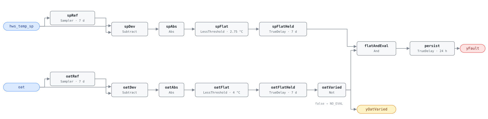

## Description

The hot water supply setpoint sits at its design value from October to April
while the weather moves through thirty degrees underneath it. A working reset
schedules supply temperature against outdoor air, and the savings arrive by two
routes: every metre of distribution pipe sheds less heat, and a condensing
boiler that sees return water below roughly 55 °C picks up something like ten
points of combustion efficiency it cannot reach at design temperature.

This rule is a **library extension** — the reference's ch.14 specifies three hot
water rules and no reset checks. The detection is grounded in PNNL-27338 §4.5.2,
which flags a plant whose supply setpoint moves less than 10 °F across a day;
the window, the weather gate and every block in the graph are this library's.
The weather gate is what makes a flat setpoint evidence: a week where the
weather did not move is a week where a correct reset had nothing to do, and a
frozen OAT sensor — one of the things that *causes* a flat setpoint — flattens
the driver and takes the rule out of service rather than letting it report a
fault it cannot substantiate.

## Detection Logic

```
baseline(x)  = x sampled and held every evaluation_window (7 days)
sp_flat      = |hws_temp_sp − baseline(hws_temp_sp)| < sp_flat_tolerance,
               continuously for evaluation_window
oat_flat     = |oat − baseline(oat)| < oat_variation_tolerance,
               continuously for evaluation_window

yOatVaried   = NOT oat_flat        (false ⇒ host reports NO_EVAL)
yFault       = sp_flat AND yOatVaried, sustained for alarm_delay
```

Block graph (`rule.cxf.jsonld`):



This is AHU-FC-057's detector with the boiler plant's points bound to it. Two
symmetric chains compare each signal against a weekly `Discrete.Sampler`
baseline, which emits the live input on its first tick, so there is no startup
artifact. `spFlatHeld` asserts only after the setpoint has stayed within
tolerance continuously for a full window, and any reset activity of 2.75 °C or
more restarts it. `oatFlatHeld` does the same for outdoor air, and its negation
is `yOatVaried` — "not varied" means a full window of continuous flatness, so
the signal is optimistically true during the first window after startup, which
is harmless because `yFault` needs that same window.

Both dwell timers fire on the same tick when plant and weather are flat
together, so the fault conjunction is false by construction on that tick and
there is no boundary race. `persist` (24 h) filters the remainder, and every
`TrueDelay` carries `delayOnInit = true`. Worst-case time to alarm from cold
start is `evaluation_window + alarm_delay` — 8 days. Comparisons are strict, so
a signal sitting exactly on a tolerance falls on the *not-flat* side.

## Possible Diagnoses

The reference algorithm publishes a detection test and no diagnosis list; these
are this library's, in the order a technician should work them.

1. HWS reset never programmed — the common case, and a desk fix
2. Reset programmed but disabled, or the setpoint overridden to a fixed value
   after a cold-weather complaint and never released
3. Reset schedule configured with endpoints so close together that the plant
   never leaves its design temperature — programmed, reviewed, and useless
4. Boilers running to their own local panel setpoints and ignoring the BAS
   value, in which case the trended setpoint may even reset while the water
   does not
5. Domestic hot water load holding the plant at a fixed temperature. Not a
   fault; a precondition this rule cannot check (see Deviations)

## Energy Impact

EXCESS_CONSUMPTION, HIGH confidence, PROXY_ESTIMATION. The savings figure is the
hot water playbook's: HW supply-temperature reset and DP reset together are
worth 1–3% of site energy, with no published split. The share belonging to this
rule depends on the boiler — on a non-condensing plant the recovery is
distribution and standby loss, worth a few percent of plant fuel, while on a
condensing plant a reset that drops return water under about 55 °C for the mild
half of the season is worth several times that. Heating-dominant, and the
strongest case for the fix is in mild climates and shoulder seasons.

## Emissions Impact

Scope 1, PROXY_EMISSIONS, HIGH confidence; typical 500–5,000 kg CO₂e/yr for a
plant carrying an uncommissioned setpoint through a heating season. The scope is
what separates this rule from its DP twin: combustion at the site on a static
fuel factor, so a site that has decarbonised its electricity still owns every
kilogram. Plants heated electrically or by heat pump move the accounting to
Scope 2 and the marginal operating emissions rate; the fault is the same and the
host owns the classification.

## Deviations

- **This rule extends the reference rather than transcribing it.** Ch.14 covers
  HW-FC-050, 051 and 052 only, so there is no reference card behind this one —
  no published description, operating states, diagnosis list, tunables line or
  test vectors. The detection is paraphrased from PNNL-27338 §4.5.2 (Katipamula
  et al. 2018); `name`, `severity` and `method` come from `faults/hw/README.md`.
- **Daily MAX−MIN → rolling sampled baseline plus dwell.** PNNL's reset checks
  run once a day at midnight over the prior day's array; this engine has no
  windowed min/max block and no batch clock, a question the library settled at
  AHU-FC-057 and has reused since. Tolerances are half the reference range — the
  half-range convention, because a signal swinging ±t about a baseline spans 2t.
  Detection is equivalent for a setpoint that moves and returns, and slightly
  conservative for monotonic drift inside one window, where a range test would
  still call it flat.
- **10 °F becomes a 2.75 °C half-range.** The point dictionary carries
  `hws_temp_sp` in °C, so the conversion happens here once: a 10 °F interval is
  5.56 °C, half-range 2.78, shipped as 2.75 (a 5.5 °C range). The rounding is 1%
  tight — a hair less willing to call the setpoint flat, so it errs toward
  silence — and 2.75 is exactly representable in binary, which lets the boundary
  be pinned to the bit rather than to within a rounding error.
- **The 7-day window is adopted from AHU-FC-057, not from PNNL.** PNNL's window
  is one calendar day, which works there because the daily batch discards its
  evidence at every midnight; a rolling dwell does not, and a one-day dwell would
  alarm on the first stable weekend of the season. Seven days is also what makes
  the weather gate meaningful, since a front takes days to move through.
  `evaluation_window` drives all four timing parameters together and hosts must
  set them as a group.
- **The OAT gate is a library addition; §4.5.2 has none.** PNNL's test is a bare
  range test on the setpoint trend with no driver condition, so a plant holding
  its setpoint through a genuinely stable week is a fault by that algorithm and
  NO_EVAL by this one. The conjunct can only make the rule quieter — it never
  creates a finding — and it buys the degradation property above: a dead OAT
  sensor suppresses the rule rather than having the flat setpoint it caused
  reported as a controls fault. AHU-FC-057 made the same trade.
- **The 8 °C minimum OAT range is adopted from AHU-FC-057** (shipped as
  `oat_variation_tolerance = 4 °C`, half-range), because PNNL has no gate and so
  supplies no figure. It is a low bar any heating season clears — 8 °C of
  movement across a week is unremarkable weather anywhere a boiler runs — and it
  is the value a host tuning both rules expects to find the same on each.
  Lowering it makes the rule evaluable more often and therefore noisier.
- **The DHW case is a precondition, not a detection.** A plant holding 60 °C for
  domestic hot water has a legitimate flat setpoint, and nothing in two points
  distinguishes it from a plant nobody programmed. Same limitation HW-FC-052
  records, same answer: exclude the rule, bind a heating-only boiler where the
  plant has one, or gate host-side on the DHW load. Widening `sp_flat_tolerance`
  would convert a false positive into a blind spot.
- **NO_EVAL is surfaced as `yOatVaried`.** Boolean logic has no tri-state, so
  evaluability is a second boundary output the host consults before interpreting
  `yFault` — false means NO_EVAL, never healthy. Same name and inverted-flat
  semantics as AHU-FC-057, deliberately, so a host binding both reads one
  convention, and it earns its place as an output rather than an echo by being a
  stateful window test over the signal's own sampled baseline.
- **`Reals.MovingAverage` rejected, and the tick band that follows.** The engine
  implements it with a fixed 64-checkpoint ring, so a seven-day window would need
  `dt ≥ 9,600 s` before it stops silently dropping its oldest samples. No BAS
  ticks that slowly; AHU-FC-057 found this and every reset rule since has
  inherited it. The sampler-and-dwell chain has no lower bound on tick period,
  and its upper bound is the one to watch — a reset excursion shorter than one
  tick is invisible to the flatness test, so trend at 5–15 min.
- **Strict comparisons on both tolerances.** `Reals.LessThreshold` is `u < t`, so
  a setpoint deviating exactly 2.75 °C clears the flatness dwell and an outdoor
  temperature deviating exactly 4 °C counts as varied. Equality is measure-zero
  in continuous data and perfectly reachable in a BAS that quantises setpoints
  to whole degrees, so both boundaries are pinned from both sides.
- **`alarm_delay` = 24 h implemented as `TrueDelay` on the fault conjunction**;
  the evaluation window itself is enforced by the two flatness dwells.
  `delayOnInit = true` on every `TrueDelay` (startup conservatism per
  AHU-FC-050), so a rule loaded onto an already-faulted plant still waits the
  full window plus delay. PNNL has no analog to the delay, its evaluation being
  one shot per midnight.
- **Two playbooks, matching HW-FC-055.** `missing-reset` owns the reset family's
  verification step — plot the setpoint against its driver over the window — and
  `hot-water-plant-faults` carries the remedy in its step 1 (program an OAT-based
  reset schedule). Neither covers the fault alone and both indexes belong to
  other writers, so this card lists both rather than stretching one.
- **Blind spots.** The rule reads the setpoint, never the water: a plant whose
  setpoint schedules beautifully while the boilers make design-temperature water
  anyway is diagnosis 4 and invisible here — pair with HW-FC-051 and HW-FC-056
  to see it. Diagnoses 1–3 are one signature. A reset driven by something other
  than weather (a valve-request trim-and-respond sequence, which some hot water
  plants run) is legitimately flat in stable weather and legitimately active when
  the weather is still, so on those plants the rule stays correct but reports
  NO_EVAL more often than it needs to. And a plant simply off for the window
  holds both signals flat; `yOatVaried` will usually catch it, but the host's
  operating-state gate is what should.

## Notes

Fix path is the [missing-reset](../../../playbooks/missing-reset.md) playbook
for the verification step and
[hot-water-plant-faults](../../../playbooks/hot-water-plant-faults.md) for the
remedy, whose step 1 gives the schedule shape with a worked example range. Plot
`hws_temp_sp` against `oat` over the window first: a flat line against moving
weather is this fault, and a line that moves but never leaves a 2 °C band is
diagnosis 3, which looks programmed in a screenshot and behaves almost as badly.

`clusters` is deliberately empty. CLU-02 ("Missing Reset Strategy") is an
AHU-scoped cluster triggered by AHU-FC-057, and membership is
`clusters/clusters.json`'s to declare — the same call the CHW pair made. A plant
failing both HW-FC-055 and HW-FC-057 has one root cause, which is that nobody
commissioned the hot water resets, and it should be dispatched as one visit.
