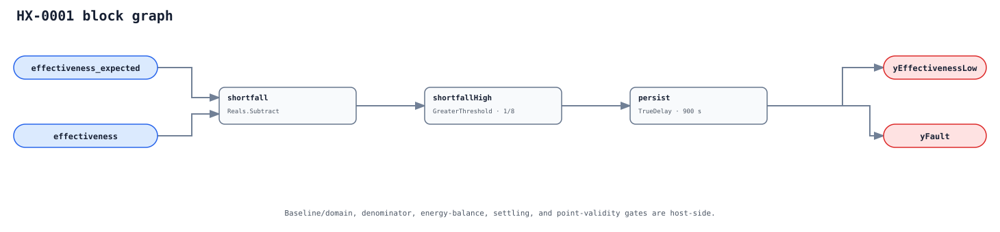

## Description

An indirect liquid heat exchanger loses effectiveness when fouling, scale,
blocked channels, internal bypass, wrong fluid properties, or hydraulic changes
reduce the heat it moves for the opportunity available. This rule compares a
host-validated actual thermal effectiveness with a frozen clean/design expected
value for the same operating condition. It reports degradation, not a root
cause and not a raw "approach" temperature.

The four-port point identity matters as much as the arithmetic. Primary and
secondary are fixed topology labels; heating usually makes signed transfer
positive and cooling negative. The host converts both directions to a positive
effectiveness before the graph sees them.

## Detection Logic

```text
shortfall = effectiveness_expected - effectiveness
yEffectivenessLow = shortfall > effectiveness_allowance
yFault = yEffectivenessLow continuously for alarm_delay
```



The graph has no `Divide`. The host publishes `effectiveness` only after safe
denominator, fluid-property, timestamp, and side-energy-balance checks. A
denominator guard downstream of a division would not prevent that division
from evaluating; moving the validated thermodynamic derivation to the host
also supports water/glycol properties the CXF graph does not carry.

Both comparisons use finite dimensionless scalars and the threshold is strict.
`yEffectivenessLow` is immediate diagnostic evidence; only `yFault` is delayed.

## Possible Diagnoses

1. Plate/tube fouling, scale, biological film, or blocked channels.
2. Internal gasket/bypass leakage or incorrect HX piping.
3. Insufficient or maldistributed flow not caught by the commissioned floors.
4. Degraded or misconfigured glycol concentration/fluid properties.
5. Temperature/flow sensor bias, time misalignment, or swapped side/location.
6. Expected model drift, wrong domain, or baseline trained on abnormal data.

## Energy Impact

EFFICIENCY_LOSS with BASELINE_COMPARISON and MEDIUM confidence. Lost transfer
must be replaced by upstream boilers, chillers, heat pumps, district energy, or
longer pumping. The estimator uses the same validated available-rate basis as
the effectiveness calculation; this two-point graph alone cannot produce kW.
Guelpa and Verda's 1.6% is a network-wide expected benefit from a cleaning
program across 325 substations, not a savings range to assign to one alarm.

## Emissions Impact

Scope 1+2, PROXY_EMISSIONS. Apply the marginal emissions rate of the actual
replacement heat source and electricity used while the fault is active. Do not
infer fuel/electric split from transfer direction alone.

## Deviations

- **The thermodynamic ratio is host-derived.** EnergyPlus documents the
  epsilon-NTU physics, but the repository graph intentionally compares two safe
  scalars instead of dividing inside CXF. This is a safety and fluid-property
  adaptation, not a claim that the host model is standardized.
- **`effectiveness_allowance = 0.125` is not portable.** No source supplies a
  universal threshold. The exact binary value makes strict-boundary vectors
  unambiguous; deployment must replace it before enabling evaluation.
- **The field method is precedent, not a transcribed algorithm.** Guelpa and
  Verda use a calibrated fouling workflow under variable district-heating
  conditions. This card keeps the baseline/error-domain obligation but does not
  claim to reproduce their full method.
- **No in-graph readiness flag.** Baseline/domain, denominator, and balance
  validity depend on provenance and configuration beyond two boundary points;
  they are mandatory host NO_EVAL gates.
- **No suppression.** HX-0002 may explain why HX-0001 is unevaluable, but rule
  IDs are not equipment-instance scoped. A host gates the same instance rather
  than globally suppressing every HX-0001 when any HX-0002 is active.
- **Initial scope excludes steam.** Phase change needs a different capacity and
  topology contract even though some trade usage calls it hydronic.
