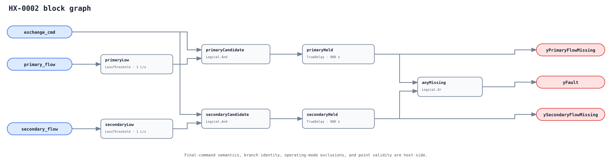

## Description

A four-port liquid heat exchanger cannot transfer useful heat when one required
branch has no flow. This rule compares a final both-flow exchange command with
individual primary and secondary branch meters, delays each missing-side
signature independently, and tells the operator which side failed.

The rule does not prove a pump fault. A closed isolation valve, clogged
strainer, air lock, pressure problem, meter failure, or correct local sequence
can create the same observation. Final command semantics and branch scope are
therefore adoption requirements.

## Detection Logic

```text
primary_candidate   = exchange_cmd AND primary_flow < primary_flow_min
secondary_candidate = exchange_cmd AND secondary_flow < secondary_flow_min

yPrimaryFlowMissing   = primary_candidate continuously for alarm_delay
ySecondaryFlowMissing = secondary_candidate continuously for alarm_delay
yFault = yPrimaryFlowMissing OR ySecondaryFlowMissing
```



Each side owns a `TrueDelay` with `delayOnInit = true`. If the missing side
reverses, the old lane clears and the new lane starts from zero; elapsed time is
not inherited through an OR. Both flags may mature if both flows are missing.
The strict `LessThreshold` makes exactly the configured floor safe.

## Possible Diagnoses

1. Side pump failed, tripped, lost coupling, or never received its final command.
2. Isolation/control valve closed, failed, or under local/HAND ownership.
3. Clogged strainer/plate passages, air lock, low pressure, or frozen path.
4. Failed check valve or hydraulic interaction preventing the intended branch.
5. Flow meter zero/scaling/freshness failure or common-header misbinding.
6. Upstream enable bound instead of the final both-flow expectation.

## Energy Impact

PROTECTIVE with DIRECT_MEASUREMENT and MEDIUM confidence. Pumps and plant may
consume energy while the exchanger delivers little or no useful transfer, but
this Boolean/flow signature cannot quantify the loss safely. In low-temperature
or protective service, delivery/freeze/equipment consequences can outweigh
energy cost.

## Emissions Impact

Scope 1+2, QUALITATIVE_ONLY. Quantify only after measuring the active plant and
pump energy plus any replacement heat source used during the incomplete path.

## Deviations

- **Thresholds have no portable default.** The numeric 1 L/s values exist for
  executable vectors only. Meter size, design flow, glycol, and minimum stable
  control flow are installation-specific and must replace them.
- **One delay is intentionally duplicated onto two blocks.** This preserves a
  direction reversal reset that a single delay after `(primary OR secondary)`
  cannot provide.
- **The final command is stricter than ordinary enable.** EnergyPlus's operation
  status/control behavior is physical precedent, not a claim that every BAS
  exposes the needed state. Without it the rule is not deployable.
- **No raw low-flow outputs.** The two exported direction flags are delayed
  findings, not mathematical evaluability flags. False never means NO_EVAL.
- **No suppression or cluster.** Pump proof/delivery rules can help diagnose a
  side, but no one causal trigger or repair clears all HX findings reliably and
  global rule-ID suppression would cross equipment instances.
