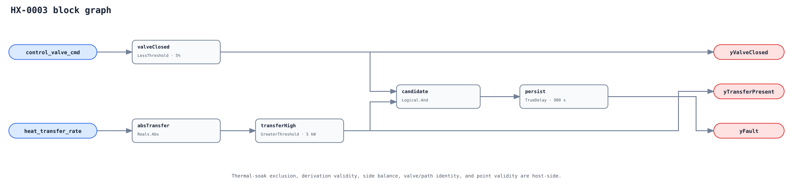

## Description

When an HX isolation/control valve is finally commanded closed, meaningful
continued transfer indicates an unintended hydraulic/thermal path. The valve
may be passing, never have reached its seat, leave a bypass open, or permit
gravity circulation. This rule treats both heating and cooling directions the
same by comparing the absolute value of a validated signed heat-transfer rate.

The observation is broader than "leaking valve." Position feedback, branch
flow, check-valve state, and a piping walk-down distinguish actuator failure,
seat leakage, bypass, and thermosiphon after the alarm.

## Detection Logic

```text
yValveClosed = control_valve_cmd < closed_command_limit
yTransferPresent = abs(heat_transfer_rate) > unexpected_transfer_limit
yFault = (yValveClosed AND yTransferPresent) continuously for alarm_delay
```



The two sub-condition outputs are immediate diagnostics. `TrueDelay` uses
`delayOnInit = true`, but its 15 minutes do not replace the host's independent
post-close soak exclusion. Both comparisons are strict: exactly 5% is not
closed at the shipped setting and exactly 5 kW is not transfer-present.

## Possible Diagnoses

1. Passing valve seat, debris, erosion, or insufficient close-off rating.
2. Actuator/linkage failed or commanded scaling does not reach physical close.
3. Manual bypass, three-way/parallel path, or wrong valve bound to the rule.
4. Failed/missing check valve or gravity/thermosiphon circulation.
5. Residual transport/metal/pipe soak not actually expired.
6. Flow/temperature bias, fluid-property error, time skew, or energy imbalance.

## Energy Impact

CRITICAL_WASTE with DIRECT_MEASUREMENT and MEDIUM confidence. Once the host has
validated signed kW and confirmed the transfer is unwanted, thermal waste is
the integral above the commissioned no-load envelope. Source energy depends on
the boiler/chiller/heat-pump/district efficiency and concurrent pumping.

## Emissions Impact

Scope 1+2, PROXY_EMISSIONS. Apply actual marginal source efficiency/COP and
emissions factors to the validated unwanted thermal energy; direction alone
does not identify the fuel/electric split.

## Deviations

- **The rule says transfer, not valve leakage.** A closed command plus transfer
  cannot uniquely identify the path. Natural circulation and a bypass are real
  findings with different repairs, kept explicit in diagnosis.
- **Heat transfer is host-derived.** The graph applies `Abs` only after the host
  validates two side estimates, safe finite capacity rates, and alignment. It
  does not derive kW from unguarded divisions.
- **5 kW has no portable authority.** It is an executable fixture. Commission a
  no-load uncertainty envelope before enabling the rule.
- **Persistence is not soak.** A host exclusion restarts after closure and every
  material hydraulic/thermal discontinuity; otherwise a long normal cooldown
  can consume the timer and manufacture a finding.
- **Optional position feedback stays diagnostic.** Requiring it would sharply
  reduce deployability, and command/position disagreement is a distinct future
  rule. Use it in the playbook when available.
- **No cluster/suppression.** HX-0001 may co-occur, but neither verdict
  universally invalidates or causally owns the other.
