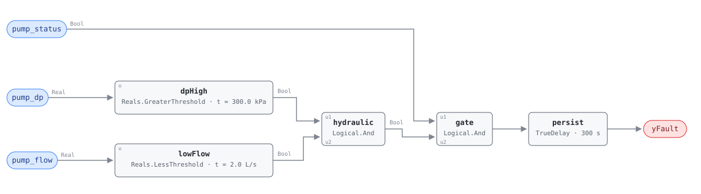

## Description

A deadheaded pump is running against a closed system. The discharge valve, or
every terminal valve on the loop, or a check valve someone installed backwards,
leaves the water nowhere to go, so the pump rides up its curve to shutoff head
and recirculates the same volute of water until that water boils. It is the
fault on this family's list that damages hardware fastest — the mechanical seal
loses the flow that cools it, the bearings take the radial thrust a pump far off
its best efficiency point produces — and the reference prices the outcome at
$5,000 to $20,000. The signature is the pair of readings, not either alone: high
DP by itself is a loop at high head, low flow by itself is PMP-0001's
condition. Together they mean downstream resistance went up, which is the
definition of deadheading and why this card carries HIGH confidence where its
sibling carries MEDIUM.

## Detection Logic

```
dp_high  = pump_dp   > deadhead_dp_threshold
low_flow = pump_flow < deadhead_flow_threshold

yFault = (pump_status AND dp_high AND low_flow)
         sustained continuously for alarm_delay
```

Block graph (`rule.cxf.jsonld`):



`dpHigh` and `lowFlow` are the two comparisons, `hydraulic` conjoins them into
the deadhead signature, `gate` adds the reference's `pump_status` conjunct, and
`persist` measures the duration. The nesting is only structural — CDL's
`Logical.And` takes two inputs — but it groups the graph the way the physics
does, hydraulic evidence on one side and run proof on the other.

Both comparisons are strict, so a DP sitting exactly on its threshold is not
high and a flow sitting exactly on its threshold is not low; each boundary is
pinned from three sides. `persist` requires five continuous minutes, which is
what separates a deadheading pump from the ordinary event that produces the
identical trace for half that: every zone valve on a loop closing together at
the end of a setback, or a two-way control valve stroking shut while its
neighbour has not yet opened. Any moment where the flow returns or the DP falls
back drops the timer, so the alarm always describes one continuous episode.

There is no evaluability output. Both hydraulic terms are direct comparisons on
bound inputs and the run term *is* a bound input — exposing `pump_status` as
`yStatusOk` would echo a point the host already has, which SCHEMA.md's
boundary-output convention exists to prevent. The NO_EVAL cases therefore live
entirely in `preconditions`: a stopped pump, a pump in hand, and any binding
where `pump_dp` is not measured across the pump.

## Possible Diagnoses

Transcribed from the reference's PMP-0002 card:

1. Downstream isolation valve closed — the single-valve case, usually left shut
   after service on a branch, and the cheapest of the four to fix
2. Severe system blockage — a plugged strainer basket after a piping repair, or
   debris carried into a reducer; the playbook's step 2.4 checks the strainer
   before anything is disassembled
3. Check valve installed backwards — a commissioning error rather than a
   failure, worth suspecting on a pump that has never made flow since it was
   installed or repaired
4. All terminal unit valves closed — nothing is broken at all. The loop is at no
   load with no minimum-flow path, which is a control or design finding: a DP
   reset that never trims, a missing bypass, or a lead pump that should have
   staged off. The common one on a variable-primary chilled water plant

The first three are field failures on one pump; the fourth is a plant-sequencing
problem that will recur on every pump in the building, and the distinction is
available before anyone goes to site by asking whether the loop was at genuine
no load when the alarm started. The DP term is also what makes this rule
diagnostic rather than merely detective: a failed impeller or a sheared coupling
makes *no* head while making no flow, and a deadheaded pump makes its maximum.

## Energy Impact

PROTECTIVE, HIGH confidence, DIRECT_MEASUREMENT. The energy line is the
sibling's — 100% of the pump's draw while the condition lasts, since none of it
is moving water anywhere — but the number that matters to an owner is the
$5K–$20K of seal and bearing damage the reference attaches to this card and not
to PMP-0001: a pump can deadhead for an afternoon and cost a few dollars of
electricity and a mechanical seal. HIGH confidence is the reference's rating and
is earned by the second term, two independent measurements agreeing on one
hydraulic story, though it survives only one direction of sensor failure (see
Deviations). Climate sensitivity is neutral.

## Emissions Impact

Scope 2, DIRECT_EMISSIONS, HIGH confidence; the reference's typical range is
100–500 kg CO₂e/yr for pump energy plus the equipment damage risk, on a marginal
operating emissions rate (MOER) basis. Pump motors are electric, so the scope
assignment does not vary with the plant the way a heating fault's does. The
embodied emissions of a replaced pump end are outside the range and outside this
rule's reach, and are plausibly the larger number over a decade of a recurring
deadhead nobody diagnosed.

## Deviations

- **The reference's 150%-of-design-head multiplier is above the shutoff head of
  many pumps, and this card says so rather than endorsing it.** Shutoff head is
  typically only 110–130% of head at the design point, so a threshold set at 150%
  exceeds the highest pressure the pump can produce and the rule is silent by
  construction. Retune to the curve's shutoff head less a margin (commonly
  105–120% of design), or above a reset sequence's maximum setpoint.
- **`deadhead_dp_threshold` ships an absolute placeholder.** The reference states
  a percentage and the rule carries kPa, because CDL parameters carry units and
  this library does no unit conversion in v1; the point dictionary is canonical
  on it. The shipped 300.0 kPa is 150% of a 200 kPa (≈20 m) design head and is
  arbitrary on any other pump. **Hosts MUST set it per pump**, and per the bullet
  above, from the curve rather than from the multiplier.
- **`deadhead_flow_threshold` ships an absolute placeholder too, at twice
  PMP-0001's.** 2.0 L/s is 10% of the same notional 20 L/s design flow that
  card's 1.0 L/s assumes, so the pair's published 5%/10% relationship survives at
  the defaults and there is a band — 5% to 10% of design — where a high-DP pump
  trips this rule and not that one. Hosts retuning one threshold should retune
  both from the same design flow.
- **`alarm_delay` has no published value, and no published existence.** The
  reference's equation for this card is the bare three-term conjunction with no
  "sustained for" clause, and its tunables line ends mid-sentence — the same
  truncation artifact VFD-0002's line carries. Both the persistence and its
  value are therefore ADOPTED, at PMP-0001's published 300 s: same chapter,
  same family, same physical event from a second angle. VFD-0002's 900 s was
  rejected — fifteen minutes is a control-loop response window, and a pump
  running its seal dry does not have fifteen minutes. Hosts should shorten rather
  than lengthen it.
- **The DP tap location is an assumption, and binding the wrong point inverts the
  rule.** The dictionary marks `pump_dp` provisional for this reason: across the
  pump, a deadhead reads high; across the loop or a decoupler it may read high or
  low depending on where the taps sit. This card assumes the across-the-pump
  reading. A loop-DP binding fails silently — the rule simply never fires — and a
  header-DP binding can be loud in the wrong direction, as a stopped standby pump
  whose tap sees the running pump's header pressure has high DP and no flow, with
  only the `pump_status` conjunct keeping it quiet. Binding review owns this; no
  logic can detect it.
- **No evaluability output, deliberately.** `pump_status` is a boundary input, so
  exposing it would echo a point the host already reads — the case SCHEMA.md's
  convention rules out — and neither hydraulic term is a derived quantity a host
  could not compute for itself. Contrast PMP-0001's `yRunOk`, a conjunction
  held for a delay, and VFD-0001's `yCmdOk`.
- **`suppresses: [PMP-0001]` is an authored relationship**, not the
  reference's — neither card declares suppression. Both fire on one physical
  event and this one is the specific diagnosis where PMP-0001 is the general
  condition. The direction matters more than usual because the general card's
  diagnosis list is wrong for this fault: impeller failure, air lock and a broken
  coupling all produce *low* DP, so leaving both alarms up sends a technician to
  open a volute on a pump whose isolation valve is shut. Precedent for authoring
  the edge: the VFD-0001/VFD-0002 pair.
- **A DP transmitter reading high and a flow meter reading zero produce this
  fault exactly.** Two failed sensors are less likely than one, which is why this
  card outranks its sibling on confidence, but the rule has no third measurement
  and the failure is not exotic: a plugged DP tap reads whatever pressure it last
  saw, and several flow meter types read zero when they lose signal. Motor
  current settles it in a minute — a deadheaded centrifugal pump draws noticeably
  *less* than at design, not more.
- **A constant-speed pump deadheads differently from a variable-speed one.** On
  DP control, closing valves drives the measured pressure up and the drive slows
  to its minimum, so the DP this rule finally sees is shutoff head *at minimum
  speed*, which can sit well below a threshold derived from a full-speed curve. A
  second, quieter reason the shipped multiplier can leave the rule silent, and an
  argument for deriving the threshold from the DP setpoint's maximum on any
  drive-controlled loop. VFD-0002 is `related` for this reason.
- **Strict comparisons at both thresholds.** The reference writes `>` and `<`
  too, and CDL `Reals` has neither `GreaterEqual` nor `LessEqual` in any case. A
  DP of exactly 300.0 kPa is not high and a flow of exactly 2.0 L/s is not low;
  both disagreements have measure zero and both err toward silence.
- **Persistence stands in for averaging.** The rule consumes instantaneous points
  and the reference specifies no averaging. A loop cycling in and out of a
  deadhead faster than `alarm_delay` — a hunting control valve, a pump staging
  against a badly tuned bypass — is a real finding this rule cannot make, the
  same blind spot PMP-0001 documents.
- **The energy formula's inputs are not this rule's inputs.** `waste_kw =
  pump_rated_kw × (pump_speed/100)³` needs nameplate power and drive speed and
  the pump dictionary carries neither, so the host supplies both. Transcribed
  unchanged otherwise, including its identity with PMP-0001's.
- **The chapter number is uncertain.** The reference's page headers label Energy
  Recovery, Pumps and Variable Frequency Drives all as "Ch. 15", which cannot be
  right for all three. `source` follows the VFD cards' §15 and names the chapter
  title and page range so the citation resolves regardless.
- **`g36` is null and no G36 provenance is claimed.** The reference sources this
  card to engineering best practice alone — unlike PMP-0001, which cites G36
  alarm patterns — so `source` says only what the reference says.
- `persist.delayOnInit = true` (CDL default is `false`), the library's standing
  choice: a pump already deadheading at controller restart waits out the full
  five minutes rather than alarming on the first tick.
- The reference publishes a vector table for PMP-0001 and none for this card,
  so every scenario in `vectors.json` is library-authored. `clusters` is empty:
  `clusters/clusters.json` defines no cluster containing a pump rule, and this
  card does not edit the cluster set.

## Notes

Treat this card as the pair's head. When both pump rules are firing, this is the
finding and PMP-0001 is its shadow — the two diagnosis lists point in opposite
physical directions and only one of them fits a pump making full head. Before
deploying on a fleet, do two things that cost one trend each: confirm where the
DP transmitter is tapped, and compare `deadhead_dp_threshold` against the pump
curve's shutoff head. The
[vfd-pump-faults](../../../playbooks/vfd-pump-faults.md) playbook's step 2 is the
service order, and its first two entries are remote — the DP setpoint may simply
be too high, and a loop with no DP reset sequence pumps against closed valves by
design (EEM-10, 0.5–2% of site energy). That playbook's header and the chapter
README both still list the pump family as future work; both belong to other
owners to correct.
