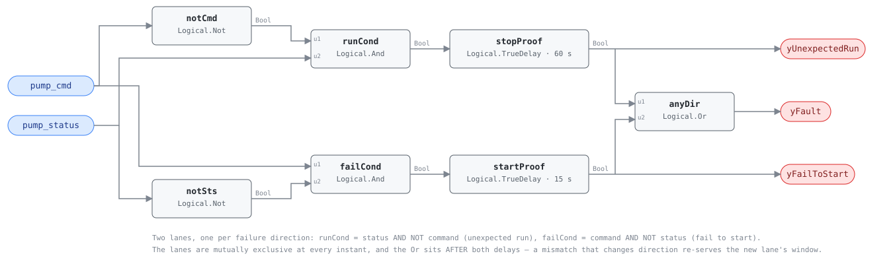

## Description

Proof of operation is the question every other pump rule assumes an answer to:
did the machine do what it was told? Two booleans settle it — the command the
BAS sends the starter, and the status the starter sends back — and their
disagreement, held past the window G36 publishes for its direction, is a fault
in whichever direction it points. Commanded on and never proven running is
a dead loop: a tripped overload, a sheared coupling, a drive locked out on a
fault, a disconnect somebody opened for service and left open. Proven running
while commanded off is usually a hand-off-auto switch left in HAND, and it bills
for that every hour of every night. PMP-0001 and PMP-0002 both begin with a pump
that is *running* and ask what the water is doing; this rule sits upstream of
both and asks whether the run state itself is real.

## Detection Logic

```
yFailToStart   = (pump_cmd AND NOT pump_status)   continuously for start_proof_time
yUnexpectedRun = (pump_status AND NOT pump_cmd)   continuously for stop_proof_time

yFault         = yFailToStart OR yUnexpectedRun
```

Block graph (`rule.cxf.jsonld`):



Seven blocks, two lanes, no thresholds and no reals. The conditions are mutually
exclusive at every instant — one needs the command true, the other needs it
false — and each delay passes only its own condition through, so the flags can
never be true together and `yFault` always has exactly one direction under it.

The Or sits *after* both delays rather than before, which is the one behaviour
worth knowing at deployment: a mismatch that changes direction is two faults
rather than one, and `yFault` drops while the new lane serves its own window
(`direction_flip_reserves_the_new_window` pins it). Both delays carry
`delayOnInit = true`, so a restart into a standing mismatch waits out the full
window instead of announcing itself on tick zero.

No evaluability flag, and none is needed: the rule is evaluable whenever both
points are delivered, which is the host's delivery-quality job. Both
sub-condition flags are diagnostic — false on either means that direction is not
proven, never NO_EVAL.

## Possible Diagnoses

`yFailToStart` — commanded on, never proved:

1. Tripped motor overload, or a starter that never pulled in. The first thing to
   look at and the one visible without tools
2. VFD locked out on a fault — overcurrent, ground fault, phase loss. The drive
   display carries the code, and `vfd-pump-faults` step 1.4 already looks for it
3. Broken coupling or snapped belt: the motor turns, the pump does not. A
   current switch set above no-load current catches this; one set below it does
   not, and reports the pump as running
4. Disconnect left open after service, or a blown control-circuit fuse — the
   cheapest cause, and common after a Friday afternoon
5. The status device rather than the pump: a failed current switch, a DP switch
   out of adjustment, a broken auxiliary contact. Rule this out with a clamp
   meter before anyone opens anything

`yUnexpectedRun` — running, never commanded:

6. Hand-off-auto switch left in HAND after service. The classic, and the one
   that shows up on the bill
7. Welded contactor, or a starter holding in on a stuck relay
8. BAS output miswired or left in override — a point overridden at the
   controller, or a command landed on the wrong starter in a pump room with
   several
9. A second controller commanding the same pump: a boiler's own pump control, a
   chiller interlock, a packaged plant sequencer. The pump is obeying somebody
   this rule cannot see

## Energy Impact

PROTECTIVE, HIGH confidence, PROXY_ESTIMATION. Only one direction spends
electricity, and it is exactly calculable. Take a 10 kW pump — an ordinary
mid-size building's secondary chilled-water pump — left in HAND when a service
call ends Friday afternoon and found Monday morning: 60 h x 10 kW = 600 kWh,
roughly $60-$90 at $0.10-$0.15/kWh. A year of unnoticed weekends is about 31 MWh
and $3,000-$4,700, and on a hot-water loop the pump's own kW is the floor rather
than the total, because a circulating loop bleeds heat and the boiler answers.
`yFailToStart` spends no pump energy at all; its cost is the loop that did not
circulate — a chiller tripping on low evaporator flow, a heating coil with no
water in freezing weather. HIGH confidence because there is nothing to
calibrate; PROXY because the hours are measured and the kilowatts are a
nameplate.

## Emissions Impact

Scope 2, PROXY_EMISSIONS. Pumps are electric everywhere, so the scope never
varies with the plant the way a heating fault's does. The weekend above is about
240 kg CO₂e on a 0.4 kg/kWh marginal operating emissions rate (MOER) and roughly
12 t/yr if it repeats — the sibling pair's published 100-500 kg/yr band is for a
fault that ends when somebody notices; this one's is driven by hours, not by
hydraulics, and has no natural end. PROXY rather than the pair's DIRECT because
this rule reads no meter and no flow.

## Deviations

- **`CDL.Logical.Proof` is exported at the pin and is deliberately not used.**
  Its two outputs map one-for-one onto this card's two directions, but a single
  timing window governs both of them — checking begins at the EARLIER of
  `feedbackDelay + debounce` after the command changes or `debounce` after the
  measurement settles — so G36's published 15 s and 60 s cannot both be
  expressed. Composed from `Logical.Not`, `Logical.And`, `Logical.TrueDelay` and
  `Logical.Or` instead, all registry-supported classes. The HW-0009 agent's
  probes reached the same verdict independently.
- **Three further `Proof` behaviours contradict this card, all measured against a
  probe document at e2ff2f8 rather than read off the engine source.** With
  `debounce = 60 s` and `feedbackDelay = 120 s`: a start into a standing
  mismatch raised `yLocFal` at t = 0 s, because its internal delays behave as
  `delayOnInit = false`; a stably-false status therefore gets no proof window at
  all, asserting on the tick the command rises; and a command held true against a
  status chattering on a 60 s period raised `yLocTru` — the *unexpected-run*
  output — at t = 240 s, both outputs latched together. This card promises
  mutually exclusive flags and a full window after restart, so the last result
  alone settles it. Nothing surprising happened at load: the block imports,
  exports and runs cleanly, and the rejection is semantic.
- **Two Nots and two Ands rather than one Xor and two Ands.**
  `pump_cmd XOR pump_status` conjoined with each input in turn is the same truth
  table in one fewer block, and draws without a wire crossing. The composed form
  is kept because batch 23 instantiates one template per equipment, and a family
  whose graphs read the same is worth more than a block.
- **Both proof times are transcribed from G36, not authored.** §5.20.17.6 and
  §5.21.10.5 publish 15 s for the commanded-on direction and a separate 60 s
  window for the commanded-off direction on exactly this equipment, so this card
  ships the standard's pair rather than the 60 s / 120 s it originally argued
  from VFD ramps and BAS poll cycles. The asymmetry survived the correction and
  its direction was right; only the magnitudes and the ratio changed, from 2x to
  the standard's 4x.
- **The shipped 15 s will alarm on a healthy start behind a slow ramp or a slow
  poll, and the vectors pin that rather than hide it.** G36's number assumes a
  controller reading a hardwired DI every scan; this library's rules read
  whatever the host delivers.  `vfd_ramp_alarms_at_the_shipped_default` runs a
  30 s acceleration ramp through the default and shows the alarm asserting at
  45 s and clearing itself at 60 s when the status finally makes. Retuning
  `start_proof_time` above the site's worst-case ramp and delivery latency is a
  precondition, not an option — the same discipline PMP-0001 applies to its
  placeholder threshold.
- **`delayOnInit = true` on both delays** (CDL default `false`), the library's
  standing choice, and it does real work in both directions here: a controller
  restart is exactly when a mismatch is most likely to be an artefact of the
  restart — outputs re-driven, statuses not yet polled — so serving the full
  window before alarming is the difference between a rule and a nuisance on
  every reboot.
- **`severity: 2` and `category: PROTECTIVE` describe the fail-to-start direction
  only, and G36 agrees that one number cannot cover both.** The standard alarms
  commanded-on/status-off at Level 2 and commanded-off/status-on at Level 4 —
  the same split this library's 1-4 scale would make, and this card has one slot
  for it. Severity 2 takes it because it is the shorter fuse: a dead heating
  loop in freezing weather costs a coil, not a bill. The unexpected-run
  direction is G36's Level 4 and EXCESS_CONSUMPTION by any reading, and is
  quantified as such above. Hosts routing work by severity or category should
  route on the sub-condition flag, not on the card.
- **No suppression edges in either direction, which is a finding about the pair
  rather than an omission.** PMP-0001 requires `pump_cmd AND pump_status` both
  true, so either of this rule's directions already puts it in NO_EVAL through
  its own `yRunOk` and an edge would be redundant. PMP-0002 gates on
  `pump_status` alone and therefore stays live during `yUnexpectedRun` — and a
  pump running in HAND against a closed system really is deadheading, so that
  alarm is true and worth keeping.
- **The rule is silent on a chattering status, deliberately.** A status that will
  not settle never accumulates either window
  (`chattering_status_never_matures`), which is precisely where
  `CDL.Logical.Proof` raises both of its alarms. An unstable point is a
  delivery-quality or sensor-health finding, and SCHEMA.md's design stance puts
  those outside the block graph.
- **`estimation_method: PROXY_ESTIMATION` and `PROXY_EMISSIONS`, against the
  sibling pair's DIRECT ratings.** They read a flow meter; this rule reads two
  booleans. The run hours are exact — the rule measures them itself — and the
  kilowatts are a nameplate the host supplies, which is what a proxy is.
- **`g36: null` even though this card names two verified clauses, and the field
  is the reason rather than the provenance.** SCHEMA.md scopes `g36` to
  "001-range rules" — the cards transcribing the reference's G36-numbered fault
  conditions — and every populated value in the library today is a
  §5.16.14 FC#n or §5.22.6 FC#n. Widening it to a directly-instantiated sequence
  clause is a schema question for that field's owner, not a decision to take
  inside one card, so §5.20.17.6 and §5.21.10.5 are carried in `source` instead.
  Batch sibling HW-0009 reaches the same null by the opposite route: G36
  §5.1.15.5.b.1 forbids proving a boiler by status at all, so its card departs
  from the standard where this one instantiates it.
- **Two playbooks are bound and only one names this rule.**
  `proof-of-operation` is batch 23's purpose-built procedure and lists PMP-0003
  in its Applies-To row; `vfd-pump-faults` is the pump family's service playbook
  and its step 1 is where a drive lockout gets diagnosed, but its Applies-To row
  still names only VFD-0001/0002 and PMP-0001/0002. That row belongs to the
  playbook's owner; the binding is kept because the diagnosis list points at it.
- **`related` carries one addition beyond the batch brief's list.** VFD-0001 is
  added because its own Deviations reserve exactly this check from the
  electrical side, and a pump whose proof fails on a drive fault trips both.
  HW-0009 is batch 23's boiler instance of the same template — a sibling
  instantiation rather than a co-occurring fault, listed for the family rather
  than for the diagnosis.
- `clusters` is empty: `clusters/clusters.json` defines no cluster containing a
  pump rule, and this card does not edit the cluster set. Every scenario in
  `vectors.json` is library-authored: G36 states the alarm and its two windows
  but publishes no test vectors, and the reference has no such card at all.

## Notes

Read the flag, not the card: the two directions send different people to
different places. `yFailToStart` is a work order at the starter — HOA position,
overload, drive fault code, coupling — and it is urgent in proportion to what
the loop was supposed to be doing. `yUnexpectedRun` is usually a five-minute fix
and a conversation: put the switch back in AUTO, then find out why it was in
HAND, because somebody moved it for a reason and that reason is often another
fault this library can name. The
[proof-of-operation](../../../playbooks/proof-of-operation.md) playbook owns
both procedures and starts where it should — with which device is providing the
status. Run this card first on any pump where PMP-0001 has been quiet for a
suspiciously long time: a lead/lag standby whose `yRunOk` never goes true looks
exactly like a healthy idle pump until something reads the two points directly.
