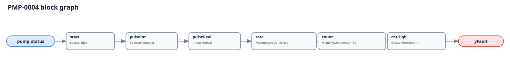

## Description

This rule reports an individual hydronic pump starting too often. Repeated
starts stress the motor, starter or drive, coupling, bearings, and seals, and
usually point to unstable staging, a narrow control deadband, insufficient
system storage, or unreliable proof. The signature is direct—observed starts
per rolling hour—but the cause and acceptable count remain pump- and
sequence-specific.

## Detection Logic

```
start  = rising edge of pump_status
count  = MovingAverage(start, evaluation_window) × count_scale
yFault = count > max_starts
```



`Logical.Edge` counts OFF-to-ON proof transitions only. Its initialization pulse
has zero area at the first tick, but the partially filled moving-average window
is an extrapolated event pace; the first full window is therefore host-gated.
The comparison is strict and has no added persistence: the fifth observed start
inside the default trailing hour raises the raw verdict. `count_scale` is
load-bearing because the moving average integrates one-tick pulses.

## Possible Diagnoses

1. Differential-pressure or temperature deadband set too narrowly
2. Lead/lag staging with inadequate minimum on/off times
3. Oversized pump or insufficient hydronic buffer at low load
4. VFD/control-loop hunting that repeatedly crosses the run threshold
5. Overload, safety, or drive fault repeatedly tripping and auto-resetting
6. Chattering contactor, current switch, auxiliary contact, or communication
7. Approved exercise/test sequence not excluded by the host

## Energy Impact

PROTECTIVE and QUALITATIVE_ONLY. Short cycles spend proportionally more time
accelerating and less time delivering stable flow, but this Boolean rule cannot
price that loss. The stronger value is avoided motor, starter/drive, seal, and
bearing wear. Size the opportunity host-side from motor power, observed starts,
and manufacturer start limits.

## Emissions Impact

Scope 2, qualitative. Avoiding unnecessary acceleration and premature
component replacement reduces electrical and embodied emissions, but neither
term is computable from run proof alone.

## Deviations

- **The four-start limit is adopted, not source-transcribed.** Pump and motor
  manufacturers publish application-specific limits; `4/window` is an
  executable commissioning placeholder and must be reviewed per asset.
- **`count_scale` is added to the planning table.** The engine's continuous-time
  MovingAverage returns a pulse rate, so `evaluation_window/tick` is required to
  recover an event count. Leaving 60 at a 300 s tick reports five times too many.
- **No alarm delay is copied from the sibling cards.** The PR brief defines
  `yFault = count > max_starts`; adding TOWER-0003's persistence would change the
  event-window semantics and introduce an unrequested parameter.
- **The first full window is NO_EVAL.** Partial-window extrapolation is pinned in
  vectors rather than hidden; model reload also loses all prior start history.
- **The evaluator band is `[evaluation_window/63,
  evaluation_window/(2×(max_starts+1)))`.** The lower bound protects the
  64-sample MovingAverage ring; the upper bound keeps the first integer count
  above the strict threshold observable. Defaults yield 57.2–360 s, with 60 s
  recommended. The evaluator must also resolve the shortest real OFF/ON dwell.
- **Confidence is MEDIUM rather than the brief's proposed HIGH.** Rising-edge
  detection is direct, but the shipped start limit has no portable source and a
  status point can be a proof/communications artifact until commissioned.
- **No Pump Delivery Failure cluster is added.** Cycling has no single trigger
  whose repair should clear the mutually different delivery/proof signatures.
