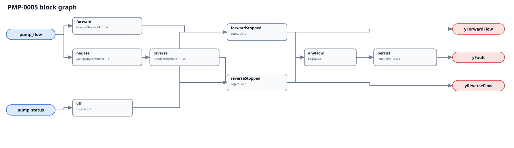

## Description

This rule detects material water flow through an individual pump branch while
that pump's independent run proof is false. Forward flow can indicate a passing
or missing check valve, parallel-header pressure, thermosiphoning, or bad proof;
reverse flow adds the risk of reverse rotation. The rule names the observed
hydraulic signature, not which component caused it.

## Detection Logic

```
forward         = pump_flow > stopped_flow_threshold
reverse         = -pump_flow > stopped_flow_threshold
yForwardFlow    = NOT pump_status AND forward
yReverseFlow    = NOT pump_status AND reverse
candidate       = yForwardFlow OR yReverseFlow
yFault           = candidate sustained for sustained_duration
```



Both comparisons are strict, so exactly ±1.0 L/s is clear at the defaults.
Direction outputs are raw diagnostic detail gated by stopped status; they are
not evaluability flags. `TrueDelay(delayOnInit=true)` applies to the OR of both
directions. A direct forward-to-reverse handoff therefore preserves the timer
because material stopped flow never ceased; an actual in-band interval resets
it, and recovery clears immediately.

## Possible Diagnoses

1. Passing, failed, reversed, or missing discharge check valve
2. Reverse flow driven by another pump on a common header
3. Thermosiphoning or a gravity path not represented in the operating gate
4. Pump run-proof failure or stale false status (PMP-0003)
5. Flow sensor zero error, sign inversion, or common-header misbinding
6. Isolation or bypass valve left open
7. Approved flushing, free-cooling, or transfer sequence not excluded

## Energy Impact

PROTECTIVE, MEDIUM confidence, QUALITATIVE_ONLY. Unintended branch flow can
waste active-pump head, transport unwanted heat, defeat staging, and rotate a
stopped pump backward. Magnitude depends on loop pressure and temperatures that
this graph does not consume.

## Emissions Impact

Scope 2, qualitative. Avoided electricity and thermal conditioning are
site-specific and require pressure, temperature, and active-equipment context.

## Deviations

- **The rule adds a signed convention without narrowing older consumers.**
  Positive is suction-to-discharge. Magnitude-only branch flow still supports
  `yFault` and PMP-0001/0002, but neither direction label; common-header flow is
  not a weaker proxy but the wrong measurement scope.
- **Both thresholds are site configured.** The 1.0 L/s and 300 s defaults are
  adopted executable placeholders, not manufacturer or standard limits.
- **Direction reversal does not reset persistence.** The timer watches absolute
  stopped-flow candidacy; continuous material flow remains one hydraulic event
  even when its sign changes. Vectors pin this explicitly.
- **PMP-0003 suppression is host-side and same-pump only.** A proof mismatch
  invalidates the stopped premise; the raw graph still alarms, preserving the
  evidence and avoiding command/status inputs that do not belong here.
- **No Pump Delivery Failure cluster is added.** Running-with-no-flow,
  deadheading, proof mismatch, and stopped-with-flow have incompatible premises
  and no shared trigger whose correction reliably clears all members.
