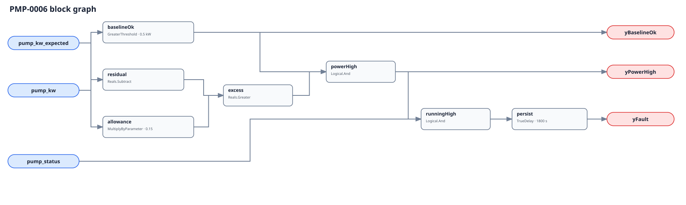

## Description

This rule detects a pump motor/drive assembly drawing materially more active
power than a known-good model expects at the same operating condition. The
signature can accompany mechanical drag, impeller/strainer degradation,
incorrect speed feedback, bypassed control, or reduced motor/drive efficiency;
it can also be manufactured by a stale, out-of-domain, or badly scoped
baseline. The model remains host-side and is published as an ordinary derived
point.

## Detection Logic

```
baseline_ok = pump_kw_expected > minimum_expected_kw
residual    = pump_kw - pump_kw_expected
allowance   = pump_kw_expected × max_positive_residual_fraction
power_high  = baseline_ok AND residual > allowance

yBaselineOk = baseline_ok
yPowerHigh  = power_high
yFault      = pump_status AND power_high, sustained for sustained_duration
```



The graph deliberately cross-multiplies instead of dividing. For a positive
valid baseline, `actual−expected > fraction×expected` is exactly the requested
relative-residual test and cannot evaluate a zero denominator. Both comparisons
are strict. `yPowerHigh` exposes residual direction independently of run status;
only `yFault` is status-gated and persisted with `delayOnInit=true`.

## Possible Diagnoses

1. Fouled or damaged impeller, blocked strainer, or unexpected hydraulic load
2. Bearing, seal, coupling, or alignment drag
3. Motor or drive efficiency degradation
4. Incorrect speed feedback or control in bypass/manual mode
5. Different parallel-pump staging than the baseline condition
6. Actual/expected points covering different electrical boundaries
7. Stale, out-of-domain, or degradation-trained expected-power model
8. Active power sensor scaling or wiring error

## Energy Impact

EFFICIENCY_LOSS with BASELINE_COMPARISON. During evaluable alarm intervals the
positive residual is directly measured kW above the host model, so the host may
integrate it to kWh. That estimate inherits model error and must exclude invalid
domains, startup, and mode changes. A low residual is intentionally not accused
by this rule because it can mean successful turndown or a separate delivery
failure.

## Emissions Impact

Scope 2. Multiply evaluable excess kWh by the applicable marginal or accounting
grid factor. Report the baseline/model uncertainty with the estimate.

## Deviations

- **No Divide block is used.** Downstream Boolean gating does not short-circuit
  an elementary Divide; cross-multiplication is equivalent in the positive
  baseline domain and guarantees no zero-denominator evaluation.
- **Expected power is a host-derived point, not a universal curve.** The point
  contract requires model inputs, known-good fit period, electrical boundary,
  and in-domain readiness. The graph cannot certify those obligations.
- **All three defaults need commissioning.** The 0.5 kW floor has
  NO_PORTABLE_DEFAULT; the 15% residual and 1800 s duration are adopted
  tunables, not source-transcribed thresholds.
- **Only positive residual is in scope.** Low power may indicate successful
  reset, broken coupling, bad metering, or another delivery fault; conflating
  the directions would erase diagnosis.
- **VFD relationships stay informational in the library metadata.** Whether a
  same-drive VFD-0001/0005 invalidates this model depends on its inputs and
  operating state; unconditional ID-level suppression could silence every pump
  or a baseline that does not use the disputed signal.
- **No simulation validation is claimed.** The plant harness now preserves
  per-pump power, flow, and status proxies, but it has no frozen expected-power
  model trained on a disjoint known-good period. Synthetic vectors validate
  graph behavior only.
