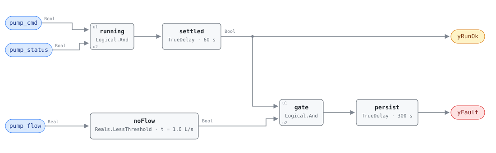

## Description

A pump that is running and moving no water is the cheapest fault in the building
to describe and one of the more expensive to leave alone. Every kilowatt going
into the motor is going into the water it is churning and the bearings it is
spinning; none of it reaches a coil. The building notices eventually — a chilled
water loop that will not hold temperature, a heating branch that never warms —
but by then the finding is a comfort complaint being chased at the air handler,
several floors and one subsystem away from the pump that caused it.

The rule is the direct test: the pump says it is on, the starter says it is
running, and the flow meter says nothing is moving. Two booleans and a
comparison. What makes it worth having is not subtlety but coverage — it fires
on impeller damage, a closed isolation valve, an air lock, and a sheared
coupling alike, which is a list no single more specific rule covers, and it
fires within minutes of the pump starting rather than at the next complaint.

It also fires when the flow meter is the thing that is broken, and this card
does not pretend otherwise. That is diagnosis 5 in the reference's own list, it
is indistinguishable from the rest on these three points, and it is the reason
the confidence rating is MEDIUM rather than HIGH. It is also why the playbook's
closing step is "verify flow is present" against a second measurement rather
than against the same meter that raised the alarm.

## Detection Logic

```
yRunOk = (pump_cmd AND pump_status) sustained for flow_check_delay
                                        (false ⇒ host reports NO_EVAL)

yFault = (pump_flow < no_flow_threshold AND yRunOk)
         sustained continuously for alarm_delay
```

Block graph (`rule.cxf.jsonld`):



`running` forms the reference's first two conjuncts and `settled` holds them for
`flow_check_delay` before the rest of the rule believes anything. That placement
is the one structural decision in this card. The reference describes
`flow_check_delay` as "wait after pump start", and a start is exactly when a
healthy pump reads zero flow: the check valve has not lifted, the volute is
still filling, and a paddle or magnetic meter is looking at water that has not
begun to move. Delaying the run condition rather than the fault condition says
that in the graph — for the first minute of every run this rule has no verdict
at all, and `yRunOk` tells the host so.

The consequence is that the two delays are not interchangeable with one longer
delay, which is where this card differs from VFD-FC-050's superficially similar
chain. A pump that starts dry alarms at exactly 360 s, the two delays adding.
A pump that has been running for hours and loses its flow alarms at exactly
300 s, because the run condition settled long ago and only `persist` is left to
run. `flow_lost_mid_run` pins the second case at 900 s and would fail at 960 s
if `flow_check_delay` were moved onto the conjunction;
`pump_starts_dry_mid_run` pins the first at 960 s from a start at 600 s.

`yRunOk` is also the rule's whole answer to the reference's NO_EVAL row. Four
different states hold it down and none of them is a healthy pump: the pump is
off (the reference's published vector 3), the pump is commanded on and not
running, the pump is running while commanded off, or the pump started less than
a minute ago. The middle two are real faults that belong to a rule this library
does not have yet — see Deviations — and reporting them here as "no flow
detected" would be the right alarm attached to the wrong diagnosis list.

`noFlow` is a strict `Reals.LessThreshold`, so flow sitting exactly on the
threshold is not no-flow. Both sides and the boundary itself are pinned.

## Possible Diagnoses

Transcribed from the reference's PMP-FC-050 card:

1. Pump impeller failure — eroded, corroded, or spun loose on the shaft. The
   pump turns, the head collapses, and the loop gets nothing. Distinguishable
   from a deadhead by the pump DP, which is *low* here and high there
2. Isolation valve closed — the cheapest cause and the most common one after a
   service call. It is what the playbook's first on-site step (2.3) goes looking
   for, once the two remote checks above it have come back clean
3. Air lock in the pump — the volute is holding a bubble the pump cannot push
   through. Often self-clearing and then recurring, which is what the
   `intermittent_flow_never_alarms` vector is about
4. Broken coupling between motor and pump — the motor draws near no-load
   current and the pump shaft is stationary. Free to confirm with a clamp meter
   and worth ruling out before anyone opens the volute
5. Flow meter failure — the pump is fine and the measurement is wrong. This
   rule cannot tell that from any of the four above, and on a fleet result it is
   the first thing to rule out because it is the only one that costs nothing to
   check

The discriminator for 1 against 2 and 4 is the pump differential pressure, which
this rule does not read. PMP-FC-051 does: a high-DP no-flow condition is a
deadhead, a low-DP no-flow condition is a pump that has stopped making head.
When both rules are live on the same pump the pair answers the question that
this rule alone cannot.

## Energy Impact

PROTECTIVE, MEDIUM confidence, DIRECT_MEASUREMENT, and the savings line is the
whole pump: 100% of its energy while the condition lasts, because none of it is
doing work. Climate sensitivity is neutral — a pump making no flow costs the
same in January and July, and the loop it serves is failing to deliver either
way.

DIRECT_MEASUREMENT is the reference's rating and it is defensible with one
caveat: the measurement it refers to is the pump's own power, which this rule
does not read. The runtime formula reconstructs it from nameplate kilowatts and
drive speed, so the number is as good as the nameplate and the speed feedback,
which is closer to a proxy than to a meter on a constant-speed pump with no
drive. MEDIUM confidence carries the honest part — the flow meter case means
some fraction of these alarms describe a healthy pump wasting nothing at all.

The larger cost is usually not the energy. A pump running dry is a pump running
its mechanical seal without the water that lubricates and cools it, and the
damage that follows is measured in thousands rather than in kilowatt-hours. That
is what the PROTECTIVE category is recording.

## Emissions Impact

Scope 2, DIRECT_EMISSIONS, MEDIUM confidence; the reference's typical range is
100–500 kg CO₂e/yr for pump energy doing no useful work, on a marginal operating
emissions rate (MOER) basis. Pumps are electric everywhere, so the whole
consequence is purchased electricity and the scope assignment is not
site-dependent the way a heating fault's is. The avoided emissions from the
motor and seal damage the fault causes are real and not in the range — the
reference counts them as protective value rather than as CO₂e, and so does this
card.

## Deviations

- **`no_flow_threshold` ships an absolute placeholder, not the reference's
  percentage.** The reference gives 5% of design flow; the rule carries L/s
  because CDL parameters carry units and this library does no unit or scale
  conversion in v1. The point dictionary is canonical on this and says so in
  `pump_flow`'s notes: "rules ship absolute L/s placeholders that MUST be set
  from the loop's design flow at binding." The shipped 1.0 L/s is 5% of a 20 L/s
  (≈320 gpm) design flow — a mid-size distribution pump — and is arbitrary on
  any other loop. On a 4 L/s zone pump it is 25% of design and the rule alarms
  during normal part-load operation; on a 100 L/s primary it is 1% and the rule
  detects almost nothing. **Hosts MUST set it per loop.** Placeholder-default
  precedent: VAV-FC-050's `ventilation_requirement`.
- **A variable-speed pump at genuine low load can sit under 5% of design flow
  with nothing broken.** The threshold is a fraction of *design* flow, not of
  current demand, so a loop with two valves cracked open on a mild morning can
  read below it legitimately. The reference's stance — a pump making no useful
  work is a finding regardless of why — is the right one for a protective rule,
  but the operator's action differs completely: that case is a missing
  minimum-flow bypass or a deadhead, which is PMP-FC-051's territory, not a
  broken pump. Sites that see this rule fire at low load should read
  PMP-FC-051 before touching the pump.
- **`flow_check_delay` gates the run condition, not the fault condition.** The
  reference lists it as a tunable and describes it as "wait after pump start",
  which is what this graph implements: `settled` holds `pump_cmd AND
  pump_status` for 60 s before anything downstream is evaluated. Applying it to
  the conjunction instead — the shape VFD-FC-050 and AHU-FC-061 use — would have
  produced the same 360 s alarm on a dry start and a 60 s slower alarm on every
  mid-run flow loss, for no stated reason. The choice is visible in the vectors
  by design: `flow_lost_mid_run` asserts at exactly 900 s and fails at 960 s.
  Unlike VFD-FC-050, this chain is therefore *not* a repackaged single delay,
  and collapsing the two tunables into one number would change behaviour.
- **The command/status mismatch is NO_EVAL here and is nobody's fault rule
  today.** A pump commanded on that never proves running, and a pump running
  against a command of off, are both real and both silent in this library:
  `yRunOk` goes false and this rule stands down.
  `commanded_on_but_not_running` and `running_while_commanded_off` pin the
  behaviour so it cannot change silently. The check that would cover them is a
  status-versus-command comparison at the equipment level, which this library
  has for fans only in the after-hours sense (AHU-FC-052, RTU-FC-055) and not at
  all for pumps. Until such a rule exists, `yRunOk = false` means "ask something
  else", not "the pump is fine". The reference's own vector table has the same
  hole: it publishes the OFF/OFF row as NO_EVAL and never states a verdict for
  the mismatch rows, so the decision above is this card's, not a transcription.
- **The flow meter is uncorroborated and the rule reports its failure as a pump
  fault.** Diagnosis 5 is in the reference's list and there is nothing in three
  points that can separate it from the other four. The nearest available
  cross-check is `pump_dp`, which this rule does not bind: a failed meter leaves
  DP at its normal operating point, an impeller failure collapses it, and a
  deadhead raises it. That is a host-side read of a point already in the
  dictionary, and it is the reason to run PMP-FC-051 on the same pump even
  though the two rules overlap.
- **`yRunOk` is the library's, not the reference's.** The reference writes the
  command and status tests as conjuncts of the fault condition, and the graph
  computes exactly that; exposing the settled conjunction as a boundary output
  adds no logic and changes no verdict. It is a computed signal rather than an
  echo of one input — the AND of two booleans held for a delay — which is what
  SCHEMA.md asks an evaluability output to be. Same stance as VFD-FC-050's
  `yCmdOk` and FCU-FC-005's `yCmdOk`.
- **Strict `<` at the flow threshold.** The reference writes `<` too, so nothing
  is lost, but CDL `Reals` has no `LessEqual` and could not express the
  inclusive form in any case. Flow of exactly 1.0 L/s reads as flow. The
  disagreement is measure-zero on a real-valued signal and errs toward silence;
  all three sides are pinned (`flow_just_below_threshold`,
  `flow_exactly_at_threshold`, `flow_just_above_threshold`). A site whose BAS
  quantizes flow coarsely — or clamps small readings to zero, which many
  meters do — should retune rather than rely on the signal landing off the
  boundary.
- **`suppressed_by: [PMP-FC-051]` is an authored relationship, not the
  reference's.** Neither card declares suppression. It is added because both
  rules fire on one physical event — every valve on the loop closed against a
  running pump satisfies both — and PMP-FC-051 is the specific diagnosis while
  this one is the general condition. Worse than redundant, this card's diagnosis
  list is actively misleading on a deadhead: impeller failure, air lock, and a
  broken coupling all produce *low* pump DP, and a technician sent to open the
  volute on a pump whose valves are shut has been sent by this alarm. So the
  deadhead silences the no-flow alarm and PMP-FC-051 carries the matching
  `suppresses`. Precedent for authoring the relationship: the VFD-FC-050/051
  pair, where the direction is the other way round for a different reason (a
  broken premise rather than a specific diagnosis).
- **The two rules do not alarm at the same moment, and the order depends on when
  the deadhead started.** On a mid-run valve closure both land at 300 s after
  the event. On a pump started into a closed system this rule waits out
  `flow_check_delay` first and lands at 360 s while PMP-FC-051 lands at 300 s.
  A host implementing the suppression as "drop PMP-FC-050 if PMP-FC-051 is
  active" gets the right answer in both cases; one implemented as "drop it only
  if PMP-FC-051 alarmed first" gets the right answer in one.
- **The energy formula's inputs are not this rule's inputs.** `waste_kw =
  pump_rated_kw × (pump_speed/100)³` needs nameplate power and drive speed, and
  the pump point dictionary carries neither. The host supplies them — speed is
  the VFD family's `vfd_speed` where a drive exists, and the term is 1 where one
  does not. Transcribed unchanged otherwise.
- **`AlarmDelay` is renamed `alarm_delay`.** The reference's tunables table
  spells the fault-persistence parameter in G36's PascalCase while spelling its
  two neighbours in snake_case. The library uses `alarm_delay` throughout, the
  value is unchanged at 5 min, and the CXF path (`persist.delayTime`) is the
  same one every other card in this library exposes for the same quantity.
- **The chapter number is uncertain.** The reference's page headers label
  Energy Recovery, Pumps, and Variable Frequency Drives all as "Ch. 15", which
  cannot be right for all three. `source` follows the VFD cards' precedent of
  §15 and names the chapter title and page range so the citation resolves
  regardless. Nothing in the rule depends on it.
- **`g36` is null although the reference cites G36.** Its source line reads
  "G36 alarm patterns; engineering best practice" — a family of patterns, not a
  clause. With no clause identified there is nothing to put in the field, and
  the pattern claim is carried in `source` as prose. Contrast FCU-FC-005, where
  the reference names §5.22.6 and the field carries it unverified.
- `settled.delayOnInit` and `persist.delayOnInit` are both `true` (the CDL
  default is `false`), the library's standing choice: a pump already running dry
  when the controller restarts waits out the full 360 s instead of alarming on
  the first tick, and its flow reading is treated as untrustworthy for the first
  minute exactly as it would be after a real start.
- **Three published test vectors, eleven authored.** The reference publishes
  normal operation (3.2 L/s, NO_FAULT), no flow while running (0 L/s, FAULT),
  and pump off (NO_EVAL); all three are in `vectors.json` under those names and
  pass. The rest — both mismatch cases, three sides of the flow boundary, the
  band between this rule's threshold and PMP-FC-051's, the mid-run onset and
  mid-run loss edges, the intermittent case, and the two release cases — are
  library-authored.
- **Persistence stands in for averaging.** The rule consumes instantaneous
  points; the reference specifies no averaging and G36's AHU set would have used
  a 5-minute rolling mean. The two are not equivalent, and
  `intermittent_flow_never_alarms` pins the miss: flow alternating between zero
  and normal every four minutes never accumulates `alarm_delay` and never
  alarms, though a pump catching and losing its prime all day is a genuine
  finding. A steady failure — which is what a closed valve or a sheared coupling
  produces — reads the same either way.
- **`clusters` is empty.** `clusters/clusters.json` defines no cluster
  containing a pump rule, and this card does not edit the cluster set.

## Notes

Read `yRunOk` before reading `yFault`. On a lead/lag pair the standby pump's
`yRunOk` is false for weeks at a time, and every `yFault = false` under it means
"not evaluated", not "no problem".

The [vfd-pump-faults](../../../playbooks/vfd-pump-faults.md) playbook owns the
service procedure; its step 2 is this fault and PMP-FC-051 together, in the
order that costs least: check the DP setpoint and the reset sequence remotely,
then look for closed isolation valves and a blocked strainer on site, then the
impeller. Step 2.6 is the one worth reading before deploying this rule on a
variable-primary chilled water plant — without a working minimum-flow bypass the
lead pump deadheads whenever the last AHU valve closes, which is a design
finding that will present as a fleet of these alarms.

That playbook's header still says the pump family is future work and that "this
library has no `PMP-FC-*` rules yet", and the chapter README still lists this
rule as `planned`. Both lines are out of date as of this card and both files
belong to other owners to correct.

PMP-FC-051 is the other half of the pair and reads the same flow meter with the
pump DP beside it. Where both are firing, treat the deadhead as the finding and
this card as its shadow; where this one fires alone, the pump DP is still the
question to ask, and asking it costs one trend.

VFD-FC-050 is `related` rather than linked: on a drive-controlled pump it
watches the same machine from the electrical side, and a drive that is not
tracking its command is a plausible reason for a pump that is proven running to
be moving nothing. It does not suppress this rule and this rule does not
suppress it — the run status here is proof of rotation, not of speed, so both
findings stand on their own evidence.
