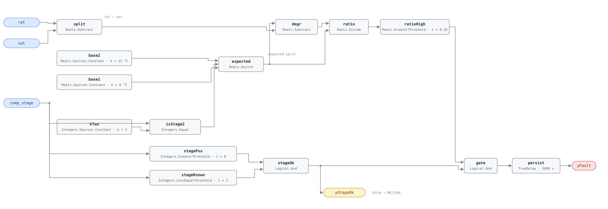

## Description

A clean evaporator coil at design airflow drops the air passing through it by a
predictable amount — roughly 8 °C on one compressor stage, 12 °C on two. When
that split shrinks while the same stage runs, the coil is no longer moving the
heat it should: dust bridging the fins, a loaded filter, ice, or a charge that
has leaked away all produce the same reading, and they cost the same way — the
unit runs longer for the same cooling, and where the cause is restricted airflow
the fan spends more energy per unit of air delivered. Two temperatures and a
stage number is the whole measurement, which is what makes it practical on
packaged equipment carrying no refrigerant instrumentation, and also why the
rule is blind to cause. Catrini & Piacentino (2023) measured 13.3% capacity loss
and up to 47% additional fan power on fouled units.

## Detection Logic

```
actual_split   = rat − sat
expected_split = baseline_split_stage_2  if comp_stage = 2
                 baseline_split_stage_1  otherwise
degradation    = (expected_split − actual_split) / expected_split

yStageOk = comp_stage > 0 AND comp_stage ≤ 2       (false ⇒ host reports NO_EVAL)
yFault   = degradation > split_degradation_threshold AND yStageOk,
           sustained for alarm_delay
```

Block graph (`rule.cxf.jsonld`):



Both baselines are live on every tick and `expected` selects one, so the
baseline can change under the rule mid-run when the unit stages. Because that
denominator is always a selected constant — 8 or 12, never zero, never noisy —
the division is safe by construction and needs no divide-by-zero branch.
`yStageOk` answers a different question: which stages does the rule carry
baselines for? Outside 1–2 it holds `yFault` down, and that false means "not
evaluated", not "coil is clean". Stage 0 is the case that matters in practice —
with no compressor running, `rat − sat` collapses toward zero and reads as
near-total degradation. `stagePos` carries no `t` node because CDL's default
integer threshold is already the 0 this test wants. The comparison is strict, so
a split exactly 25% below baseline is not a fault and 25.1% is. `persist`
requires 60 continuous minutes, long enough to ride out swings in return air and
to let the split settle after a stage-up; `delayOnInit = true` holds that window
across a controller restart.

## Possible Diagnoses

1. Evaporator coil fouled — dust and lint bridging the fins, usually downstream
   of a filter that was never changed; a loaded filter alone gives the same
   reading and is the cheapest thing on this list to rule out
2. Low refrigerant charge from a leak, which shrinks the split the same way
3. Evaporator fan motor or drive degradation cutting airflow — belt slip, a
   failing motor, or a dirty blower wheel
4. Iced evaporator coil, itself usually a symptom of low charge or low airflow

## Energy Impact

EFFICIENCY_LOSS, MEDIUM confidence, BASELINE_COMPARISON. The degradation
fraction the rule already computes is the estimator:
`waste_kw = (expected_split − actual_split) / expected_split × rtu_kw`, treating
the capacity shortfall as proportional extra runtime at the unit's rated draw.
Catrini & Piacentino (2023) put the measured effect at 13.3% capacity reduction
and as much as 47% additional fan power on airflow-restricted cases; PNNL EEM-23
(advanced RTU controls) is the related retrofit package. Confidence is MEDIUM
because the baselines are population values, not this unit's commissioned
performance.

## Emissions Impact

Scope 2, PROXY_EMISSIONS, MEDIUM confidence; typically 300–2,000 kg CO₂e/yr for
a commercial packaged unit, scaling with tonnage and cooling hours. Emissions
follow the added compressor and fan electricity, so the avoided-emissions basis
is the marginal operating emissions rate (MOER) — fouling costs most on hot
afternoons, when the grid is dirtiest and the unit runs longest.

## Deviations

- **The per-stage baseline function is a two-way `Switch`, not a lookup.** The
  reference writes an open-ended `baseline_split_for_stage(comp_stage)`; the
  block set has no integer-keyed table and the reference supplies exactly two
  baselines. A host with three or more stages instantiates the rule once per
  stage pair, rebinding `base1`, `base2`, `kTwo.k` and both integer bounds
  together. Widening `stageKnown.t` alone is the trap: it removes the NO_EVAL
  signal while stage 3 still falls through to the stage-1 baseline.
- **Stage evaluability is an output, not just a precondition.** The stage-range
  test is computable from this rule's own inputs, so per SCHEMA.md it is exposed
  as `yStageOk`. A rule that silently returned false at `comp_stage = 0` would
  be reporting a healthy coil on a unit that is not cooling at all.
- **`min_runtime_for_eval` (15 min) stays a host precondition.** It gates on
  time since the last stage change, which the block graph cannot see, and this
  library keeps state gating host-side. The 60-minute `alarm_delay` does not
  substitute for it: pull-down after a stage change starts the persistence timer
  rather than being excluded from it, so a coil taking 20 minutes to settle
  spends a third of the alarm window looking fouled.
- **`method: statistical` describes the provenance of the baselines, not the
  graph.** At runtime the graph does one subtraction, one division and one
  comparison. The classification is the reference's and it is fair — the 8/12 °C
  baselines are population values from the fouling literature rather than a
  commissioned measurement of the unit in front of you.
- **Strict `>` at the degradation threshold, where the reference's playbook is
  inclusive** ("a 25% or greater reduction in split indicates fouling"). CDL
  Reals has no `GreaterEqual`, so the strict form is the expressible one and a
  split exactly 25% below baseline reads healthy. The disagreement is
  measure-zero on a real-valued signal; both sides are pinned by vectors.
- **The threshold is carried as a fraction, not a percentage.** The reference
  writes 25%; `ratioHigh.t` is `0.25`, matching the dimensionless quotient the
  graph computes. A host that set this parameter to `25` would disable the rule,
  so the card declares its unit as `1`.
- `persist.delayOnInit = true` (CDL default is `false`): a coil already degraded
  when the controller starts waits out the full hour rather than alarming on the
  first tick.

## Notes

Start at the filter: it reproduces the fouled-coil signature exactly and costs
minutes to rule out. If a fresh filter does not restore the split, the question
is airflow versus refrigerant, and the two separate at the unit — airflow shows
in static pressure across the coil, charge shows in superheat and subcooling at
the service ports. Neither is visible from the points this rule reads.

The [rtu-compressor-refrigerant](../../../playbooks/rtu-compressor-refrigerant.md)
playbook orders the remediation (filter, coil cleaning, fan motor, ice) and
tests resolution at the split returning to within 15% of baseline — tighter than
the 25% this rule alarms at, so a coil cleaned back to 20% degraded clears the
alarm without being fixed. RTU-0007 (condenser airflow restriction) is the
condenser-side counterpart: its stage-and-OAT baseline ships as the
host-fitted point `cond_split_baseline`, and its own resolution-vs-alarm
gap mirrors this one.
