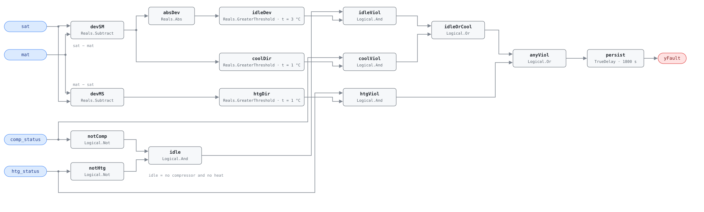

## Description

Air leaving a rooftop unit has to be explained by what the unit is doing. With
no compressor and no heat, supply air should arrive at the mixed-air condition
give or take fan heat and sensor error; with a compressor running it must be
colder than the mixture; with gas or electric heat energized it must be warmer.
Half an hour of the temperatures saying otherwise means either a sensor is lying
or the equipment is not doing what its status point claims. This is PNNL's AFDD0
(PNNL-23790), the prerequisite the rest of the RTU chapter is built on — the
diagnostics it gates read the same two sensors it is checking. Present on
roughly 15% of units.

## Detection Logic

```
dev_sm = sat − mat
idle   = NOT comp_status AND NOT htg_status

yFault = ( idle        AND |dev_sm|      > consistency_threshold       )
      OR ( comp_status AND  dev_sm       > cooling_direction_threshold )
      OR ( htg_status  AND  (mat − sat)  > heating_direction_threshold ),
         sustained for alarm_delay
```

Block graph (`rule.cxf.jsonld`):



The state gating is what makes the three branches safe to OR: a 12 °C spread
between supply and mixed air is a gross violation with nothing running and the
expected result with the compressor on, and `idle` holds the magnitude test off
in every active mode so the same numbers are never read by two branches with
opposite expectations. All three comparisons are strict `>` against positive
thresholds, so a deviation sitting exactly on one reads healthy — 3.0 °C while
idle is not a fault, 3.1 °C is. `persist` requires 30 continuous minutes and
resets on any tick where no branch is violated, which rides out the pull-down
after a stage start. A violation that hands off from one branch to another
within a tick does not reset the timer — the right reading of the physics, and
also why the host's `min_stage_runtime` precondition earns its keep, since the
minutes after a stage change are when a lagging sensor is most likely to carry a
stale disagreement across the handoff. `delayOnInit = true` holds the window
across a controller restart.

## Possible Diagnoses

1. `sat` or `mat` sensor out of calibration
2. Supply air temperature sensor in the wrong location — reading a stratified
   slice of the discharge, or radiant heat from the heat exchanger
3. Compressor running with no refrigerant flow: lost charge, failed compressor,
   or a stuck reversing valve on a heat pump
4. Heater energized with no heat output: failed ignition, tripped high-limit,
   closed gas valve, or an open electric heat element
5. Sensor wiring: swapped `sat` and `mat` leads, a shorted or open sensor, or a
   status point wired to the wrong stage

## Energy Impact

COMFORT_ENERGY, LOW confidence, QUALITATIVE_ONLY. Nothing here is directly
computable: a mis-read temperature burns no fuel by itself, and a compressor
running without refrigerant burns plenty but this rule has no capacity data to
price it. PNNL EEM-01 (sensor recalibration) covers the sensor half at 0–5% of
site energy across a whole sensor population. The value of the rule is the
accuracy it restores to RTU-0002 and RTU-0004, which read the same two
sensors, plus the mechanical failures it catches on the way.

## Emissions Impact

QUALITATIVE_EMISSIONS, LOW confidence. Scope is recorded as `1|2` because it
depends on which half of the unit is wrong: a heating-branch violation on a
gas-fired RTU points at scope 1 combustion, a cooling-branch violation at scope
2 electricity, and an idle violation at whichever subsystem the bad reading
later misdirects. Avoided-emissions basis: N/A.

## Deviations

- **Two `Subtract` blocks rather than one difference and a negation.** The
  heating test is `mat − sat` against a positive threshold, i.e. `−dev_sm`, and
  CDL has no unary negate. This library keeps negative parameter values out of
  rule documents (precedent: AHU-0021's `designConst`); algebraically
  identical.
- **Three independent thresholds, two of which default to the same number.**
  The cooling and heating direction thresholds are both 1.0 °C but stay separate
  because the reference lists them separately and they are not the same physical
  quantity — evaporator approach on one side, heat exchanger effectiveness on
  the other.
- **`min_stage_runtime` (10 min) is a host precondition, not a block.** It gates
  on a stage transition the block graph cannot see, and this library keeps state
  gating host-side (the treatment the G36-derived AHU rules give ModeDelay). The
  30-minute persistence does not substitute: a unit that stages up and stays up
  starts the timer at the moment of the change.
- **Fan-running is a precondition too.** With the fan off both sensors read
  stagnant air in different parts of a cabinet and the comparison means nothing.
- **Suppression is declared, not encoded.** The reference's "when active,
  suppresses RTU-0002 and RTU-0004" lives in `suppresses` and is enforced by
  the host; the engine is status-blind and each rule is an independent
  composite. Same treatment as AHU-0028, whose CLU-09 role this rule plays for
  the RTU chapter without being a cluster member — the reference defines no RTU
  sensor-integrity cluster, so `clusters` is empty rather than reusing an AHU
  cluster ID.
- **Simultaneous heating and cooling is reported, not refereed.** With both
  statuses true the idle branch is held off and both directional branches
  evaluate, so whichever direction the temperatures contradict raises the alarm.
  A unit heating and cooling at once is already broken; deciding which half is
  at fault belongs to whoever opens the panel.
- `persist.delayOnInit = true` (CDL default is `false`), the library's standing
  choice: an inconsistency already present when the controller starts waits out
  the full 30 minutes rather than alarming on the first tick.

## Notes

The suppression contract is the point of this card. While `yFault` is true,
RTU-0002 and RTU-0004 are computing on numbers known to be wrong and the
host must report them as NO_EVAL rather than healthy — a silenced rule is not a
passing rule. RTU-0002 consumes `sat` in its temperature split against an 8 °C
baseline, where a 3 °C sensor bias moves the ratio by 37 percentage points: the
entire distance from a clean coil to an alarm.

Check the sensors first, because it is the cheap end — two thermometers and ten
minutes settle whether `sat` and `mat` agree with reality, and the
[sensor-drift](../../../playbooks/sensor-drift.md) playbook covers the fix
($30–$80 per sensor). Only once both read true does the alarm point at
diagnoses 3 and 4, and then it means a compressor or a heater is running and
producing nothing.
