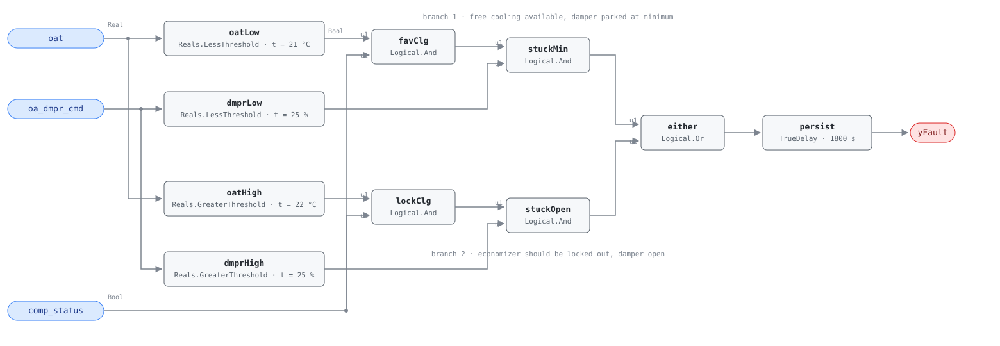

## Description

A packaged unit's economizer has two jobs and this rule watches both of them
fail. Branch 1 catches the damper parked at ventilation minimum on a mild day
with mechanical cooling running — free cooling standing right there, unused;
branch 2 catches 30 °C outdoor air pouring through a damper that should have
closed, with the compressor absorbing the difference. The two failures come from
different places: stuck-at-minimum is usually mechanical (a popped rod end, a
dead actuator, economizing switched off), stuck-open is more often a
spring-return actuator that lost its return or a high limit that never locks
out. Cowan's 2004 survey found 54% of RTU economizers carrying at least one
fault, and both failures are invisible from a monthly bill.

## Detection Logic

```
fault_1 = oat < econ_lockout_temp AND comp_status AND oa_dmpr_cmd < min_oa_margin
fault_2 = oat > econ_relock_temp  AND comp_status AND oa_dmpr_cmd > min_oa_margin

yFault  = (fault_1 OR fault_2), sustained continuously for alarm_delay
```

Block graph (`rule.cxf.jsonld`):



`comp_status` is in the graph rather than in the frontmatter because it is not a
gate on data quality — it is part of the fault definition. Neither branch
describes waste without a compressor running: a damper at minimum on a cool
morning with the unit coasting is a unit that does not need cooling, not a
broken economizer. Between `econ_lockout_temp` and `econ_relock_temp` the rule
is deliberately silent — neither temperature test is true in that band, so a
unit changing over at 21.4 °C produces no verdict while its mixed-air loop
settles. That silence is what the reference's `lockout_deadband` buys. All four
comparisons are strict, so a damper resting exactly on `min_oa_margin` trips
neither branch and outdoor air resting exactly on either setpoint arms neither.
`persist` requires 30 minutes of continuous violation, which rides out a damper
stroke, a changeover, and the minimum-position dwell an economizer holds while
its own loop settles; `delayOnInit = true` holds that window across a restart.

## Possible Diagnoses

1. OA damper stuck at minimum — disconnected linkage, failed actuator, bound
   blades (branch 1, and the most likely one by a wide margin)
2. OA damper stuck open — spring return failed, actuator jammed off its seat
   (branch 2)
3. Economizer controller disabled or misconfigured in the unit controller
4. OAT sensor reading erroneously high, which locks out changeover while the
   control sequence works correctly (branch 1's most common false positive, and
   the reason RTU-0003 suppresses this rule)
5. Economizer high-limit setpoint set too low for the climate zone, so the unit
   locks out during weather it should be economizing in

## Energy Impact

CRITICAL_WASTE, HIGH confidence, DIRECT_MEASUREMENT. The waste is compressor
work the economizer position made unnecessary, and compressor status is one of
this rule's own inputs: `waste_kw = comp_status × rtu_cooling_kw` — under branch
1 the mechanical cooling free cooling would have displaced, under branch 2 the
load the open damper added. The reference's 5–20% of cooling energy is
consistent with PNNL EEM-06 (OA damper and controls) and EEM-23 (RTU advanced
controls, 3–11% of unit electricity). HIGH confidence: the condition is read
directly from a temperature and two commands with no model in between. Strongly
cooling-dominant, and worth the most in shoulder seasons.

## Emissions Impact

Scope 2, DIRECT_EMISSIONS, HIGH confidence; typically 800–5,000 kg CO₂e/yr for a
single packaged unit. The wasted energy is compressor electricity, so the whole
impact lands in purchased power. Free-cooling hours cluster in mild daytime and
overnight weather, so use the marginal operating emissions rate (MOER), not an
average grid factor, or the estimate misses by the width of the grid's daily
swing.

## Deviations

- **`min_oa_margin`'s default is adopted, not transcribed.** The reference
  states both branches in terms of it but omits it from the tunables table. This
  card adopts 25.0%, chapter 9's value for a damper parked at minimum
  (AHU-0017's `econ_damper_threshold`), so the phrase means the same thing
  across both economizer rules; the reference's own vectors (10% versus 75–80%)
  are decidable at any margin between those. AHU-0030 precedent.
- **The reference's `lockout_deadband` is folded into a second absolute
  threshold.** Branch 2 is written `oat > econ_lockout_temp + lockout_deadband`,
  but a card parameter binds a single CXF path and the block set cannot add two
  parameters in-graph, so branch 2 compares against `econ_relock_temp` = 22.0 °C
  = 21.0 + 1.0. Moving the lockout means retuning **both**; setting
  `econ_relock_temp` below `econ_lockout_temp` overlaps the temperature tests
  into a rule that fires at every damper position but the margin itself.
  Combined-parameter precedent AHU-0005.
- **`min_oa_margin` is one card parameter bound to two CXF paths**
  (`dmprLow.t`, `dmprHigh.t`), matching the reference's single margin. Hosts
  must set both together: split them and a band of damper positions is either
  tested by neither branch or read as parked at minimum and as open at once.
  AHU-0025 precedent.
- **All four comparisons are strict** (`<`, `>`, `<`, `>`). The reference does
  not specify boundary behavior and CDL's Reals family has no `GreaterEqual`, so
  the inclusive reading is not expressible. The deviation is measure-zero and it
  errs toward silence.
- **The changeover band is a blind spot, by construction.** Between 21 and 22 °C
  neither branch can fire whatever the damper is doing, so an economizer that
  fails while the weather sits in that 1 °C band reports nothing until the
  weather moves. Reporting inside the band would alarm on every normal
  changeover, which is what the deadband exists to prevent.
- **`comp_status` is in-graph; everything else about mode is not.** The
  reference lists "cooling call active" as the operating state and
  `comp_status` as a term of both equations. The term is implemented; broader
  gating (unit mode, occupancy, manual override, RTU-0003's sensor check)
  stays host-side, as in AHU-0017.
- **Damper command, not damper feedback.** The RTU dictionary carries no damper
  position feedback point, so an actuator reporting 80% while the blades sit
  closed is invisible here. That failure belongs to the mixed-air checks
  (RTU-0003) and to step 3 of the playbook — which is why the two rules are
  linked by suppression rather than by a shared input.
- Severity 3 (warning), phase 2, method `rule`, and the tunable defaults are the
  reference's chapter 11 card; its §5.8.3 index corroborates and carries no
  severity column. `g36: null` — PNNL/Title 24-derived, not a G36 §5.16.14
  clause.
- `persist.delayOnInit = true` (Modelica/CDL default is `false`), the library's
  standing choice: a violation already present at load waits out the full 30
  minutes instead of alarming on the first tick after a restart.

## Notes

This is AHU-0017's fault seen through packaged-unit points — an RTU has a
compressor contactor and a fixed dry-bulb high limit where the AHU has a
modulating valve and a differential changeover — so both sit in CLU-03 with
AHU-0017 as trigger and this card as member.

Retune `econ_lockout_temp` for the climate zone before trusting the default:
21 °C is near ASHRAE 90.1's 70 °F fixed high limit for zones 4A–5A, while zones
1A–3A allow 75 °F (23.9 °C) and zones 5B–8 use 65 °F (18.3 °C). A limit set for
the wrong zone produces branch 1's signature with nothing mechanically wrong
(diagnosis 5, a remote fix). Verify order within CLU-03 is RTU-0003 first,
then this rule, then RTU-0005, whose excess outdoor air is often branch 2 seen
from the airflow side; the [economizer-failure](../../../playbooks/economizer-failure.md)
playbook carries the climate-zone table and puts the odds of a sibling unit on
the same roof having the same problem at 30–50%.
