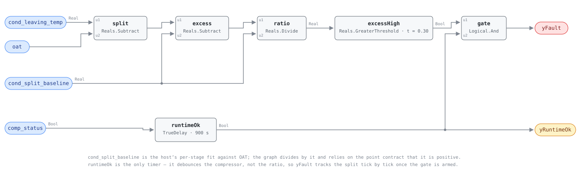

## Description

An air-cooled condenser rejects heat by warming the air it pulls through the
coil, so the split between leaving air and outdoor air is a signature of how
much air moves across how much clean fin area. Restrict either and the same heat
leaves in less air: cottonwood seed matted into the fins, a fan motor losing
speed, a bent blade, a discharge hood aimed so the neighbouring unit's hot air is
drawn back in. The split widens, head pressure climbs with it, and the
compressor pays for the extra lift every hour the unit cools — without missing a
setpoint, which is why nobody on the ground notices. Two temperatures and a
baseline is the whole measurement, and the baseline has to come from the host:
the split a healthy unit makes depends on both compressor stage and outdoor air.

## Detection Logic

```
condenser_split = cond_leaving_temp − oat
relative_excess = (condenser_split − cond_split_baseline) / cond_split_baseline

yRuntimeOk = comp_status held continuously true for min_compressor_runtime
             (false ⇒ host reports NO_EVAL)
yFault     = relative_excess > fouling_threshold AND yRuntimeOk
```

Block graph (`rule.cxf.jsonld`):



`runtimeOk` is the only timer, and it debounces the compressor rather than the
ratio: it asserts exactly 900 s after comp_status rises, any stop restarts it,
and once armed `yFault` follows the split tick by tick with no persistence of
its own (`excess_flickering_across_the_threshold_chatters` pins that). The
`delayOnInit = true` house choice makes a compressor already running at engine
start wait out the full window, which is the right reading here — the rule
cannot know how long that machine has been on.

`cond_split_baseline` reaches the graph twice, once as the subtrahend and once
as the divisor, and nothing guards the division: the point contract carries that
obligation (see Deviations). The threshold comparison is strict, so a split
exactly 30% wide reads healthy; the boundary is bit-exact for a baseline of 10.0
and a split of 13.0, and both sides are pinned.

## Possible Diagnoses

1. Fouled condenser coil — cottonwood seed, leaves, grass clippings, or roof
   grit matted into the fins. The most common cause, the cheapest to confirm
   (look at the coil from outside the unit) and the cheapest to fix
2. Condenser fan motor degradation — a failing motor or slipping mount turning
   the same blade slower, which moves less air across a coil that is clean
3. Blade damage or obstruction — a bent or cracked blade, or something set down
   on the condenser guard; the split widens the same way as a fouled coil
4. Hot-air recirculation from an adjacent rooftop unit discharging into this
   unit's condenser intake. The coil is clean, the fan is fine, and the fix is
   sheet metal rather than service — indistinguishable from causes 1-3 on this
   signal, and the one to suspect when a cleaned coil does not clear the alarm
5. Neither: an unshaded leaving-air probe, a biased outdoor-air sensor, or a
   baseline fitted while the coil was already dirty. Rule these out first —
   they cost nothing and the third one silences the rule permanently

## Energy Impact

EFFICIENCY_LOSS, MEDIUM confidence, BASELINE_COMPARISON. The excess split the
graph already computes is the estimator:
`waste_kw ≈ compressor_kw × 0.025 /K × relative_excess × cond_split_baseline` —
the share of compressor power spent lifting across resistance that should not be
there. A unit 43% over a 14 K baseline carries 6 K of excess split, which the
estimator reads as 6 K of extra lift and about 15% of compressor power — the top
of the reference's 5-15% band. MEDIUM because both steps are approximations: the
sensitivity ratio is a thumb-rule borrowed from the chiller side, and air-side
split stands in for refrigerant-side lift. Cooling-dominant, and worst on design
days when the condenser is already working hardest.

## Emissions Impact

Scope 2, PROXY_EMISSIONS, MEDIUM confidence; the same order as RTU-0002's
300-2,000 kg CO₂e/yr, scaling with tonnage and cooling hours. Marginal operating
emissions rate (MOER) is the avoided-emissions basis, and the timing works
against the building twice over: a restricted condenser costs most on the hot
afternoons when the grid dispatches its dirtiest generation and the unit runs
longest.

## Deviations

- **The deferral was resolved by the point dictionary, not by new blocks.**
  `faults/rtu/README.md` carried this rule as deferred because its baseline is a
  function of two variables (stage and OAT) and the block set expresses no
  baseline curve. Publishing the fit as the host-derived point
  `cond_split_baseline` moves that curve out of the graph entirely, as CHW-0005
  and HP-0004 do with derived saturation temperatures.
- **The stage dependence lives in the host fit, so `comp_stage` is not a point
  of this rule.** The baseline the host publishes already answers "which stage",
  and re-deriving the stage in-graph would add a binding and a block for
  information the rule cannot act on. The cost is real and declared in
  `preconditions`: a 1-to-2 stage-up switches the baseline instantly while the
  physical split takes minutes to follow, and nothing in-graph holds evaluation
  off across it.
- **`comp_status` is the runtime gate, not `comp_stage > 0`.** The gate asks one
  question — is a compressor running — which `comp_status` answers directly
  ("true = at least one compressor running") while the integer route needs an
  `Integers.GreaterThreshold` to reach the same boolean. The dictionary's
  OR-undercount warning is about counting starts (RTU-0001), not about whether
  anything is running, so it does not bite here.
- **The TrueDelay sits on the compressor condition, not on the fault
  condition.** Settling is a property of the machine, not of the finding: a
  timer fed the AND would restart its clock every time the split dipped under
  the line, so a marginal unit could run all afternoon and never complete a
  window it had physically earned in the first 15 minutes. The consequence is
  that `yFault` has no debounce of its own.
- **No `alarm_delay` was invented to supply that debounce.** The reference names
  two parameters and this card ships two. The arithmetic supports the choice:
  ±0.5 K of sensor error on a 14 K baseline is ~3.5% of the ratio against a 30%
  line, so the decision is not normally made on noise. A unit that genuinely
  oscillates across the line will chatter, which the vectors pin rather than
  hide, and the host's alarm layer is where that hold-off belongs.
- **The division relies on the point contract instead of an in-graph guard.**
  `points/rtu.points.json` requires the host to publish `cond_split_baseline`
  strictly positive, which it is by construction — an expected temperature rise
  across a working condenser. A host that publishes 0 anyway drives the quotient
  non-finite and the rule alarms permanently rather than going quiet, which
  `zero_baseline_violates_the_point_contract_and_alarms` pins: the survivable
  direction for a misconfiguration, but still a contract violation.
- **Strict `>` where the reference's playbook is inclusive** ("a 30% or greater
  increase indicates fouling"). CDL `Reals` has no `GreaterEqual`, so a split
  exactly 30% over baseline reads healthy. The disagreement is measure-zero on a
  real-valued signal and both sides are pinned, one of them bit-exact.
- **`method: statistical` describes where the baseline comes from, not what the
  graph does** — RTU-0002's stance, and more literally true here: the fit is
  regressed from this unit's own clean-operation history rather than adopted
  from a population, which is also why `estimation_method` is
  `BASELINE_COMPARISON` rather than RTU-0002's shipped constants.
- **The sensor half of the original deferral is not resolved, only declared.**
  Most packaged units carry no condenser leaving-air sensor, so this rule is
  retrofit-gated in a way none of its RTU siblings are; the point dictionary
  says so and `preconditions` repeats it. A library that shipped this rule as
  broadly deployable would be overstating what a typical RTU can bind.
- **The energy estimator borrows a chiller thumb-rule.** BEE 2006 §2.5.2's 2-4%
  of compressor power per °C of lift is stated for water-cooled machines; the
  compressor does not care what fluid raised its condensing temperature, so the
  crossover is defensible as an approximation and `runtime_estimation` writes it
  as one. It is also the reason the estimator is only corroborating evidence for
  the reference's 5-15% band rather than a second derivation of it.
- **The playbook's resolution target is tighter than this rule's alarm.** Step
  3.3 confirms the fix at the split returning within 20% of baseline while the
  rule alarms at 30%, so a coil cleaned back to 25% over clears the alarm
  without being fixed — the same trap RTU-0002 documents against its own
  playbook step. The playbook already carries this fault in its Applies-To row
  and its Steps 1.3, 2.3 and 3.3, so no playbook edit was needed.
- **`clusters: []` and `suppressed_by: []`, both deliberate.** CLU-10
  (condenser-side degradation) is the water-side syndrome behind a shared
  cooling tower; an air-cooled packaged condenser shares no loop with it, so
  membership would be a false neighbour. And no rule in this family adjudicates
  `oat` or `cond_leaving_temp` — RTU-0003's AFDD0 consistency check covers
  `sat`/`mat` — so there is nothing honest to be suppressed by. Both are the
  index owner's to revisit.
- **The CXF namespace is `urn:cxf-library:rtu-0007#`.** SCHEMA.md's normative
  form, matching VAV-0010; the rest of the RTU family still carries
  pre-renumbering `rtu-fc-0NN` namespaces because renaming them would churn
  every recorded `content_id` for no gain.
- `runtimeOk.delayOnInit = true` against the CDL default of `false`, the
  library's standing choice, and load-bearing here: a compressor already running
  at load raises no edge for the timer to key on. Threshold hysteresis stays at
  the CDL default `h = 0`; a site whose split chatters should add hold-off at
  the host rather than widen the band.
- **No published test vectors exist.** The reference supplies no cases for this
  test, so every scenario in `vectors.json` is authored from the equation and
  replayed against the pinned engine rev. Operating states and preconditions are
  declared in frontmatter for host enforcement rather than encoded in the graph.
  Severity 3 and `method: statistical` are the row `faults/rtu/README.md` has
  carried for this rule since the chapter was indexed; `confidence: MEDIUM` and
  `estimation_method: BASELINE_COMPARISON` are this card's own, and match the
  chapter's other baseline-referenced finding, RTU-0002.

## Notes

Read `yRuntimeOk` first: on a short-cycling unit it never turns true, and that
silence is RTU-0001's finding rather than a clean coil. Then look at the coil,
which is visible from outside the unit and is cause 1 in both the diagnosis list
and the playbook. If washing it does not restore the split, take the fan next
(motor speed, then the blade), and the neighbours last — hot-air recirculation is
common on dense rooftops, invisible from the trend, and fixed with sheet metal
rather than service. Trend the split against outdoor temperature for a week
before scheduling any of it: a gap that grows with OAT points at the coil or the
fan, while one flat and wide across the range points at recirculation or at a
baseline fitted while the unit was already dirty.
