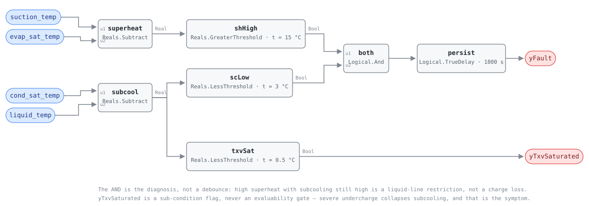

## Description

A machine short of refrigerant runs short of liquid. The metering device runs
out of authority trying to keep the evaporator fed, so the evaporator starves
while the condenser loses its liquid seal: superheat climbs and subcooling
collapses at once. That divergence is the signature — capacity loss alone says
nothing about cause, and a rooftop unit loses capacity quietly for a season
before anyone calls it in. NIST SP 1087 imposed graded charge faults on a
TXV-equipped R410A machine in cooling and recorded this pair once the valve
saturated (§5.4.3, Table 5.2, zone B); Breuker & Braun's fixed-orifice charts
show it from the first pound lost. This rule forms both differences from four
refrigerant-side temperatures and alarms when they sit past their commissioned
bands for half an hour.

## Detection Logic

```
suction_superheat = suction_temp  − evap_sat_temp
liquid_subcooling = cond_sat_temp − liquid_temp

yTxvSaturated = liquid_subcooling < subcooling_two_phase_floor
                (sub-condition flag; false does NOT mean NO_EVAL)

yFault        = suction_superheat > superheat_high_band
                AND liquid_subcooling < subcooling_low_band,
                sustained continuously for alarm_delay
```

Block graph (`rule.cxf.jsonld`):



The conjunction is the diagnosis, not a noise filter. High superheat with
subcooling *high* is the liquid-line or filter-drier restriction pattern, where
refrigerant backs up ahead of the restriction; with subcooling merely *normal*
it is a fixed-orifice unit at low indoor load, which is no fault at all. Low
subcooling with superheat still normal is a valve compensating successfully.
Only the two together indict the charge.

Both comparisons are strict, so a unit exactly on either band reads healthy, and
both bands are per-unit commissioning values — the shipped defaults are
placeholders, not thresholds anyone measured on the machine in front of you.
`persist` requires 30 continuous minutes and clocks them from the conjunction,
not from the first symptom; `delayOnInit = true` holds that window across a
controller restart. `yTxvSaturated` reports whether the liquid line is still
measurably subcooled; it does not gate the alarm, and the reason it must not is
the card's main deviation.

## Possible Diagnoses

1. Refrigerant leak — brazed joints, Schrader cores, service-valve packing and
   flare connections, in that order of prevalence; a top-up without a leak
   search buys months, not years
2. The unit was charged short, at commissioning or after a rooftop repair that
   vented the circuit and was recharged by pressure rather than by weight
3. Condenser airflow restriction (RTU-0007) — a fouled coil moves this pair the
   same way and separates only on condensing temperature, which rises rather
   than falls. This rule reads differences, not levels, so RTU-0007's split is
   the discriminator and neither card suppresses the other
4. Instrumentation: a P-T derivation configured for the wrong refrigerant, or a
   liquid-line probe with poor contact, missing insulation or sun on it. Each
   fabricates the pattern on a correctly charged machine

## Energy Impact

EFFICIENCY_LOSS, MEDIUM confidence, PROXY_ESTIMATION.
`waste_kw = compressor_kw × d / (1 − d)`, the extra compressor runtime needed
to deliver the same cooling at a degraded EER. NIST SP 1087 sizes `d` directly:
every fault it tested except compressor leakage needed a fault level above 10%
to cost 5% of EER, and a 20% charge shortfall cost 6.5-13% of EER, the largest
hit in its Figure 5.17. Confidence is MEDIUM because the rule fires on a
pattern, not a severity — it reports that the charge is low, not by how much, so
`d` is a population number until the technician's gauge set supplies a real one.

## Emissions Impact

Scope 2, PROXY_EMISSIONS, MEDIUM confidence; typically 300-2,000 kg CO₂e/yr for
a commercial packaged unit, the same order as RTU-0002 and RTU-0007 and all of
it compressor electricity, so the avoided-emissions basis is the marginal
operating emissions rate (MOER) and the waste peaks on the hot afternoons when
the grid is dirtiest. A leaking circuit also vents refrigerant, and R410A
carries a GWP near 2,000; that release is a scope 1 emission this card does not
estimate, because the leak rate is not observable from any point the rule reads.
Sites with refrigerant-tracking obligations should account for it separately.

## Deviations

- **The 0.5 °C subcooling floor is a sub-condition flag, not an evaluability
  gate.** SP 1087 uses it (§5.4.4) to select *which* fault-direction chart
  applies, never to suppress evaluation, and that chart still lists falling
  subcooling as an undercharge symptom. Gating `yFault` on it would silence the
  rule exactly when the liquid line has flashed to two-phase — severe
  undercharge, not missing data — so the flag is named `yTxvSaturated`, not
  `y…Ok`.
- **The flag keeps HP-0004's name on a family where half the population has no
  TXV.** Nothing saturates on a fixed-orifice unit, but the measurement is
  identical — the liquid line is no longer measurably subcooled — and `outputs`
  says so. A per-family rename would cost hosts binding both cards a shared
  signal name for one word of accuracy.
- **The rule does not know which expansion device it is watching, and does not
  need to.** SP 1087 splits its charts on that device — Table 5.2 for TXV,
  Table 5.1(a) for fixed orifice — but both list superheat up with subcooling
  down for undercharge, so the pattern is common ground and no point or
  parameter records the device. The split moves into commissioning instead, and
  it lands on the superheat band: on a fixed-orifice unit superheat follows
  indoor wet-bulb and outdoor drybulb rather than being controlled (charging
  charts for that population are two-dimensional for that reason), so the band
  belongs at the chart's high-superheat corner — low indoor wet-bulb against a
  high outdoor drybulb — or a dry-climate unit alarms on its hottest afternoons
  (`fixed_orifice_unit_at_low_indoor_load` pins the case).
- **Fixed bands replace SP 1087's regressed no-fault baseline.** SP 1087
  compares each feature against a third-order regression on three variables; this
  library's only regression primitive is a host-fitted line, so charging-chart
  nominal targets stand in — a real simplification, named as one on RTU-0002's
  precedent, and the reason untouched defaults can alarm forever.
- **Sensitivity runs opposite between the two populations.** On a TXV unit
  undercharge moves no superheat until the valve saturates (SP 1087's zone A),
  so a mild loss the valve absorbs reads healthy here; earlier investigators
  reported difficulty detecting undercharge below roughly 40% charge loss
  (Breuker & Braun 1998b; Stylianou & Nikanpour 1996, via SP 1087 §2). A
  fixed-orifice unit is caught earlier and pays for it in false-alarm exposure
  at low load.
- **Two features, so condenser airflow restriction is not excluded.** It shares
  the superheat-up/subcooling-down pair and separates on condensing temperature
  moving up rather than down — a level test needing a baseline, which RTU-0007
  has and this rule does not. Diagnosis 3 names it and
  `condenser_restriction_reads_as_undercharge` pins that this rule fires on it;
  no suppression either way, because neither rule adjudicates the other's
  evidence.
- **The grounding transfers from a residential heat pump to packaged
  equipment.** A starved evaporator and an unsealed condenser are circuit-level
  physics, and Li & Braun (2009) validated charge inference from these same four
  surface temperatures across seven unitary systems, Kim & Braun (2020) carrying
  it onto rooftop units. What transfers is the pattern, not the numbers: no
  SP 1087 threshold is adopted except the physical two-phase floor.
- **Cooling-only, which is where this card stands on firmer ground than
  HP-0004.** SP 1087 tested cooling exclusively, so the heat-pump reading has to
  carry a caveat about the coils swapping roles in heating. A cooling-only
  packaged unit has no reversing valve and no defrost cycle: the sensors keep
  their heat exchangers year-round, `operating_states` needs no mode split and
  `preconditions` no defrost gate. Bind HP-0004 for a heat-pump rooftop.
- **Compressor and steady-state gating stay host preconditions.** The graph
  computes the fault given valid data, per SCHEMA.md; `comp_status` and
  time-since-stage-change are not among its inputs, and the 30-minute
  `alarm_delay` does not substitute — a post-start superheat overshoot starts
  the persistence timer rather than being excluded from it.
- **The pattern chart is a single-fault chart.** SP 1087 imposed one fault at a
  time, and Hu et al. (2021) show single-feature charge inference degrading when
  other faults are present, their residuals superposing. Two faults at once can
  cancel this rule's pattern or fake it; the diagnosis list is a ranking, not a
  verdict.
- **Strict `>` and `<` at both bands.** CDL `Reals` has no `GreaterEqual` or
  `LessEqual`, so a unit sitting exactly on a band reads healthy. The
  disagreement is measure-zero on real-valued signals; both sides of both bands,
  and of the two-phase floor, are pinned bit-exactly by vectors.
- **The playbook covers the work but does not yet list this rule.** Its
  Step 2.1.2 already sends the technician to superheat and subcooling against
  manufacturer specs, the measurement this rule automates; the Applies-To row
  and a charge-specific Step 1 entry are the index owner's to add.
- `persist.delayOnInit = true` (CDL default is `false`), the library's standing
  choice. Severity 3 and `category: EFFICIENCY_LOSS` follow HP-0004 and
  RTU-0002; the namespace `urn:cxf-library:rtu-0008#` is SCHEMA.md's normative
  form, as on RTU-0007 and VAV-0010. No reference card exists to inherit any of
  this from and none publishes test vectors, so every scenario in `vectors.json`
  is authored from the equation and replayed against the pinned engine rev.

## Notes

Do not read a cleared alarm as a repaired machine: the host gates this rule on
the compressor running, so every stop drops `yFault` for the same reason a
recharge does, and a short-cycling unit may never complete a settled window at
all. When `yTxvSaturated` is true, expect flash gas at the sight glass and weigh
the recovered charge rather than trusting subcooling to confirm the fix. Check
RTU-0007 before opening the gauges — a fouled condenser makes this same pair and
costs a coil wash rather than a leak search. RTU-0009 is the overcharge branch,
HP-0004 the heat-pump original, and
[rtu-compressor-refrigerant](../../../playbooks/rtu-compressor-refrigerant.md)
orders the on-site work.
